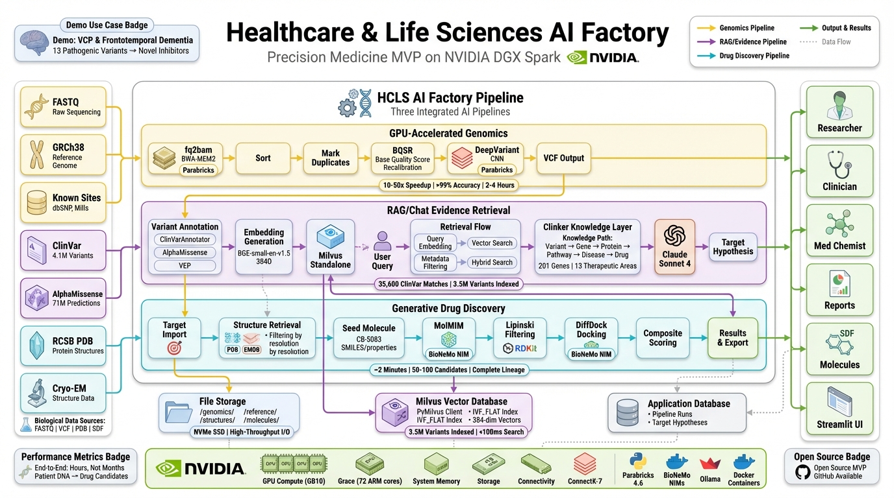

# HCLS AI Factory

[](https://github.com/ajones1923/hcls-ai-factory/actions/workflows/ci.yml)
[](https://codecov.io/gh/ajones1923/hcls-ai-factory)
[](https://opensource.org/licenses/Apache-2.0)
[](https://www.python.org/downloads/)
[](https://hcls-ai-factory.org)
[](https://www.nvidia.com/en-us/data-center/dgx-spark/)

**Foundation. Intelligence. Discovery.**

*Transform patient DNA into therapeutic candidates in hours, not months.*

<p align="center">
  
</p>

---

## Three Engines. One Pipeline.

The HCLS AI Factory is built on three coordinated engines that form a continuous pipeline from raw DNA to drug candidates:

| Engine | Stage | What It Does |
|--------|-------|-------------|
| **[Genomic Foundation Engine](docs/engines/genomic-foundation.md)** | 1 | GPU-accelerated variant calling and annotation. FASTQ → 3.5M searchable variant vectors via Parabricks, DeepVariant, ClinVar, and AlphaMissense. |
| **[Precision Intelligence Network](docs/engines/precision-intelligence.md)** | 2 | 11 domain-specialized AI agents sharing a common molecular foundation. RAG-powered clinical interpretation across oncology, neurology, cardiology, rare disease, and 9 more domains. |
| **[Therapeutic Discovery Engine](docs/engines/therapeutic-discovery.md)** | 3 | Generative drug design via BioNeMo MolMIM, molecular docking via DiffDock, and drug-likeness scoring via RDKit. Validated targets become ranked drug candidates. |

### The 11 Intelligence Agents

| Agent | Domain | Port | Key Capabilities |
|-------|--------|------|------------------|
| [Precision Oncology](docs/precision-oncology-agent/index.md) | Cancer | 8526 | MTB packet generation, therapy ranking, trial matching |
| [CAR-T Intelligence](docs/cart-intelligence-agent/index.md) | Cell Therapy | 8521 | Cross-collection evidence, comparative analysis, deep research |
| [Imaging Intelligence](docs/imaging-intelligence-agent/index.md) | Medical Imaging | 8525 | VISTA-3D, MAISI, VILA-M3 workflows, FHIR R4 export |
| [Precision Biomarker](docs/precision-biomarker-agent/index.md) | Biomarkers | 8528 | PhenoAge/GrimAge, 9-domain risk, genotype-aware interpretation |
| [Pharmacogenomics](docs/pharmacogenomics-intelligence-agent/index.md) | Drug-Gene | 8507 | Star allele calling, CPIC guidelines, 9 dosing algorithms |
| [Precision Autoimmune](docs/precision-autoimmune-agent/index.md) | Autoimmune | 8531 | Autoantibody interpretation, HLA analysis, flare prediction |
| [Neurology Intelligence](docs/neurology-intelligence-agent/index.md) | Neurology | 8529 | Stroke triage, dementia evaluation, EDSS scoring |
| [Cardiology Intelligence](docs/cardiology-intelligence-agent/index.md) | Cardiovascular | 8536 | 11 clinical workflows, 6 risk calculators |
| [Clinical Trial Intelligence](docs/clinical-trial-intelligence-agent/index.md) | Clinical Trials | 8128 | Trial optimization, adaptive design, biomarker strategy |
| [Rare Disease Diagnostic](docs/rare-disease-diagnostic-agent/index.md) | Rare Disease | 8544 | HPO matching, ACMG classification, gene therapy tracking |
| [Single-Cell Intelligence](docs/single-cell-intelligence-agent/index.md) | Single-Cell | 8130 | Cell type annotation, TME profiling, drug response |

---

## See It in Action

> **From Patient DNA to New Medicines** — a 9-minute walkthrough of the complete pipeline.

<p align="center">
  <a href="https://www.youtube.com/watch?v=ccS3g1Wt9g0">
    
  </a>
</p>

<p align="center">
  <a href="https://www.youtube.com/watch?v=ccS3g1Wt9g0">▶ Watch on YouTube</a>
</p>

---

## Origin

In 2012, I set out to use my high-performance computing background for something that mattered. I started with one conviction: no parent should ever have to lose a child to disease.

That conviction led me to Pediatric Neuroblastoma. I taught myself biology, genomics, molecular pathways, drug discovery—whatever the work required. I made one commitment early: I would not profit from this. Whatever I built, I would give away freely, so others could build on it and move faster than any one person ever could alone.

Thousands of hours later, this is the result.

— **Adam Jones**

---

## Why This Is Open

This project is open by design, not as a shortcut or a visibility exercise, but as a deliberate decision about how foundational healthcare infrastructure should be built.

The challenges in precision medicine are no longer primarily scientific—they are architectural. Fragmented pipelines, opaque tooling, and closed systems slow the transition from genomic data to actionable insight. Solving this requires shared understanding of how systems are constructed, not just better algorithms.

By open-sourcing the HCLS AI Factory, this project provides a reproducible, inspectable reference implementation for end-to-end genomics, AI reasoning, and therapeutic exploration. The goal is not to prescribe outcomes, but to remove unnecessary friction so researchers, clinicians, and engineers can build on a common, trustworthy foundation.

Open access to infrastructure knowledge accelerates progress, enables collaboration, and shifts innovation away from re-solving plumbing toward advancing care.

---

## Who This Is For

This project is for people and institutions working at the intersection of healthcare, life sciences, and AI who need systems, not abstractions.

**Researchers and Bioinformaticians**
Building, extending, or validating secondary genomics pipelines and variant interpretation workflows who need reproducible, inspectable infrastructure rather than ad hoc scripts.

**Clinicians and Translational Teams**
Exploring how genomic data, AI reasoning, and therapeutic insights can be integrated into real-world decision-making, without requiring deep expertise in infrastructure or orchestration.

**Academic Medical Centers and R1 Institutions**
Teaching, researching, or operationalizing genomics and AI at scale, where transparency, reproducibility, and extensibility are critical.

**AI and Systems Engineers**
Interested in how real biomedical workloads behave when treated as first-class AI systems, including data flow, orchestration, observability, and reasoning layers.

**Platform Builders and Infrastructure Teams**
Designing future healthcare platforms who want a concrete reference architecture for AI-native pipelines rather than high-level diagrams.

This project is not limited to a single specialty, disease, or institution. It is designed to be a shared foundation that can support many domains while remaining grounded in real, working workflows.

---

## What This Is Not

This project is intentionally open, but it is not:

- **A clinical product** — It is a reference architecture and research platform, not a regulated medical device or diagnostic system.
- **A black-box AI solution** — All workflows, data flows, and reasoning layers are inspectable and reproducible.
- **A replacement for institutional expertise** — It is designed to augment researchers and clinicians, not automate judgment.
- **A single prescribed workflow** — The system is modular by design and intended to be adapted, extended, or specialized.
- **A vendor lock-in strategy** — The architecture is deliberately vendor-neutral and infrastructure-agnostic.

The intent is clarity, not control.

---

## What It Is

The Healthcare & Life Sciences (HCLS) AI Factory unifies three production-grade AI workflows into a single, continuous system—designed to take raw patient DNA and produce viable drug candidates without the fragmentation and delays that define traditional approaches.

Raw FASTQ files flow through NVIDIA Parabricks for GPU-accelerated genomics—alignment, variant calling, clinical-grade accuracy via DeepVariant—completing in hours instead of days. Outputs feed directly into an evidence layer where millions of variants can be queried in natural language, grounded in ClinVar, AlphaMissense, structural data, and curated biomedical knowledge. Validated targets then move into generative drug discovery via NVIDIA BioNeMo, where novel molecules are created, docked, scored, and ranked.

No batch jobs. No manual handoffs. Full lineage from patient DNA to candidate therapeutic.

One workstation. One workflow. Hours, not months.

Take it. Use it. Make it better.

<p align="center">
  
</p>

---

## What It Does

| Stage | Engine | Input | Output | Key Technology |
|-------|--------|-------|--------|----------------|
| 1 | **[Genomic Foundation](docs/engines/genomic-foundation.md)** | FASTQ (raw sequences) | 3.5M variant vectors | NVIDIA Parabricks, DeepVariant, ClinVar, AlphaMissense |
| 2 | **[Precision Intelligence](docs/engines/precision-intelligence.md)** | Variant vectors + natural language | Clinical intelligence | 11 RAG agents, Milvus, Claude AI |
| 3 | **[Therapeutic Discovery](docs/engines/therapeutic-discovery.md)** | Protein target | Ranked drug candidates | BioNeMo MolMIM, DiffDock, RDKit |

Each of the 11 intelligence agents extends the core platform with domain-specific RAG, cross-modal triggers linking to the shared genomic evidence base (3.5M vectors), and Streamlit UIs for interactive exploration.

### Performance

- **Genome analysis**: 120-240 minutes (vs. 24-48 hours on CPU)
- **Variant database**: 3.56 million searchable with semantic search
- **Query response**: <5 seconds for complex natural language
- **Molecule generation**: 10-100 candidates in seconds

---

## Architecture

```
┌─────────────────────────────────────────────────────────────────────────────┐
│                    HCLS AI FACTORY — Foundation. Intelligence. Discovery.    │
├─────────────────┬─────────────────┬─────────────────────────────────────────┤
│  STAGE 1        │  STAGE 2        │  STAGE 3                                │
│  GENOMIC        │  PRECISION      │  THERAPEUTIC                            │
│  FOUNDATION     │  INTELLIGENCE   │  DISCOVERY                              │
│                 │  NETWORK        │  ENGINE                                 │
│  FASTQ → 3.5M  │  11 Agents      │  Target → Molecules                     │
│  variant vectors│                 │                                         │
│  • Parabricks   │  • Milvus       │  • BioNeMo MolMIM                       │
│  • BWA-MEM2     │  • Claude AI    │  • BioNeMo DiffDock                     │
│  • DeepVariant  │  • ClinVar      │  • RDKit scoring                        │
│  • AlphaMissense│  • 142 colls    │                                         │
└────────┬────────┴────────┬────────┴──────────────────┬──────────────────────┘
         │                 │                           │
         ▼                 ▼                           ▼
   Web Portal:8080   Chat UI:8501              Discovery UI:8505

┌─────────────────────────────────────────────────────────────────────────────┐
│                  PRECISION INTELLIGENCE NETWORK (11 Agents)                  │
├──────────────────┬──────────────────┬───────────────────────────────────────┤
│  Oncology :8526  │  CAR-T :8521     │  Imaging :8525    Biomarker :8528     │
│  PGx :8507       │  Autoimmune :8531│  Neurology :8529  Cardiology :8536    │
│  Trials :8128    │  Rare Dis :8544  │  Single-Cell :8130                    │
└──────────────────┴──────────────────┴───────────────────────────────────────┘
         ▲                 ▲                           ▲
         └─────────────────┴───────────────────────────┘
              Shared Genomic Evidence (3.5M vectors)
```

<p align="center">
  
</p>

---

## Knowledge Coverage

- **201 genes** across 13 therapeutic areas
- **171 druggable targets** (85% druggability rate)
- **4.1M variants** from ClinVar (clinical evidence)
- **71M predictions** from AlphaMissense (AI pathogenicity)

### Therapeutic Areas

Oncology | Neurology | Rare Disease | Cardiovascular | Immunology | Pharmacogenomics | Metabolic | Ophthalmology | Dermatology | Pulmonary | Infectious Disease | Hematology | Musculoskeletal

---

## Demo: VCP and Frontotemporal Dementia

The platform includes a complete demonstration using VCP (Valosin-containing protein) as a target for Frontotemporal Dementia:

1. **Genomic Analysis** — Process HG002 whole-genome sequencing data
2. **Variant Discovery** — Identify 13 VCP variants including rs188935092
3. **Evidence Synthesis** — Connect variants to FTD through knowledge graph
4. **Structure Retrieval** — Access Cryo-EM structures (8OOI, 9DIL, 7K56, 5FTK)
5. **Molecule Generation** — Create novel VCP inhibitor candidates
6. **Binding Prediction** — Dock molecules to ATP-binding pocket
7. **Report Generation** — Export PDF with ranked candidates

---

## Requirements

### Hardware

| Component | Recommended | Minimum |
|-----------|-------------|---------|
| GPU | NVIDIA DGX Spark (128GB) | NVIDIA GPU with 24GB+ VRAM |
| RAM | 128GB | 64GB |
| Storage | High-performance NVMe | 2TB SSD |

### Software

- Ubuntu 22.04 LTS
- Docker with NVIDIA Container Runtime
- NVIDIA CUDA 12.x
- NGC CLI (for Parabricks and BioNeMo)

### API Keys

- **NVIDIA NGC** — Required for Parabricks and BioNeMo NIMs
- **Anthropic** — Required for Claude AI in RAG pipeline

---

## Quick Start

```bash
git clone https://github.com/ajones1923/hcls-ai-factory.git && cd hcls-ai-factory
cp .env.example .env && nano .env   # Add your NGC + Anthropic API keys
./start-services.sh                  # Launch all 3 engines → http://localhost:8080
```

> **First time?** The data download (`setup-data.sh`) is a one-time step that fetches ~500 GB of genomic reference data, clinical databases, and sequencing files. It includes automatic retry, checksum verification, and can be safely re-run if interrupted. See [Data Setup Guide](docs/DATA_SETUP.md) for details and troubleshooting.

### Service Ports

| Service | Port | Description |
|---------|------|-------------|
| Landing Page | 8080 | Main entry point and health dashboard |
| Chat UI | 8501 | RAG-powered variant queries |
| Discovery UI | 8505 | Drug candidate generation |
| Portal | 8510 | Pipeline orchestration |
| CAR-T Agent | 8521 | CAR-T cell therapy intelligence |
| Imaging Agent | 8525 | Medical imaging analysis |
| Oncology Agent | 8526 | Precision oncology decision support |
| Grafana | 3000 | Monitoring dashboards |

---

## Documentation

- [Documentation Index](docs/README.md) — Quick navigation to all docs
- [Complete Reference](docs/PRODUCT_DOCUMENTATION.txt) — Installation, configuration, API, troubleshooting (3,300+ lines)
- [Genomics Pipeline](docs/genomics-pipeline/README.md) — Stage 1: FASTQ → VCF
- [RAG/Chat Pipeline](docs/rag-chat-pipeline/README.md) — Stage 2: VCF → Target Hypothesis
- [Drug Discovery Pipeline](docs/drug-discovery-pipeline/README.md) — Stage 3: Target → Molecules
- [Architecture Diagrams](docs/diagrams/) — Mermaid workflow diagrams
- [Performance Benchmarks](docs/PERFORMANCE.md) — DGX Spark benchmark data for all stages
- [Troubleshooting](docs/TROUBLESHOOTING.md) — Common issues and solutions
- [Roadmap](ROADMAP.md) — Development trajectory and planned features

---

## Technology Stack

**Compute**: NVIDIA DGX Spark, CUDA 12.x

**Genomics**: NVIDIA Parabricks 4.6, BWA-MEM2, DeepVariant

**AI/ML**: Anthropic Claude, NVIDIA BioNeMo NIMs, HuggingFace Transformers

**Databases**: Milvus (vectors), ClinVar, AlphaMissense, RCSB PDB

**Chemistry**: RDKit, BioNeMo MolMIM, BioNeMo DiffDock

**Infrastructure**: Docker, Nextflow, Grafana, Prometheus

---

## Use Cases

**Pharmaceutical R&D**
- Accelerate target identification from months to days
- Generate novel chemical matter for hit-to-lead programs
- Rapid hypothesis testing across genomic datasets

**Research Institutions**
- Process patient cohorts at scale
- Natural language queries over genomic evidence
- Publication-ready analyses and visualizations

**Healthcare Organizations**
- Clinical-grade variant calling (>99% accuracy)
- Actionable therapeutic insights from patient genomes
- Compliance-ready documentation

---

## Path to Clinical Readiness

This project is provided as an open research and reference implementation. It is not a clinical system and does not claim compliance with medical, regulatory, or safety standards.

That said, the architecture is designed to support institutions that wish to pursue clinical readiness through appropriate processes and oversight. A typical progression includes:

### 1. Research Validation
- Reproducible execution across datasets and environments
- Independent verification of outputs
- Clear documentation of assumptions, limitations, and known failure modes

*This project is intended to support and accelerate this phase.*

### 2. Institutional Integration
- Deployment within controlled institutional environments
- Integration with access controls, identity systems, logging, and monitoring
- Secure handling of sensitive or regulated data, as applicable

*These requirements vary by organization and are outside the scope of this repository.*

### 3. Regulatory and Compliance Review
- Alignment with applicable regulatory frameworks (e.g., HIPAA, GDPR, FDA guidance)
- Formal validation, documentation, and quality management processes
- Clear definition of intended use

*No regulatory claims are made by this project.*

### 4. Clinical Governance
- Human-in-the-loop workflows for interpretation and decision-making
- Defined accountability and oversight structures
- Ongoing evaluation of performance and limitations

*AI-enabled systems should support clinical professionals, not replace them.*

### 5. Ongoing Oversight
- Versioned workflows and traceable outputs
- Controlled updates and change management
- Continuous monitoring and review after deployment

*Clinical readiness is an ongoing process, not a single milestone.*

**Scope Clarification**: This project provides technical building blocks and reference patterns. Responsibility for validation, compliance, governance, and clinical use rests entirely with the deploying institution.

Open infrastructure can enable readiness. Clinical use requires formal stewardship.

---

## License

This project is released under the [Apache License 2.0](LICENSE).

### Why Apache 2.0

This project is released under the Apache 2.0 License because the license reflects the same principles that guided the system's design: openness with responsibility.

Apache 2.0 enables:
- Free use, modification, and distribution
- Commercial and non-commercial adoption
- Patent protection for contributors
- Clear attribution and transparency requirements

This licensing model ensures the work can be used by academic institutions, startups, enterprises, and healthcare organizations without legal friction—while preserving credit, accountability, and long-term sustainability.

Open infrastructure only succeeds when it is both permissive and principled. Apache 2.0 provides that balance.

---

## Contributing

Contributions are welcome. Please see [CONTRIBUTING.md](CONTRIBUTING.md) for guidelines and [CODE_OF_CONDUCT.md](CODE_OF_CONDUCT.md) for community standards.

---

## Citation

If you use HCLS AI Factory in academic work, please consider citing:

```
HCLS AI Factory: An End-to-End Precision Medicine Platform
https://github.com/ajones1923/hcls-ai-factory
```

---

## Acknowledgments

Built with technologies from:

- **NVIDIA** — Parabricks, BioNeMo, DGX Spark
- **Anthropic** — Claude AI
- **ClinVar** — Clinical variant database
- **AlphaMissense** — AI pathogenicity predictions

---

## About

HCLS AI Factory was created by **Adam Jones** as a vendor-neutral baseline platform, designed for organizations to adopt, extend, and optimize for their own infrastructure. It represents 14+ years of genomic research experience distilled into an accessible, end-to-end workflow.

The platform intentionally contains no vendor-specific dependencies beyond the core NVIDIA computing stack, allowing storage vendors, cloud providers, system integrators, and life sciences organizations to build tailored solutions on top of this foundation.

---

## Author

**Adam Jones**
Creator and Maintainer
[LinkedIn](https://www.linkedin.com/in/socal-engineer)

---

*Foundation. Intelligence. Discovery.*
