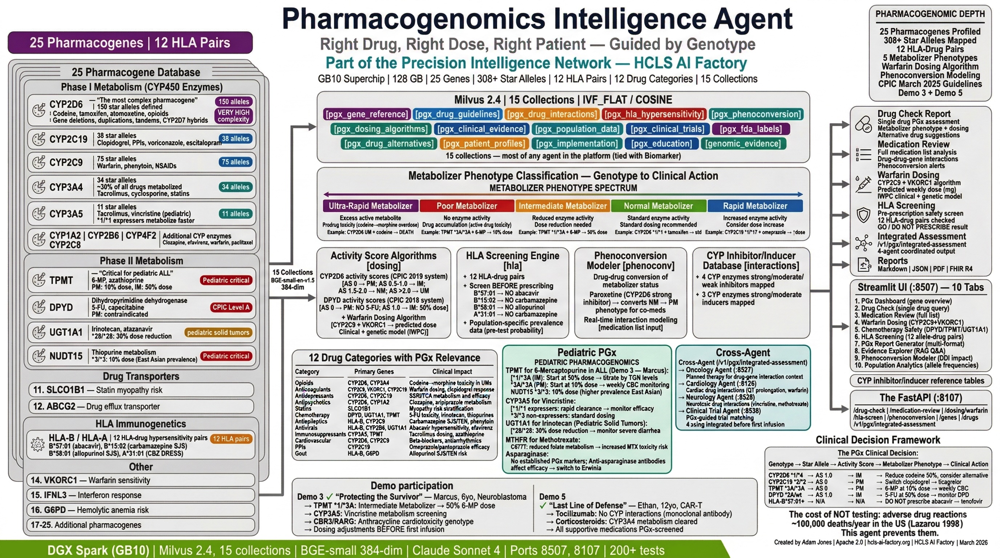

# Pharmacogenomics Intelligence Agent




*Source: [pharmacogenomics-intelligence-agent](https://github.com/ajones1923/pharmacogenomics-intelligence-agent)*

RAG-powered pharmacogenomics decision support system built on Milvus, Claude, and BGE-small-en-v1.5. Part of the HCLS AI Factory precision medicine platform.

Translates patient genotype data into actionable prescribing guidance using CPIC/DPWG guidelines, PharmGKB annotations, FDA labeling, and published clinical evidence.

**Author:** Adam Jones
**Date:** March 2026

## Architecture

```
                    +------------------+
                    |  Streamlit UI    |
                    |  :8507           |
                    +--------+---------+
                             |
                    +--------+---------+
                    |  FastAPI Server  |
                    |  :8107           |
                    +--------+---------+
                             |
              +--------------+--------------+
              |                             |
    +---------+----------+     +------------+-----------+
    |  RAG Engine        |     |  PGx Pipeline          |
    |  - Query Expansion |     |  - Dosing Algorithms   |
    |  - Multi-Collection|     |  - Phenoconversion     |
    |  - Citation Scoring|     |  - HLA Screening       |
    +---------+----------+     +------------+-----------+
              |                             |
    +---------+-----------------------------+-----------+
    |              Milvus Vector DB (:19530)            |
    |  15 collections (384-dim BGE-small-en-v1.5)      |
    +--------------------------------------------------+
    |  etcd (:2379)  |  MinIO (:9000)                  |
    +--------------------------------------------------+
```

## Collections (15)

| Collection | Description |
|---|---|
| pgx_gene_reference | Pharmacogene star allele definitions and activity scores |
| pgx_drug_guidelines | CPIC/DPWG clinical prescribing guidelines |
| pgx_drug_interactions | Drug-gene interaction records (PharmGKB) |
| pgx_hla_hypersensitivity | HLA-mediated adverse drug reaction screening |
| pgx_phenoconversion | Metabolic phenoconversion via drug-drug interactions |
| pgx_dosing_algorithms | Genotype-guided dosing algorithms and formulas |
| pgx_clinical_evidence | Published PGx clinical evidence and outcomes |
| pgx_population_data | Population-specific allele frequency data |
| pgx_clinical_trials | PGx-related clinical trials |
| pgx_fda_labels | FDA pharmacogenomic labeling information |
| pgx_drug_alternatives | Genotype-guided therapeutic alternatives |
| pgx_patient_profiles | Patient diplotype-phenotype profiles |
| pgx_implementation | Clinical PGx implementation programs |
| pgx_education | PGx educational resources and guidelines |
| genomic_evidence | Shared genomic evidence (read-only) |

## Port Map

| Service | Port |
|---|---|
| Streamlit UI | 8507 |
| FastAPI API | 8107 |
| Milvus gRPC | 19530 |
| Milvus Health | 9091 |
| MinIO | 9000 |
| etcd | 2379 |

## Quickstart

```bash
# 1. Configure environment
cp .env.example .env
# Edit .env and set ANTHROPIC_API_KEY

# 2. Start all services (Milvus + PGx agent)
docker compose up -d

# 3. Watch setup/seed progress
docker compose logs -f pgx-setup

# 4. Open the UI
open http://localhost:8507
```

### Manual Setup (without Docker)

```bash
# Install dependencies
pip install -r requirements.txt

# Create Milvus collections
python scripts/setup_collections.py --drop-existing --seed

# Seed knowledge base
python scripts/seed_knowledge.py

# Run live data ingest (CPIC, PharmGKB, FDA, PubMed, etc.)
python scripts/run_ingest.py

# Start Streamlit UI
streamlit run app/pgx_ui.py --server.port=8507

# Start FastAPI server (separate terminal)
uvicorn src.api_server:app --host 0.0.0.0 --port 8107 --workers 2
```

## Data Sources

- **CPIC** - Clinical Pharmacogenetics Implementation Consortium guidelines
- **PharmVar** - Pharmacogene Variation Consortium star allele definitions
- **PharmGKB** - Pharmacogenomics knowledge base annotations
- **FDA** - Pharmacogenomic labeling information
- **PubMed** - Pharmacogenomics literature via NCBI E-utilities
- **ClinicalTrials.gov** - PGx-related clinical trials

## Tech Stack

- **Vector DB:** Milvus 2.4 (IVF_FLAT / COSINE)
- **Embeddings:** BGE-small-en-v1.5 (384-dim)
- **LLM:** Claude (Anthropic)
- **UI:** Streamlit
- **API:** FastAPI + Uvicorn
- **VCF Parsing:** cyvcf2
- **Monitoring:** Prometheus metrics
