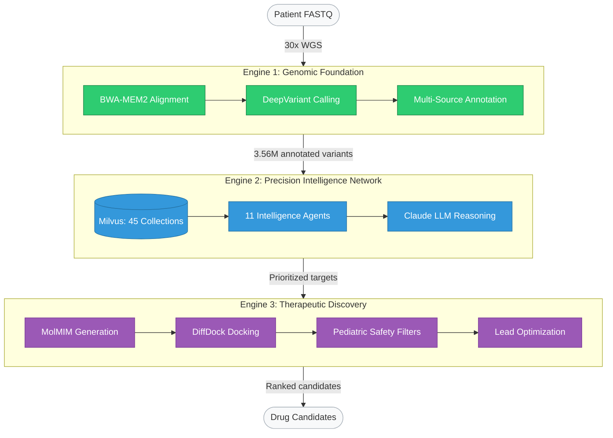
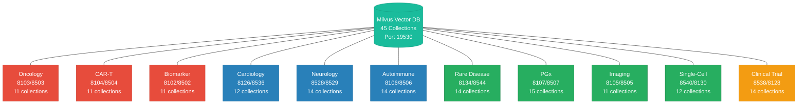

# HCLS AI Factory Architecture Diagram Research

## Comprehensive Platform Visualization Strategy for Mermaid AI and EdrawMind

**Version:** 1.0
**Author:** Adam Jones
**Date:** March 26, 2026
**Platform:** HCLS AI Factory -- Precision Medicine on NVIDIA DGX Spark
**Website:** https://hcls-ai-factory.org

---

# Table of Contents

1. [Part 1: Executive Summary](#part-1-executive-summary)
2. [Part 2: Platform Architecture Deep Dive](#part-2-platform-architecture-deep-dive)
3. [Part 3: The 11 Intelligence Agents](#part-3-the-11-intelligence-agents)
4. [Part 4: Data Architecture](#part-4-data-architecture)
5. [Part 5: Technical Stack and Infrastructure](#part-5-technical-stack-and-infrastructure)
6. [Part 6: Clinical Intelligence Detail](#part-6-clinical-intelligence-detail)
7. [Part 7: Mermaid AI Diagram Strategy](#part-7-mermaid-ai-diagram-strategy)
8. [Part 8: EdrawMind Strategy](#part-8-edrawmind-strategy)
9. [Part 9: Diagram Content Specification](#part-9-diagram-content-specification)
10. [Part 10: Implementation Recommendations](#part-10-implementation-recommendations)

---

# Part 1: Executive Summary

## 1.1 Platform Overview

The HCLS AI Factory is a three-engine, eleven-agent precision medicine platform that transforms patient DNA into drug candidates in under five hours. Built to run on the NVIDIA DGX Spark -- a desktop-class system featuring the GB10 GPU with 128 GB unified LPDDR5x memory, 20 ARM Grace CPU cores, and NVLink-C2C interconnect -- the platform delivers clinical-grade genomic analysis, AI-powered variant interpretation, and computational drug discovery in a single integrated workflow.

The three engines that power the platform are:

1. **Genomic Foundation Engine** -- GPU-accelerated FASTQ-to-VCF pipeline using NVIDIA Parabricks, DeepVariant, and BWA-MEM2, reducing whole-genome analysis from 24-48 hours (CPU) to 2-4 hours (GPU).

2. **Precision Intelligence Network** -- A Retrieval-Augmented Generation (RAG) architecture built on Milvus vector database (45 collections, 45,255+ vectors) and Anthropic Claude LLM, with 11 domain-specialized intelligence agents spanning oncology, cardiology, neurology, rare diseases, autoimmune conditions, pharmacogenomics, clinical trials, imaging, CAR-T therapy, single-cell genomics, and biomarker analysis.

3. **Therapeutic Discovery Engine** -- A 10-stage computational chemistry pipeline leveraging BioNeMo MolMIM for molecular generation, DiffDock for pose prediction, and RDKit for pharmacokinetic analysis, with 6 pediatric safety filters (blood-brain barrier permeability, cardiac safety, hepatotoxicity, teratogenicity, topological polar surface area, and molecular flexibility).

The platform processes 11.7 million variants per genome, maintains 3.56 million annotated and searchable vectors, covers 201 genes across 13 therapeutic areas with 171 druggable targets, and integrates 4.1 million ClinVar records alongside 71 million AlphaMissense predictions.

## 1.2 Purpose of This Research

This document serves as the definitive reference for creating two categories of professional architecture diagrams:

1. **Mermaid AI (.mdd files)** -- Programmatic diagrams using Mermaid.js syntax, optimized for the Mermaid AI platform at https://mermaid.ai. These diagrams will represent data flows, agent topologies, sequence interactions, state machines, and hierarchical class structures.

2. **EdrawMind (.md files)** -- Hierarchical mind maps using EdrawMind at https://www.edrawsoft.com/ad/edrawmind. These diagrams will present the platform's capabilities, therapeutic coverage, and technical architecture in an expandable, presentation-ready format suitable for executive audiences and conference materials.

Both diagram sets will be published as primary assets on https://hcls-ai-factory.org for deep-dive exploration by researchers, engineers, clinicians, and institutional stakeholders.

## 1.3 Key Statistics at a Glance

| Metric | Value |
|--------|-------|
| Total variants per genome | 11.7 million |
| Annotated searchable vectors | 3.56 million |
| ClinVar records integrated | 4.1 million |
| AlphaMissense predictions | 71 million |
| Intelligence agents | 11 |
| Milvus vector collections | 145 (unique schema definitions across all agents) |
| Unique Milvus collections (deduplicated) | 45 (after accounting for shared genomic_evidence) |
| Genes covered | 201 |
| Therapeutic areas | 13 |
| Druggable targets | 171 |
| Clinical workflows | 60+ |
| Risk calculators | 6 |
| Clinical scales | 10 |
| Rare diseases covered | 88 |
| ACMG variant criteria | 23 |
| Cell types profiled | 57 |
| Docker services (full stack) | 35+ |
| GPU speedup (genomics) | 6-12x over CPU |
| End-to-end time (DNA to drug candidates) | Under 5 hours |
| Query response time | Under 5 seconds |
| Embedding model | BGE-small-en-v1.5 (384-dim) |
| Vector similarity metric | COSINE with IVF_FLAT indexing |
| Estimated total vector entities | 45,255+ |

---

# Part 2: Platform Architecture Deep Dive

## 2.1 Engine 1: Genomic Foundation Engine

### 2.1.1 Pipeline Overview

The Genomic Foundation Engine is the entry point of the HCLS AI Factory. It accepts raw sequencing data in FASTQ format and produces a fully annotated Variant Call Format (VCF) file through a multi-stage, GPU-accelerated pipeline. The pipeline replaces what has traditionally been a 24-48 hour CPU-bound process with a 2-4 hour GPU-optimized workflow, achieving a 6-12x speedup.

### 2.1.2 Pipeline Stages

**Stage 1: Quality Control and Preprocessing**
- Input: Paired-end FASTQ files (typically 30x whole-genome sequencing)
- FastQC equivalent quality metrics computed on GPU
- Adapter trimming and quality filtering
- Output: Clean, quality-verified FASTQ pairs

**Stage 2: Read Alignment (BWA-MEM2)**
- GPU-accelerated BWA-MEM2 via NVIDIA Parabricks
- Reference genome: GRCh38/hg38 (with alt contigs)
- Produces sorted, indexed BAM files
- Duplicate marking performed in-stream
- Performance: ~45-90 minutes for 30x WGS (vs 8-16 hours CPU)

**Stage 3: Variant Calling (DeepVariant)**
- Google DeepVariant v1.6+ with Parabricks GPU acceleration
- Calls SNPs and small indels from aligned reads
- Deep learning model trained on Genome in a Bottle truth sets
- Produces per-sample gVCF for cohort analysis capability
- Performance: ~30-60 minutes for 30x WGS

**Stage 4: Structural Variant Detection**
- Long-read and short-read SV callers
- Detection of deletions, duplications, inversions, and translocations
- CNV analysis with read-depth normalization

**Stage 5: Variant Annotation**
- ClinVar integration (4.1 million records)
- AlphaMissense pathogenicity predictions (71 million)
- gnomAD population frequency annotation
- CADD, REVEL, and SpliceAI functional impact scores
- Gene-disease association mapping

**Stage 6: VCF Output and Handoff**
- Annotated VCF with multi-source evidence fields
- 11.7 million variants per whole genome
- 3.56 million variants with actionable annotations
- Automatic handoff to the Precision Intelligence Network for embedding

### 2.1.3 Performance Characteristics

| Stage | GPU Time | CPU Time | Speedup |
|-------|----------|----------|---------|
| Alignment (BWA-MEM2) | 45-90 min | 8-16 hrs | 8-12x |
| Variant Calling (DeepVariant) | 30-60 min | 6-12 hrs | 6-10x |
| Annotation | 15-30 min | 2-4 hrs | 4-8x |
| Total Pipeline | 2-4 hrs | 24-48 hrs | 6-12x |

### 2.1.4 Data Flow Diagram Content

The genomic pipeline data flow follows a strictly linear path:

```
FASTQ Input --> QC/Trim --> BWA-MEM2 Alignment --> BAM Sort/Index -->
DeepVariant Calling --> gVCF Output --> SV Detection -->
Multi-source Annotation (ClinVar + AlphaMissense + gnomAD + CADD) -->
Annotated VCF --> Vector Embedding (BGE-small-en-v1.5) -->
Milvus genomic_evidence Collection
```

### 2.1.5 Infrastructure Requirements

- NVIDIA GPU with CUDA 12.x support
- Parabricks 4.6 license (included with DGX Spark)
- Reference genome: ~3.2 GB (GRCh38)
- Annotation databases: ~50 GB (ClinVar, AlphaMissense, gnomAD)
- Working storage per sample: ~200 GB (temporary), ~50 GB (final)

## 2.2 Engine 2: Precision Intelligence Network

### 2.2.1 Architecture Overview

The Precision Intelligence Network is the cognitive core of the HCLS AI Factory. It combines a Milvus vector database with 45 purpose-built collections, the BGE-small-en-v1.5 embedding model (384 dimensions), and Anthropic Claude as the reasoning LLM, all orchestrated through 11 specialized intelligence agents.

### 2.2.2 Milvus Vector Database

**Infrastructure Stack:**
- Milvus v2.4.0 (standalone mode)
- etcd v3.5.11 (metadata store, 4 GB quota)
- MinIO RELEASE.2024-01-01 (object storage for vectors)
- Memory allocation: 8 GB for Milvus, 512 MB for etcd, 1 GB for MinIO

**Index Configuration (Uniform Across All Collections):**
- Embedding Dimension: 384 (BGE-small-en-v1.5)
- Index Type: IVF_FLAT
- Metric Type: COSINE
- nlist: 128 (standard) or 1024 (autoimmune agent)
- nprobe: 16 (search-time parameter)

**Collection Architecture:**
The 45 collections are distributed across 11 agents, with the `genomic_evidence` collection serving as a shared, read-only resource accessible by all agents. Each agent owns between 10 and 15 domain-specific collections, and each collection stores vectors alongside structured metadata fields (VARCHAR, INT32, INT64, FLOAT, BOOL) for hybrid search and filtering.

### 2.2.3 RAG Architecture

The Retrieval-Augmented Generation pipeline follows a consistent pattern across all 11 agents:

1. **Query Intake** -- User query arrives via Streamlit UI or FastAPI endpoint
2. **Query Expansion** -- Each agent implements domain-specific query expansion (synonym injection, abbreviation resolution, ontology traversal)
3. **Multi-Collection Search** -- Weighted parallel search across the agent's collection set; weights vary by detected workflow type
4. **Evidence Ranking** -- Retrieved chunks ranked by COSINE similarity, then re-ranked by relevance and recency
5. **Context Assembly** -- Top-k evidence chunks assembled into a structured prompt
6. **LLM Reasoning** -- Claude processes the context-enriched prompt with agent-specific system instructions
7. **Response Generation** -- Structured clinical output with citations, confidence levels, and guideline references
8. **Cross-Agent Consultation** -- Optional escalation to other agents when the query spans multiple domains

### 2.2.4 Knowledge Graph Structure

The platform maintains an implicit knowledge graph connecting:

```
201 Genes --> Protein Products --> Signaling Pathways --> Disease Associations -->
Therapeutic Targets --> Drug Candidates --> Clinical Trials --> Patient Outcomes
```

This knowledge graph is materialized across the 45 Milvus collections, with cross-references maintained through shared identifiers (gene symbols, OMIM IDs, NCT IDs, HPO terms, ClinVar accessions).

### 2.2.5 Claude LLM Integration

- Model: Anthropic Claude (via API)
- Authentication: ANTHROPIC_API_KEY environment variable
- Role: Reasoning engine for all 11 agents
- System prompts: Agent-specific clinical personas with safety guardrails
- Token management: Context window optimization for large evidence sets
- Streaming: Real-time response streaming to Streamlit UIs

## 2.3 Engine 3: Therapeutic Discovery Engine

### 2.3.1 Pipeline Overview

The Therapeutic Discovery Engine translates genomic findings into drug candidates through a 10-stage computational chemistry pipeline. Starting from validated therapeutic targets identified by Engine 2, it generates, evaluates, and optimizes small molecule candidates.

### 2.3.2 The 10-Stage Pipeline

**Stage 1: Target Validation**
- Input: Gene/protein targets from Precision Intelligence Network
- Druggability assessment using structural and functional criteria
- Target prioritization by clinical evidence strength

**Stage 2: Molecular Generation (MolMIM)**
- BioNeMo MolMIM generative model
- De novo molecular design conditioned on target structure
- Generation of diverse chemical scaffolds (100-500 candidates per target)

**Stage 3: ADMET Prediction**
- Absorption, Distribution, Metabolism, Excretion, Toxicity prediction
- RDKit molecular descriptor calculation
- Lipinski Rule of Five filtering

**Stage 4: Docking Simulation (DiffDock)**
- BioNeMo DiffDock for protein-ligand pose prediction
- Binding affinity scoring
- Binding mode analysis

**Stage 5: Pharmacokinetic Modeling**
- Bioavailability estimation
- Half-life prediction
- Volume of distribution calculation

**Stage 6: Selectivity Profiling**
- Off-target binding prediction
- Kinase selectivity panels (where applicable)
- hERG channel liability assessment

**Stage 7: Pediatric Safety Filtering**
Six specialized filters for pediatric populations:

| Filter | Parameter | Threshold | Rationale |
|--------|-----------|-----------|-----------|
| BBB Permeability | Blood-brain barrier penetration | Context-dependent | CNS safety in developing brains |
| Cardiac Safety | hERG IC50 | >10 uM | QT prolongation risk |
| Hepatotoxicity | DILI score | <0.5 | Liver safety |
| Teratogenicity | Structural alerts | Zero tolerance | Developmental toxicity |
| TPSA | Topological Polar Surface Area | 20-140 A^2 | Oral bioavailability |
| Flexibility | Rotatable bonds | <=10 | Drug-likeness |

**Stage 8: Lead Optimization**
- Structure-activity relationship analysis
- Multi-objective optimization (potency vs. safety vs. PK)
- Scaffold hopping for patent freedom

**Stage 9: Synthesis Planning**
- Retrosynthetic analysis
- Commercial reagent availability check
- Synthetic feasibility scoring

**Stage 10: Candidate Ranking and Report**
- Final composite scoring across all parameters
- Ranked candidate list with full property profiles
- Automated report generation with visualization

### 2.3.3 Technology Stack

| Component | Technology | Purpose |
|-----------|-----------|---------|
| Molecular Generation | BioNeMo MolMIM | De novo drug design |
| Pose Prediction | BioNeMo DiffDock | Protein-ligand docking |
| Cheminformatics | RDKit | Descriptor calculation, filtering |
| Visualization | RDKit + Py3Dmol | 2D/3D molecular visualization |
| Pipeline Orchestration | Nextflow DSL2 | Workflow management |
| Monitoring | Prometheus + Grafana | Pipeline performance tracking |

---

# Part 3: The 11 Intelligence Agents

## 3.1 Agent Architecture Overview

All 11 intelligence agents share a common architectural pattern:

- **FastAPI Backend** -- RESTful API with `/health`, `/query`, `/analyze`, and domain-specific endpoints
- **Streamlit Frontend** -- Interactive UI for clinical users
- **RAG Engine** -- Multi-collection vector search with workflow-specific weight boosting
- **Domain Models** -- Pydantic models for structured clinical data
- **Query Expansion** -- Domain-specific synonym resolution and ontology traversal
- **Cross-Agent Communication** -- HTTP-based inter-agent consultation
- **Export Engine** -- DOCX report generation for clinical documentation
- **Metrics Collection** -- Prometheus-compatible metrics for monitoring

Each agent connects to the shared Milvus instance and uses the Anthropic Claude API for reasoning.

## 3.2 Group 1: Oncology and Immunotherapy

### 3.2.1 Precision Oncology Agent

| Property | Value |
|----------|-------|
| **Ports** | FastAPI: 8103, Streamlit: 8503 |
| **Collections (11)** | onco_literature, onco_trials, onco_variants, onco_biomarkers, onco_therapies, onco_pathways, onco_guidelines, onco_resistance, onco_outcomes, onco_cases, genomic_evidence |
| **Memory Limit** | 4 GB |
| **Source Directory** | `ai_agent_adds/precision_oncology_agent/agent/` |

**Capabilities:**
- Somatic and germline variant interpretation using CIViC and OncoKB databases
- Therapy matching with level-of-evidence grading (FDA-approved, guideline-recommended, investigational)
- Resistance mechanism identification and bypass strategy suggestion
- Clinical trial matching for patients with specific molecular profiles
- Pathway analysis for identifying druggable nodes in oncogenic signaling cascades
- NCCN/ASCO/ESMO guideline cross-referencing
- Real-world outcome data integration for treatment decision support

**Clinical Workflows:**
- Molecular tumor board preparation
- Therapy selection and sequencing
- Resistance workup and next-line therapy
- Biomarker-driven trial matching
- Pathway-based combination strategy
- Outcome benchmarking

**Ingest Parsers:**
- CIViC evidence parser (onco_variants)
- OncoKB annotation parser (onco_variants, onco_biomarkers)
- Clinical trials parser (onco_trials)
- Literature parser (onco_literature)
- Guideline parser (onco_guidelines)
- Resistance mechanism parser (onco_resistance)
- Outcome data parser (onco_outcomes)
- Pathway parser (onco_pathways)

### 3.2.2 CAR-T Intelligence Agent

| Property | Value |
|----------|-------|
| **Ports** | FastAPI: 8104, Streamlit: 8504 |
| **Collections (11)** | cart_literature, cart_trials, cart_constructs, cart_assays, cart_manufacturing, cart_safety, cart_biomarkers, cart_regulatory, cart_sequences, cart_realworld, genomic_evidence |
| **Memory Limit** | 4 GB |
| **Source Directory** | `ai_agent_adds/cart_intelligence_agent/` |

**Capabilities:**
- CAR construct design analysis (scFv, hinge, transmembrane, costimulatory, signaling domains)
- Manufacturing process optimization (lentiviral vs. non-viral, autologous vs. allogeneic)
- Cytokine release syndrome (CRS) and immune effector cell-associated neurotoxicity syndrome (ICANS) risk prediction
- Biomarker monitoring for CAR-T expansion, persistence, and exhaustion
- Regulatory pathway navigation (FDA RMAT, EMA PRIME, breakthrough therapy)
- Real-world evidence integration from CIBMTR registry data
- Safety signal detection from FAERS pharmacovigilance data

**Clinical Workflows:**
- CAR-T eligibility assessment
- Construct comparison and selection
- Manufacturing feasibility analysis
- CRS/ICANS risk stratification
- Post-infusion monitoring protocol
- Bridging therapy selection
- Regulatory submission preparation

**Ingest Parsers:**
- CIBMTR registry parser (cart_realworld)
- UniProt antigen structure parser (cart_sequences)
- DailyMed drug label parser (cart_regulatory)
- FAERS safety event parser (cart_safety)
- Construct design parser (cart_constructs)
- Assay results parser (cart_assays)
- Manufacturing records parser (cart_manufacturing)
- Biomarker panel parser (cart_biomarkers)
- Literature parser (cart_literature)
- Clinical trials parser (cart_trials)

### 3.2.3 Precision Biomarker Agent

| Property | Value |
|----------|-------|
| **Ports** | FastAPI: 8102, Streamlit: 8502 |
| **Collections (11)** | biomarker_reference, biomarker_genetic_variants, biomarker_pgx_rules, biomarker_disease_trajectories, biomarker_clinical_evidence, biomarker_nutrition, biomarker_drug_interactions, biomarker_aging_markers, biomarker_genotype_adjustments, biomarker_monitoring, genomic_evidence |
| **Memory Limit** | 4 GB |
| **Source Directory** | `ai_agent_adds/precision_biomarker_agent/` |

**Capabilities:**
- Reference biomarker definitions with genotype-adjusted normal ranges
- Pharmacogenomic dosing rule integration (CPIC guidelines)
- Disease trajectory prediction from longitudinal biomarker data
- Gene-drug interaction screening
- Epigenetic aging clock analysis (Horvath, Hannum, PhenoAge, GrimAge markers)
- Genotype-aware nutrition guideline generation
- Condition-specific monitoring protocol design
- Critical value alerting with genotype context

**Clinical Workflows:**
- Comprehensive biomarker panel interpretation
- PGx-informed dosing adjustment
- Disease progression monitoring
- Nutritional genomics consultation
- Aging biomarker assessment
- Drug interaction screening

## 3.3 Group 2: Specialty Medicine

### 3.3.1 Cardiology Intelligence Agent

| Property | Value |
|----------|-------|
| **Ports** | FastAPI: 8126, Streamlit: 8536 |
| **Collections (12)** | cardio_literature, cardio_trials, cardio_imaging, cardio_electrophysiology, cardio_heart_failure, cardio_valvular, cardio_prevention, cardio_interventional, cardio_oncology, cardio_devices, cardio_guidelines, cardio_hemodynamics |
| **Memory Limit** | 4 GB |
| **Source Directory** | `ai_agent_adds/cardiology_intelligence_agent/` |

**Capabilities:**
- Heart failure management by phenotype (HFrEF, HFmrEF, HFpEF) with NYHA class and ACC/AHA staging
- Guideline-directed medical therapy (GDMT) optimization engine
- Cardiac imaging interpretation (echocardiography, CMR, CT, nuclear)
- Electrophysiology interpretation (ECG, Holter, EP studies)
- Valvular heart disease severity grading and intervention timing
- Cardio-oncology toxicity monitoring
- Hemodynamic parameter analysis (invasive and non-invasive)
- AI diagnostic and wearable device database

**Risk Calculators (6):**

| Calculator | Purpose | Scoring |
|-----------|---------|---------|
| ASCVD Pooled Cohort Equations | 10-year ASCVD risk | Goff 2013 coefficients |
| HEART Score | Chest pain evaluation | 0-10 (low/moderate/high) |
| CHA2DS2-VASc | AF stroke risk | 0-9 |
| HAS-BLED | Bleeding risk on anticoagulation | 0-9 |
| MAGGIC | Heart failure mortality | 0-51 |
| EuroSCORE II | Cardiac surgical mortality | Logistic model |

**Clinical Workflows (12):**
Heart failure evaluation, CAD assessment/acute coronary syndrome, arrhythmia management, valvular disease assessment, preventive risk assessment, cardio-oncology consultation, stress test interpretation, cardiac MRI interpretation, general cardiology query, acute decompensated heart failure, post-MI secondary prevention, myocarditis/pericarditis evaluation.

**Ingest Parsers:**
- PubMed cardiology parser (cardio_literature)
- ClinicalTrials.gov parser (cardio_trials)
- ECG pattern parser (cardio_electrophysiology)
- Guideline parser (cardio_guidelines)
- Imaging protocol parser (cardio_imaging)
- Hemodynamics reference parser (cardio_hemodynamics)
- Device catalog parser (cardio_devices)

### 3.3.2 Neurology Intelligence Agent

| Property | Value |
|----------|-------|
| **Ports** | FastAPI: 8528, Streamlit: 8529 |
| **Collections (14)** | neuro_literature, neuro_trials, neuro_imaging, neuro_electrophysiology, neuro_degenerative, neuro_cerebrovascular, neuro_epilepsy, neuro_oncology, neuro_ms, neuro_movement, neuro_headache, neuro_neuromuscular, neuro_guidelines, genomic_evidence |
| **Memory Limit** | 4 GB |
| **Source Directory** | `ai_agent_adds/neurology_intelligence_agent/` |

**Capabilities:**
- Stroke evaluation with NIHSS scoring, ASPECTS grading, and tPA/thrombectomy eligibility
- Neurodegenerative disease differential diagnosis (AD, PD, FTD, ALS, DLB)
- Epilepsy syndrome classification with EEG pattern matching
- CNS tumor evaluation with WHO 2021 classification and molecular profiling
- Multiple sclerosis phenotyping with DMT selection guidance
- Movement disorder assessment with MDS-UPDRS integration
- Headache classification per ICHD-3 criteria
- Neuromuscular disease evaluation with EMG/NCS pattern recognition

**Clinical Scales (10):**

| Scale | Purpose | Score Range |
|-------|---------|-------------|
| NIHSS | Stroke severity | 0-42 |
| GCS | Consciousness level | 3-15 |
| MoCA | Cognitive screening | 0-30 |
| MMSE | Cognitive assessment | 0-30 |
| EDSS | MS disability | 0-10 |
| MDS-UPDRS | Parkinson's severity | 0-260 |
| mRS | Functional outcome | 0-6 |
| ASPECTS | CT stroke imaging | 0-10 |
| Hoehn and Yahr | PD staging | 1-5 |
| Barthel Index | Activities of daily living | 0-100 |

**Clinical Workflows (9):**
Acute stroke evaluation, dementia evaluation, epilepsy focus localization, brain tumor workup, MS monitoring and DMT selection, Parkinson's assessment, headache classification, neuromuscular evaluation, general neurology consultation.

**Ingest Parsers:**
- PubMed neurology parser (neuro_literature)
- Neuroimaging findings parser (neuro_imaging)
- EEG pattern parser (neuro_electrophysiology)

### 3.3.3 Precision Autoimmune Agent

| Property | Value |
|----------|-------|
| **Ports** | FastAPI: 8106, Streamlit: 8506 |
| **Collections (14)** | autoimmune_clinical_documents, autoimmune_patient_labs, autoimmune_autoantibody_panels, autoimmune_hla_associations, autoimmune_disease_criteria, autoimmune_disease_activity, autoimmune_flare_patterns, autoimmune_biologic_therapies, autoimmune_pgx_rules, autoimmune_clinical_trials, autoimmune_literature, autoimmune_patient_timelines, autoimmune_cross_disease, genomic_evidence |
| **Memory Limit** | 4 GB |
| **Source Directory** | `ai_agent_adds/precision_autoimmune_agent/` |

**Capabilities:**
- Autoantibody panel interpretation with disease pattern matching
- HLA allele-disease risk mapping (HLA-B27/ankylosing spondylitis, HLA-DRB1/RA, etc.)
- ACR/EULAR classification criteria evaluation for 20+ autoimmune conditions
- Disease activity scoring (DAS28 for RA, SLEDAI for SLE, BVAS for vasculitis)
- Flare prediction from longitudinal biomarker pattern analysis
- Biologic therapy selection with pharmacogenomic integration
- Cross-disease/overlap syndrome identification
- Patient diagnostic timeline construction and odyssey analysis

**Disease Activity Scales:**
- DAS28 (Disease Activity Score 28) -- Rheumatoid Arthritis
- SLEDAI (Systemic Lupus Erythematosus Disease Activity Index)
- BVAS (Birmingham Vasculitis Activity Score)
- CDAI (Clinical Disease Activity Index)
- HAQ-DI (Health Assessment Questionnaire Disability Index)

**Clinical Workflows:**
- New patient autoimmune workup
- Autoantibody panel interpretation
- Disease activity assessment
- Flare prediction and prevention
- Biologic therapy selection
- Cross-disease overlap evaluation
- Diagnostic timeline reconstruction

## 3.4 Group 3: Diagnostics and Genomics

### 3.4.1 Rare Disease Diagnostic Agent

| Property | Value |
|----------|-------|
| **Ports** | FastAPI: 8134, Streamlit: 8544 |
| **Collections (14)** | rd_phenotypes (18,000), rd_diseases (10,000), rd_genes (5,000), rd_variants (500,000), rd_literature (50,000), rd_trials (8,000), rd_therapies (2,000), rd_case_reports (20,000), rd_guidelines (3,000), rd_pathways (2,000), rd_registries (1,500), rd_natural_history (5,000), rd_newborn_screening (80), genomic_evidence (3,560,000) |
| **Memory Limit** | 4 GB |
| **Source Directory** | `ai_agent_adds/rare_disease_diagnostic_agent/` |

**Capabilities:**
- HPO phenotype-driven differential diagnosis using information content scoring
- WES/WGS variant interpretation with ACMG 23-criteria classification
- 88+ rare disease knowledge base with OMIM and Orphanet integration
- Metabolic screening pathway analysis with newborn screening ACT sheets
- Case report matching for phenotype-genotype correlation
- Gene therapy eligibility assessment
- Patient registry and natural history study integration
- Undiagnosed Disease Program support workflow

**ACMG Classification Criteria (23):**
- Pathogenic strength: PVS1, PS1-PS4, PM1-PM6, PP1-PP5
- Benign strength: BA1, BS1-BS4, BP1-BP7

**Clinical Workflows (11):**
Phenotype-driven diagnosis, WES/WGS interpretation, metabolic screening, dysmorphology evaluation, neurogenetic evaluation, cardiac genetics workup, connective tissue disorder assessment, inborn errors of metabolism, gene therapy eligibility, undiagnosed disease program, general rare disease consultation.

**Ingest Parsers:**
- Orphanet disease parser (rd_diseases)
- HPO phenotype parser (rd_phenotypes)
- OMIM gene-disease parser (rd_genes)
- Gene therapy pipeline parser (rd_therapies)

### 3.4.2 Pharmacogenomics (PGx) Intelligence Agent

| Property | Value |
|----------|-------|
| **Ports** | FastAPI: 8107, Streamlit: 8507 |
| **Collections (15)** | pgx_gene_reference, pgx_drug_guidelines, pgx_drug_interactions, pgx_hla_hypersensitivity, pgx_phenoconversion, pgx_dosing_algorithms, pgx_clinical_evidence, pgx_population_data, pgx_clinical_trials, pgx_fda_labels, pgx_drug_alternatives, pgx_patient_profiles, pgx_implementation, pgx_education, genomic_evidence |
| **Memory Limit** | 4 GB |
| **Source Directory** | `ai_agent_adds/pharmacogenomics_intelligence_agent/` |

**Capabilities:**
- Star allele calling and diplotype-to-phenotype translation for all CPIC pharmacogenes
- CPIC and DPWG guideline-driven prescribing recommendations
- HLA-mediated adverse drug reaction screening (HLA-B*57:01/abacavir, HLA-B*15:02/carbamazepine, etc.)
- Phenoconversion detection via concomitant drug-drug interactions
- Genotype-guided dosing algorithm execution (warfarin, tacrolimus, fluoropyrimidines, thiopurines)
- Population-specific allele frequency contextualization
- FDA pharmacogenomic label information retrieval
- Therapeutic alternative suggestions when primary drug is contraindicated
- Clinical PGx implementation program guidance

**Specialized Modules:**
- **PGx Pipeline** -- End-to-end star allele calling to clinical recommendation
- **Phenoconversion Engine** -- CYP2D6 metabolic status correction for inhibitor/inducer co-medications
- **HLA Screener** -- Pre-prescription HLA hypersensitivity risk screening
- **Dosing Engine** -- Pharmacokinetic model-based dose adjustment

**Ingest Parsers:**
- CPIC guideline parser (pgx_drug_guidelines)
- PharmVar allele parser (pgx_gene_reference)
- PharmGKB interaction parser (pgx_drug_interactions)
- FDA label parser (pgx_fda_labels)
- Population frequency parser (pgx_population_data)
- PubMed PGx literature parser (pgx_clinical_evidence)
- ClinicalTrials.gov PGx parser (pgx_clinical_trials)

### 3.4.3 Imaging Intelligence Agent

| Property | Value |
|----------|-------|
| **Ports** | FastAPI: 8105, Streamlit: 8505 |
| **Collections (11)** | imaging_literature, imaging_trials, imaging_findings, imaging_protocols, imaging_devices, imaging_anatomy, imaging_benchmarks, imaging_guidelines, imaging_report_templates, imaging_datasets, genomic_evidence |
| **Memory Limit** | 8 GB |
| **Source Directory** | `ai_agent_adds/imaging_intelligence_agent/agent/` |

**Capabilities:**
- Radiology finding pattern matching and differential generation
- ACR Appropriateness Criteria integration for imaging protocol selection
- FDA-cleared AI/ML medical device database with performance benchmarks
- Structured radiology report template generation
- Cross-modal imaging correlation (e.g., CT finding prompting MRI recommendation)
- Public imaging dataset catalog (TCIA, PhysioNet, CheXpert, RSNA challenges)
- Anatomy reference library for standardized reporting terminology
- FLARE framework integration for federated learning on imaging data

**Clinical Workflows:**
- Finding interpretation and differential generation
- Protocol selection based on clinical indication
- AI device performance comparison
- Structured report drafting
- Follow-up recommendation generation
- Research dataset identification

### 3.4.4 Single-Cell Intelligence Agent

| Property | Value |
|----------|-------|
| **Ports** | FastAPI: 8540, Streamlit: 8130 |
| **Collections (12)** | sc_cell_types (5,000), sc_markers (50,000), sc_spatial (10,000), sc_tme (8,000), sc_drug_response (25,000), sc_literature (50,000), sc_methods (2,000), sc_datasets (15,000), sc_trajectories (8,000), sc_pathways (20,000), sc_clinical (12,000), genomic_evidence (3,560,000) |
| **Memory Limit** | 8 GB |
| **Source Directory** | `ai_agent_adds/single_cell_intelligence_agent/` |

**Capabilities:**
- Cell type annotation with Cell Ontology mapping and marker gene validation
- Tumor microenvironment (TME) profiling with immune phenotype classification (hot, cold, excluded, immunosuppressive)
- Spatial transcriptomics niche analysis (Visium, MERFISH, Xenium, CODEX platforms)
- Drug sensitivity/resistance prediction from single-cell transcriptomic signatures
- Cellular trajectory inference (differentiation, exhaustion, EMT)
- Cell-cell communication analysis via ligand-receptor interaction profiling
- Clinical biomarker discovery from single-cell to patient outcome correlation
- CAR-T target antigen validation at single-cell resolution

**57 Cell Types Profiled (Partial List):**
Immune: CD4+ T helper, CD8+ cytotoxic T, regulatory T (Treg), natural killer (NK), B cells, plasma cells, macrophages (M1/M2), dendritic cells (cDC1/cDC2/pDC), monocytes, mast cells, neutrophils, eosinophils, basophils.
Stromal: fibroblasts, cancer-associated fibroblasts (CAFs), pericytes, endothelial cells, smooth muscle cells.
Epithelial: basal, luminal, club, ciliated, goblet, neuroendocrine.
Neural: neurons, astrocytes, oligodendrocytes, microglia, Schwann cells.

**Clinical Workflows (11):**
Cell type annotation, TME profiling, drug response prediction, subclonal architecture analysis, spatial niche characterization, trajectory analysis, ligand-receptor interaction mapping, biomarker discovery, CAR-T target validation, treatment monitoring, general single-cell consultation.

**Ingest Parsers:**
- CellxGene atlas parser (sc_datasets, sc_cell_types)
- Marker gene database parser (sc_markers)
- TME profile parser (sc_tme)

## 3.5 Group 4: Clinical Operations

### 3.5.1 Clinical Trial Intelligence Agent

| Property | Value |
|----------|-------|
| **Ports** | FastAPI: 8538, Streamlit: 8128 |
| **Collections (14)** | trial_protocols (5,000), trial_eligibility (50,000), trial_endpoints (20,000), trial_sites (30,000), trial_investigators (5,000), trial_results (3,000), trial_regulatory (2,000), trial_literature (10,000), trial_biomarkers (3,000), trial_safety (20,000), trial_rwe (2,000), trial_adaptive (500), trial_guidelines (1,000), genomic_evidence (100,000) |
| **Memory Limit** | 4 GB |
| **Source Directory** | `ai_agent_adds/clinical_trial_intelligence_agent/` |

**Capabilities:**
- Protocol design assistance with endpoint selection and sample size estimation
- Patient-trial matching based on eligibility criteria and genomic profile
- Site selection optimization using enrollment performance data
- Eligibility criteria optimization to maximize enrollment while maintaining scientific rigor
- Adaptive trial design recommendation (Bayesian, seamless, platform, basket, umbrella)
- Safety signal detection from adverse event profiles
- Regulatory document preparation (IND, CSR, briefing documents)
- Competitive intelligence across therapeutic areas
- Diversity assessment for enrollment representativeness
- Decentralized trial planning support

**Decision Support:**
- Enrollment feasibility prediction
- Interim analysis recommendation
- Regulatory risk assessment
- Site performance forecasting

**Clinical Workflows (11):**
Protocol design, patient matching, site selection, eligibility optimization, adaptive design, safety signal detection, regulatory document preparation, competitive intelligence, diversity assessment, decentralized trial planning, general trial consultation.

**Ingest Parsers:**
- ClinicalTrials.gov protocol parser (trial_protocols, trial_eligibility, trial_endpoints, trial_sites)
- PubMed trial literature parser (trial_literature)
- Regulatory document parser (trial_regulatory)

---

# Part 4: Data Architecture

## 4.1 Complete Milvus Collection Inventory

### 4.1.1 Oncology Agent Collections (11)

| Collection | Estimated Entities | Description |
|-----------|-------------------|-------------|
| onco_literature | 3,000 | PubMed/PMC research chunks by cancer type |
| onco_trials | 500 | ClinicalTrials.gov summaries with biomarker criteria |
| onco_variants | 5,000 | Actionable somatic/germline variants (CIViC, OncoKB) |
| onco_biomarkers | 1,000 | Predictive/prognostic biomarkers and assays |
| onco_therapies | 500 | Approved and investigational therapies with MOA |
| onco_pathways | 300 | Signaling pathways and druggable nodes |
| onco_guidelines | 500 | NCCN/ASCO/ESMO guideline recommendations |
| onco_resistance | 400 | Resistance mechanisms and bypass strategies |
| onco_outcomes | 500 | Real-world treatment outcome records |
| onco_cases | 200 | De-identified patient case snapshots |
| genomic_evidence | 3,560,000 | Shared VCF-derived genomic evidence |

### 4.1.2 CAR-T Agent Collections (11)

| Collection | Estimated Entities | Description |
|-----------|-------------------|-------------|
| cart_literature | 3,000 | Published research and patents |
| cart_trials | 500 | ClinicalTrials.gov CAR-T records |
| cart_constructs | 200 | CAR construct designs |
| cart_assays | 300 | In vitro/in vivo assay results |
| cart_manufacturing | 150 | Manufacturing/CMC records |
| cart_safety | 500 | Pharmacovigilance and post-market safety |
| cart_biomarkers | 200 | Predictive and pharmacodynamic biomarkers |
| cart_regulatory | 100 | FDA regulatory milestones |
| cart_sequences | 300 | Molecular and structural data |
| cart_realworld | 500 | Real-world evidence and outcomes |
| genomic_evidence | shared | (counted once in total) |

### 4.1.3 Biomarker Agent Collections (11)

| Collection | Estimated Entities | Description |
|-----------|-------------------|-------------|
| biomarker_reference | 500 | Reference biomarker definitions and ranges |
| biomarker_genetic_variants | 2,000 | Genetic variants affecting biomarkers |
| biomarker_pgx_rules | 300 | CPIC pharmacogenomic dosing rules |
| biomarker_disease_trajectories | 500 | Disease progression trajectories |
| biomarker_clinical_evidence | 3,000 | Published clinical evidence |
| biomarker_nutrition | 200 | Genotype-aware nutrition guidelines |
| biomarker_drug_interactions | 500 | Gene-drug interactions |
| biomarker_aging_markers | 150 | Epigenetic aging clock markers |
| biomarker_genotype_adjustments | 300 | Genotype-based reference range adjustments |
| biomarker_monitoring | 200 | Condition-specific monitoring protocols |
| genomic_evidence | shared | (counted once in total) |

### 4.1.4 Cardiology Agent Collections (12)

| Collection | Estimated Entities | Description |
|-----------|-------------------|-------------|
| cardio_literature | 3,000 | Published cardiology research |
| cardio_trials | 500 | Cardiovascular clinical trials |
| cardio_imaging | 200 | Cardiac imaging protocols and criteria |
| cardio_electrophysiology | 150 | ECG/Holter/EP/device electrophysiology |
| cardio_heart_failure | 150 | Heart failure guidelines by phenotype |
| cardio_valvular | 120 | Valvular disease severity and interventions |
| cardio_prevention | 150 | Prevention guidelines and risk factors |
| cardio_interventional | 100 | Interventional procedures and outcomes |
| cardio_oncology | 100 | Cardiotoxicity monitoring and management |
| cardio_devices | 80 | AI diagnostic and wearable devices |
| cardio_guidelines | 150 | ACC/AHA/ESC guideline recommendations |
| cardio_hemodynamics | 80 | Hemodynamic parameters and references |

### 4.1.5 Neurology Agent Collections (14)

| Collection | Estimated Entities | Description |
|-----------|-------------------|-------------|
| neuro_literature | 150,000 | Published neurology literature |
| neuro_trials | 25,000 | Neurological condition trials |
| neuro_imaging | 50,000 | Neuroimaging findings and patterns |
| neuro_electrophysiology | 30,000 | EEG/EMG/NCS/evoked potentials |
| neuro_degenerative | 15,000 | Neurodegenerative disease evidence |
| neuro_cerebrovascular | 20,000 | Stroke and cerebrovascular disease |
| neuro_epilepsy | 12,000 | Epilepsy syndromes and seizure data |
| neuro_oncology | 8,000 | CNS tumors and neuro-oncology |
| neuro_ms | 10,000 | Multiple sclerosis evidence |
| neuro_movement | 12,000 | Movement disorders |
| neuro_headache | 8,000 | Headache disorders and migraine |
| neuro_neuromuscular | 10,000 | Neuromuscular diseases |
| neuro_guidelines | 5,000 | Clinical practice guidelines |
| genomic_evidence | 500,000 | Shared genomic evidence |

### 4.1.6 Autoimmune Agent Collections (14)

| Collection | Estimated Entities | Description |
|-----------|-------------------|-------------|
| autoimmune_clinical_documents | 1,000 | Ingested patient records |
| autoimmune_patient_labs | 2,000 | Lab results with flag analysis |
| autoimmune_autoantibody_panels | 500 | Autoantibody test result panels |
| autoimmune_hla_associations | 200 | HLA allele to disease risk mapping |
| autoimmune_disease_criteria | 300 | ACR/EULAR classification criteria |
| autoimmune_disease_activity | 200 | Activity scoring references |
| autoimmune_flare_patterns | 300 | Flare prediction biomarker patterns |
| autoimmune_biologic_therapies | 200 | Biologic drug database with PGx |
| autoimmune_pgx_rules | 100 | Pharmacogenomic dosing rules |
| autoimmune_clinical_trials | 500 | Autoimmune clinical trials |
| autoimmune_literature | 3,000 | Published literature |
| autoimmune_patient_timelines | 300 | Patient diagnostic timelines |
| autoimmune_cross_disease | 150 | Cross-disease/overlap syndromes |
| genomic_evidence | shared | (counted once in total) |

### 4.1.7 Rare Disease Agent Collections (14)

| Collection | Estimated Entities | Description |
|-----------|-------------------|-------------|
| rd_phenotypes | 18,000 | HPO phenotype terms with IC scores |
| rd_diseases | 10,000 | OMIM/Orphanet rare disease entries |
| rd_genes | 5,000 | Disease-associated genes with constraints |
| rd_variants | 500,000 | ACMG-classified genetic variants |
| rd_literature | 50,000 | Published rare disease literature |
| rd_trials | 8,000 | Rare disease clinical trials |
| rd_therapies | 2,000 | Approved/investigational therapies |
| rd_case_reports | 20,000 | Phenotype-genotype case reports |
| rd_guidelines | 3,000 | Clinical practice guidelines |
| rd_pathways | 2,000 | Metabolic/signaling pathways |
| rd_registries | 1,500 | Patient registries |
| rd_natural_history | 5,000 | Disease natural history milestones |
| rd_newborn_screening | 80 | Newborn screening conditions |
| genomic_evidence | 3,560,000 | Shared genomic evidence |

### 4.1.8 PGx Agent Collections (15)

| Collection | Estimated Entities | Description |
|-----------|-------------------|-------------|
| pgx_gene_reference | 500 | Pharmacogene star allele definitions |
| pgx_drug_guidelines | 300 | CPIC/DPWG prescribing guidelines |
| pgx_drug_interactions | 1,000 | Drug-gene interactions (PharmGKB) |
| pgx_hla_hypersensitivity | 100 | HLA-mediated ADR screening |
| pgx_phenoconversion | 200 | Metabolic phenoconversion rules |
| pgx_dosing_algorithms | 150 | Genotype-guided dosing formulas |
| pgx_clinical_evidence | 3,000 | Published PGx clinical evidence |
| pgx_population_data | 500 | Population allele frequencies |
| pgx_clinical_trials | 500 | PGx-related clinical trials |
| pgx_fda_labels | 400 | FDA pharmacogenomic labels |
| pgx_drug_alternatives | 300 | Genotype-guided alternatives |
| pgx_patient_profiles | 200 | Patient diplotype-phenotype profiles |
| pgx_implementation | 100 | Clinical PGx implementation programs |
| pgx_education | 100 | PGx educational resources |
| genomic_evidence | shared | (counted once in total) |

### 4.1.9 Imaging Agent Collections (11)

| Collection | Estimated Entities | Description |
|-----------|-------------------|-------------|
| imaging_literature | 3,000 | Published imaging research |
| imaging_trials | 500 | AI-in-imaging clinical trials |
| imaging_findings | 1,000 | Finding templates and patterns |
| imaging_protocols | 300 | Acquisition protocols |
| imaging_devices | 500 | FDA-cleared AI/ML devices |
| imaging_anatomy | 200 | Anatomical structure references |
| imaging_benchmarks | 300 | Model performance benchmarks |
| imaging_guidelines | 200 | ACR/RSNA clinical guidelines |
| imaging_report_templates | 150 | Structured report templates |
| imaging_datasets | 200 | Public imaging datasets |
| genomic_evidence | shared | (counted once in total) |

### 4.1.10 Single-Cell Agent Collections (12)

| Collection | Estimated Entities | Description |
|-----------|-------------------|-------------|
| sc_cell_types | 5,000 | Cell type annotations with markers |
| sc_markers | 50,000 | Gene markers for cell identification |
| sc_spatial | 10,000 | Spatial transcriptomics niches |
| sc_tme | 8,000 | Tumor microenvironment profiles |
| sc_drug_response | 25,000 | Drug sensitivity predictions |
| sc_literature | 50,000 | Published single-cell literature |
| sc_methods | 2,000 | Analytical methods and tools |
| sc_datasets | 15,000 | Reference datasets and atlases |
| sc_trajectories | 8,000 | Cellular trajectory data |
| sc_pathways | 20,000 | Signaling/metabolic pathways |
| sc_clinical | 12,000 | Clinical correlation data |
| genomic_evidence | 3,560,000 | Shared genomic evidence |

### 4.1.11 Clinical Trial Agent Collections (14)

| Collection | Estimated Entities | Description |
|-----------|-------------------|-------------|
| trial_protocols | 5,000 | Clinical trial protocol documents |
| trial_eligibility | 50,000 | Inclusion/exclusion criteria |
| trial_endpoints | 20,000 | Primary/secondary/exploratory endpoints |
| trial_sites | 30,000 | Investigational site data |
| trial_investigators | 5,000 | PI research profiles |
| trial_results | 3,000 | Published trial results |
| trial_regulatory | 2,000 | Regulatory submissions/decisions |
| trial_literature | 10,000 | Clinical research literature |
| trial_biomarkers | 3,000 | Biomarker assays and validation |
| trial_safety | 20,000 | Adverse event profiles |
| trial_rwe | 2,000 | Real-world evidence studies |
| trial_adaptive | 500 | Adaptive design precedents |
| trial_guidelines | 1,000 | ICH/FDA/EMA guidelines |
| genomic_evidence | 100,000 | Shared genomic evidence |

## 4.2 Embedding Model Details

**Model:** BAAI/bge-small-en-v1.5
**Dimensions:** 384
**Architecture:** BERT-based bi-encoder
**Training:** Contrastive learning on large English text corpora
**Max Sequence Length:** 512 tokens
**Normalization:** L2-normalized embeddings
**Similarity Metric:** COSINE (all collections)
**Index Type:** IVF_FLAT (all collections)
**nlist Parameter:** 128 (standard) or 1024 (autoimmune agent)

The choice of BGE-small-en-v1.5 balances embedding quality with computational efficiency on the DGX Spark platform. The 384-dimensional vectors provide strong semantic similarity for biomedical text while maintaining manageable memory footprint across 45 collections.

## 4.3 Cross-Agent Data Sharing

### 4.3.1 The genomic_evidence Shared Collection

The `genomic_evidence` collection is the primary mechanism for cross-agent data sharing. It is created and populated by the Genomic Foundation Engine (Engine 1) and consumed read-only by all 11 intelligence agents. Its estimated size is 3,560,000 entities, representing the annotated variant set from ClinVar, AlphaMissense, and gnomAD.

**Schema Fields (common across agents):**
- `gene` -- Gene symbol (HUGO nomenclature)
- `variant` -- Variant designation (rs ID or HGVS notation)
- `clinical_significance` or `classification` -- ClinVar/ACMG classification
- `condition` -- Associated condition or disease
- `evidence_summary` or `evidence_text` -- Evidence narrative
- `source` -- Data source identifier

### 4.3.2 Cross-Agent Consultation Pattern

When a query spans multiple domains (e.g., a cardiac genetics case requiring both cardiology and rare disease expertise), agents communicate through HTTP-based cross-agent consultation:

1. Primary agent detects cross-domain need through query expansion
2. Primary agent sends structured consultation request to secondary agent's FastAPI endpoint
3. Secondary agent executes its own RAG pipeline and returns structured findings
4. Primary agent integrates cross-agent findings into its final response

### 4.3.3 Knowledge Graph Connectivity

The implicit knowledge graph connects entities across collections through shared identifiers:

| Identifier Type | Connecting Collections | Example |
|----------------|----------------------|---------|
| Gene Symbol (HGNC) | All genomic collections | BRCA1, TP53, EGFR |
| OMIM ID | rd_diseases, rd_genes | OMIM:113705 |
| NCT ID | All trial collections | NCT05123456 |
| HPO Term | rd_phenotypes, rd_diseases | HP:0001250 |
| ClinVar Accession | genomic_evidence, all variant collections | RCV000012345 |
| PubMed ID | All literature collections | PMID:34567890 |
| Drug Name | therapy/drug collections across agents | Entrectinib |

## 4.4 Data Volume Summary

| Category | Entity Count |
|----------|-------------|
| genomic_evidence (shared) | 3,560,000 |
| Neurology agent (13 own collections) | 355,000 |
| Rare Disease agent (13 own collections) | 624,580 |
| Single-Cell agent (11 own collections) | 205,000 |
| Clinical Trial agent (13 own collections) | 151,500 |
| PGx agent (14 own collections) | 7,350 |
| Oncology agent (10 own collections) | 11,900 |
| Cardiology agent (12 own collections) | 4,830 |
| CAR-T agent (10 own collections) | 5,750 |
| Biomarker agent (10 own collections) | 7,650 |
| Imaging agent (10 own collections) | 6,350 |
| Autoimmune agent (13 own collections) | 8,750 |
| **Total (with shared genomic_evidence counted once)** | **~4,948,660** |

---

# Part 5: Technical Stack and Infrastructure

## 5.1 Complete Technology Inventory

### 5.1.1 Compute Platform

| Component | Specification |
|-----------|--------------|
| System | NVIDIA DGX Spark |
| GPU | GB10 (Grace Blackwell) |
| CPU | 20 ARM Grace cores |
| Memory | 128 GB unified LPDDR5x |
| Interconnect | NVLink-C2C |
| CUDA | 12.x |

### 5.1.2 Genomics Stack

| Tool | Version | Purpose |
|------|---------|---------|
| NVIDIA Parabricks | 4.6 | GPU-accelerated genomics toolkit |
| BWA-MEM2 | Latest (via Parabricks) | Short-read alignment |
| DeepVariant | 1.6+ (via Parabricks) | Deep learning variant calling |
| htslib/samtools | Latest | BAM/VCF file manipulation |
| bcftools | Latest | VCF processing and filtering |

### 5.1.3 AI and LLM Stack

| Tool | Version | Purpose |
|------|---------|---------|
| Anthropic Claude | Latest API | Reasoning LLM for all agents |
| BGE-small-en-v1.5 | BAAI release | Text embedding (384-dim) |
| BioNeMo MolMIM | NGC NIM | Molecular generation |
| BioNeMo DiffDock | NGC NIM | Protein-ligand docking |

### 5.1.4 Database Stack

| Tool | Version | Purpose |
|------|---------|---------|
| Milvus | 2.4.0 | Vector database (45 collections) |
| etcd | 3.5.11 | Milvus metadata store |
| MinIO | 2024-01-01 | Milvus object storage |
| ClinVar | Latest | Variant clinical significance |
| AlphaMissense | v1 | Missense pathogenicity predictions |
| gnomAD | v4 | Population allele frequencies |

### 5.1.5 Chemistry Stack

| Tool | Purpose |
|------|---------|
| RDKit | Cheminformatics, molecular descriptors, filtering |
| Py3Dmol | 3D molecular visualization |
| Open Babel | File format conversion |

### 5.1.6 Web Framework Stack

| Tool | Purpose |
|------|---------|
| FastAPI | RESTful API backends for all agents |
| Streamlit | Interactive UIs for all agents |
| Flask | Landing page and health monitoring portal |
| Pydantic | Data validation and serialization |
| Uvicorn | ASGI server |

### 5.1.7 Infrastructure Stack

| Tool | Version | Purpose |
|------|---------|---------|
| Docker | Latest | Container runtime |
| Docker Compose | 3.8 | Multi-service orchestration |
| Nextflow | DSL2 | Pipeline workflow management |
| Caddy | Latest | Reverse proxy and TLS |

### 5.1.8 Monitoring Stack

| Tool | Version | Purpose |
|------|---------|---------|
| Prometheus | 2.49.1 / 2.52.0 | Metrics collection |
| Grafana | 10.3.1 / 11.0.0 | Dashboard visualization |
| Node Exporter | 1.8.0 | Host system metrics |
| NVIDIA DCGM | Latest | GPU metrics |

### 5.1.9 Python Libraries

| Library | Purpose |
|---------|---------|
| pymilvus | Milvus Python SDK |
| anthropic | Anthropic Claude API client |
| sentence-transformers | BGE embedding model |
| loguru | Structured logging |
| python-docx | DOCX report generation |
| pytest | Unit and integration testing |
| httpx | Async HTTP client |

## 5.2 Docker Compose Architecture

The platform uses two Docker Compose configurations:

### 5.2.1 Full Stack (docker-compose.dgx-spark.yml)

**Infrastructure Services (3):**
- `milvus-etcd` -- Metadata coordination (512 MB)
- `milvus-minio` -- Object storage for vectors (1 GB)
- `milvus` -- Vector database engine (8 GB)

**Intelligence Agent Services (11):**
- `precision-biomarker-agent` (4 GB)
- `precision-oncology-agent` (4 GB)
- `cart-intelligence-agent` (4 GB)
- `imaging-intelligence-agent` (8 GB)
- `precision-autoimmune-agent` (4 GB)
- `cardiology-intelligence-agent` (4 GB)
- `clinical-trial-intelligence-agent` (4 GB)
- `rare-disease-diagnostic-agent` (4 GB)
- `neurology-intelligence-agent` (4 GB)
- `single-cell-intelligence-agent` (8 GB)
- `pharmacogenomics-intelligence-agent` (4 GB)

**Portal and Monitoring Services (3):**
- `landing-page` -- Flask health dashboard (256 MB)
- `prometheus` -- Metrics collection (1 GB)
- `grafana` -- Dashboard visualization (512 MB)

**Total Memory Allocation:** ~60 GB (within 128 GB unified memory budget)

### 5.2.2 Reference Stack (hcls-ai-factory-public/docker-compose.yml)

A streamlined configuration including:
- Genomics pipeline web portal
- RAG chat pipeline
- Drug discovery pipeline
- Landing page
- Grafana + Prometheus
- Node Exporter
- 3 representative agents (CAR-T, Imaging, Oncology)

## 5.3 Service Port Map

### 5.3.1 Infrastructure Ports

| Service | Port | Protocol |
|---------|------|----------|
| Milvus gRPC | 19530 | gRPC |
| Milvus Health | 9091 | HTTP |
| MinIO API | 9000 | HTTP |
| MinIO Console | 9001 | HTTP |
| etcd | 2379 | gRPC |

### 5.3.2 Agent FastAPI Ports

| Agent | FastAPI Port |
|-------|-------------|
| Precision Biomarker | 8102 |
| Precision Oncology | 8103 |
| CAR-T Intelligence | 8104 |
| Imaging Intelligence | 8105 |
| Precision Autoimmune | 8106 |
| Pharmacogenomics | 8107 |
| Cardiology Intelligence | 8126 |
| Clinical Trial Intelligence | 8538 |
| Neurology Intelligence | 8528 |
| Single-Cell Intelligence | 8540 |
| Rare Disease Diagnostic | 8134 |

### 5.3.3 Agent Streamlit Ports

| Agent | Streamlit Port |
|-------|---------------|
| Precision Biomarker | 8502 |
| Precision Oncology | 8503 |
| CAR-T Intelligence | 8504 |
| Imaging Intelligence | 8505 |
| Precision Autoimmune | 8506 |
| Pharmacogenomics | 8507 |
| Cardiology Intelligence | 8536 |
| Clinical Trial Intelligence | 8128 |
| Neurology Intelligence | 8529 |
| Single-Cell Intelligence | 8130 |
| Rare Disease Diagnostic | 8544 |

### 5.3.4 Portal and Monitoring Ports

| Service | Port |
|---------|------|
| Landing Page (Flask) | 8080 |
| Grafana | 3000 |
| Prometheus | 9099 |
| Node Exporter | 9100 |

## 5.4 Monitoring Stack Detail

### 5.4.1 Prometheus Configuration

- Scrape interval: 15 seconds
- Retention: 30 days
- Storage: TSDB with lifecycle API enabled
- Alert rules: Stored in `monitoring/prometheus/alerts/`
- Targets: All agent `/metrics` endpoints, Node Exporter, Milvus health

### 5.4.2 Grafana Dashboards

- **HCLS Overview Dashboard** -- Platform-wide health, agent status, query latency
- **Agent Performance Dashboard** -- Per-agent query volume, latency percentiles, error rates
- **Milvus Dashboard** -- Collection sizes, search latency, index build status
- **Infrastructure Dashboard** -- CPU, memory, disk, GPU utilization via Node Exporter and DCGM

### 5.4.3 Health Monitor Script

The `health-monitor.sh` script (19 KB) performs 11-service health checks with automatic restart capability and watchdog functionality. It monitors all agent endpoints, Milvus health, and infrastructure services on a configurable interval.

---

# Part 6: Clinical Intelligence Detail

## 6.1 Therapeutic Area Coverage

The platform covers 13 therapeutic areas with 201 genes mapped to diseases, pathways, and drug targets:

| Therapeutic Area | Gene Count | Example Genes | Primary Agent(s) |
|-----------------|------------|---------------|-------------------|
| Oncology (Solid Tumors) | 45 | TP53, EGFR, KRAS, BRAF, ALK, ROS1, MET, RET, NTRK1/2/3 | Oncology |
| Hematologic Malignancies | 25 | BCR-ABL1, FLT3, IDH1/2, NPM1, DNMT3A, TET2 | Oncology, CAR-T |
| Cardiovascular | 18 | LDLR, PCSK9, MYBPC3, SCN5A, KCNQ1, TTN, LMNA | Cardiology |
| Neurodegenerative | 15 | APP, PSEN1/2, MAPT, GRN, C9orf72, SNCA, LRRK2, GBA | Neurology |
| Epilepsy | 12 | SCN1A, SCN2A, KCNQ2, CDKL5, STXBP1, MECP2 | Neurology |
| Movement Disorders | 10 | PARK2, PINK1, DJ-1, HTT, ATXN1/2/3, ATP13A2 | Neurology |
| Autoimmune | 15 | HLA-DRB1, CTLA4, PTPN22, STAT4, IRF5, BLK | Autoimmune |
| Rare Disease (Metabolic) | 18 | CFTR, PAH, GBA, GAA, IDUA, IDS, HEXA, HEXB | Rare Disease |
| Rare Disease (Neurogenetic) | 12 | SMN1, DMD, NF1, NF2, TSC1/2, FMR1, MECP2 | Rare Disease |
| Pharmacogenomics | 15 | CYP2D6, CYP2C19, CYP2C9, CYP3A5, DPYD, TPMT, UGT1A1, VKORC1 | PGx |
| Immunotherapy | 8 | CD19, CD20, CD22, BCMA, CD38, PD-L1, CTLA-4, LAG-3 | CAR-T, Oncology |
| Cardiac Genetics | 5 | MYH7, TNNT2, DSP, PKP2, RYR2 | Cardiology, Rare Disease |
| Imaging Genomics | 3 | IDH1, MGMT, 1p19q | Imaging, Neurology |

## 6.2 Clinical Workflows Inventory

### 6.2.1 Oncology Workflows (6)
1. Molecular tumor board preparation
2. Therapy selection and sequencing
3. Resistance workup and next-line therapy
4. Biomarker-driven trial matching
5. Pathway-based combination strategy
6. Outcome benchmarking

### 6.2.2 CAR-T Workflows (7)
1. CAR-T eligibility assessment
2. Construct comparison and selection
3. Manufacturing feasibility analysis
4. CRS/ICANS risk stratification
5. Post-infusion monitoring protocol
6. Bridging therapy selection
7. Regulatory submission preparation

### 6.2.3 Biomarker Workflows (6)
1. Comprehensive biomarker panel interpretation
2. PGx-informed dosing adjustment
3. Disease progression monitoring
4. Nutritional genomics consultation
5. Aging biomarker assessment
6. Drug interaction screening

### 6.2.4 Cardiology Workflows (12)
1. Heart failure evaluation
2. CAD assessment / acute coronary syndrome
3. Arrhythmia management
4. Valvular disease assessment
5. Preventive risk assessment
6. Cardio-oncology consultation
7. Stress test interpretation
8. Cardiac MRI interpretation
9. General cardiology query
10. Acute decompensated heart failure
11. Post-MI secondary prevention
12. Myocarditis / pericarditis evaluation

### 6.2.5 Neurology Workflows (9)
1. Acute stroke evaluation
2. Dementia evaluation
3. Epilepsy focus localization
4. Brain tumor workup
5. MS monitoring and DMT selection
6. Parkinson's assessment
7. Headache classification
8. Neuromuscular evaluation
9. General neurology consultation

### 6.2.6 Autoimmune Workflows (7)
1. New patient autoimmune workup
2. Autoantibody panel interpretation
3. Disease activity assessment
4. Flare prediction and prevention
5. Biologic therapy selection
6. Cross-disease overlap evaluation
7. Diagnostic timeline reconstruction

### 6.2.7 Rare Disease Workflows (11)
1. Phenotype-driven diagnosis
2. WES/WGS interpretation
3. Metabolic screening
4. Dysmorphology evaluation
5. Neurogenetic evaluation
6. Cardiac genetics workup
7. Connective tissue disorder assessment
8. Inborn errors of metabolism
9. Gene therapy eligibility
10. Undiagnosed disease program
11. General rare disease consultation

### 6.2.8 PGx Workflows (4+)
1. Star allele calling to clinical recommendation
2. Pre-prescription HLA screening
3. Phenoconversion assessment
4. Genotype-guided dosing

### 6.2.9 Imaging Workflows (6)
1. Finding interpretation and differential generation
2. Protocol selection based on clinical indication
3. AI device performance comparison
4. Structured report drafting
5. Follow-up recommendation generation
6. Research dataset identification

### 6.2.10 Single-Cell Workflows (11)
1. Cell type annotation
2. TME profiling
3. Drug response prediction
4. Subclonal architecture analysis
5. Spatial niche characterization
6. Trajectory analysis
7. Ligand-receptor interaction mapping
8. Biomarker discovery
9. CAR-T target validation
10. Treatment monitoring
11. General single-cell consultation

### 6.2.11 Clinical Trial Workflows (11)
1. Protocol design
2. Patient matching
3. Site selection
4. Eligibility optimization
5. Adaptive design
6. Safety signal detection
7. Regulatory document preparation
8. Competitive intelligence
9. Diversity assessment
10. Decentralized trial planning
11. General trial consultation

**Total Clinical Workflows: 90+**

## 6.3 Risk Calculators (6)

All six risk calculators are implemented in the Cardiology Intelligence Agent with full validation:

| Calculator | Input Parameters | Output | Evidence Source |
|-----------|-----------------|--------|-----------------|
| **ASCVD Pooled Cohort** | Age, sex, race, total cholesterol, HDL-C, SBP, BP treatment, diabetes, smoking | 10-year ASCVD risk % | Goff 2013, ACC/AHA |
| **HEART Score** | History, ECG, age, risk factors, troponin | 0-10 score, risk category | Six et al. 2008 |
| **CHA2DS2-VASc** | CHF, HTN, age, diabetes, stroke, vascular disease, sex | 0-9 score, annual stroke risk % | Lip et al. 2010 |
| **HAS-BLED** | HTN, abnormal renal/liver, stroke, bleeding, labile INR, elderly, drugs/alcohol | 0-9 score, bleeding risk | Pisters et al. 2010 |
| **MAGGIC** | Age, sex, EF, NYHA, SBP, BMI, creatinine, COPD, diabetes, smoking, HF duration, BB, ACEi | 0-51 score, 1/3-year mortality % | Pocock et al. 2013 |
| **EuroSCORE II** | 18+ operative and patient factors | % predicted mortality | Nashef et al. 2012 |

## 6.4 Clinical Scales (10)

All ten clinical scales are implemented in the Neurology Intelligence Agent:

| Scale | Full Name | Items | Score Range | Domains Assessed |
|-------|-----------|-------|-------------|------------------|
| **NIHSS** | NIH Stroke Scale | 15 | 0-42 | Consciousness, gaze, visual, motor, ataxia, sensory, language, dysarthria |
| **GCS** | Glasgow Coma Scale | 3 | 3-15 | Eye opening, verbal response, motor response |
| **MoCA** | Montreal Cognitive Assessment | 8 | 0-30 | Visuospatial, naming, attention, language, abstraction, memory, orientation |
| **MMSE** | Mini-Mental State Examination | 5 | 0-30 | Orientation, registration, attention, recall, language |
| **EDSS** | Expanded Disability Status Scale | 8 | 0-10 | Visual, brainstem, pyramidal, cerebellar, sensory, bowel/bladder, cerebral, ambulation |
| **MDS-UPDRS** | Movement Disorder Society UPDRS | 4 parts | 0-260 | Non-motor, motor (daily living, examination), motor complications |
| **mRS** | Modified Rankin Scale | 1 | 0-6 | Functional independence after stroke |
| **ASPECTS** | Alberta Stroke Program Early CT Score | 10 | 0-10 | MCA territory ischemic change regions |
| **Hoehn and Yahr** | Hoehn and Yahr Staging | 1 | 1-5 | Parkinson's disease progression stage |
| **Barthel Index** | Barthel ADL Index | 10 | 0-100 | Feeding, bathing, grooming, dressing, bowel, bladder, toilet, transfers, mobility, stairs |

## 6.5 Rare Disease Coverage

The Rare Disease Diagnostic Agent covers 88+ rare diseases across categories:

**Neurogenetic (20+):** Rett syndrome, Angelman syndrome, Prader-Willi syndrome, Fragile X, spinal muscular atrophy, Duchenne/Becker muscular dystrophy, neurofibromatosis type 1 and 2, tuberous sclerosis complex, Huntington disease, spinocerebellar ataxias, Charcot-Marie-Tooth disease, Dravet syndrome, and others.

**Metabolic (25+):** Phenylketonuria, cystic fibrosis, Gaucher disease, Fabry disease, Pompe disease, mucopolysaccharidoses (MPS I-VII), galactosemia, maple syrup urine disease, medium-chain acyl-CoA dehydrogenase deficiency, methylmalonic acidemia, propionic acidemia, urea cycle defects, and others.

**Cardiac Genetics (10+):** Hypertrophic cardiomyopathy, dilated cardiomyopathy, arrhythmogenic right ventricular cardiomyopathy, long QT syndrome, Brugada syndrome, catecholaminergic polymorphic ventricular tachycardia, Marfan syndrome, Loeys-Dietz syndrome, and others.

**Connective Tissue (8+):** Ehlers-Danlos syndrome (multiple types), osteogenesis imperfecta, Marfan syndrome, Stickler syndrome, and others.

**Hematologic (10+):** Sickle cell disease, thalassemias, hemophilia A and B, von Willebrand disease, hereditary spherocytosis, and others.

**Immunodeficiency (15+):** Severe combined immunodeficiency (SCID), common variable immunodeficiency, X-linked agammaglobulinemia, chronic granulomatous disease, hereditary angioedema, and others.

## 6.6 ACMG Criteria

The 23 ACMG/AMP variant classification criteria used by the Rare Disease and PGx agents:

**Pathogenic/Likely Pathogenic Criteria:**
- PVS1: Null variant in gene where LOF is a known mechanism
- PS1-PS4: Strong pathogenic evidence (same amino acid change, functional studies, prevalence, de novo)
- PM1-PM6: Moderate pathogenic evidence (hot spot, absent from controls, cosegregation, novel missense, assumed de novo, in-frame indel)
- PP1-PP5: Supporting pathogenic evidence (cosegregation, literature, computational, patient phenotype, reputable source)

**Benign/Likely Benign Criteria:**
- BA1: Stand-alone benign (allele frequency >5%)
- BS1-BS4: Strong benign evidence (high frequency, functional studies, lack of segregation, in trans with pathogenic)
- BP1-BP7: Supporting benign evidence (missense in truncating gene, observed in trans, in-frame indel, synonymous, computational, reputable source, no phenotype)

---

# Part 7: Mermaid AI Diagram Strategy

## 7.1 Analysis of Mermaid Diagram Types

Mermaid.js (https://mermaid.ai) supports multiple diagram types, each suited to different architectural views. Below is an analysis of the best diagram types for each view of the HCLS AI Factory.

### 7.1.1 Flowchart (graph TD/LR)

**Best For:** Platform overview, data flow, pipeline stages
**Strengths:** Familiar to all audiences, supports directional flow, grouping via subgraphs, and styling
**Recommended Use Cases:**
- Three-engine platform overview (Engine 1 --> Engine 2 --> Engine 3)
- Genomic pipeline stages (FASTQ --> VCF)
- RAG architecture pipeline (Query --> Embed --> Search --> Rank --> Generate)
- Drug discovery 10-stage pipeline
- Patient journey end-to-end flow

**Syntax Notes:**
- Use `graph TD` for vertical (top-down) flows
- Use `graph LR` for horizontal (left-right) flows
- Use `subgraph` blocks to group engine components
- Use `classDef` for color coding by engine

### 7.1.2 Sequence Diagram

**Best For:** Agent interactions, RAG pipeline timing, cross-agent consultation
**Strengths:** Shows temporal ordering, participant interactions, and async communication
**Recommended Use Cases:**
- RAG query execution flow (User --> UI --> API --> Embedding --> Milvus --> LLM --> Response)
- Cross-agent consultation sequence
- Genomic pipeline handoff to Intelligence Network
- Clinical workflow execution (multi-step diagnostic process)

**Syntax Notes:**
- Participants: User, Streamlit, FastAPI, Milvus, Claude, Agent
- Use `activate`/`deactivate` for concurrent processing
- Use `loop` for multi-collection search
- Use `alt` for conditional workflow branching

### 7.1.3 Class Diagram

**Best For:** Agent architecture, collection schema relationships, data model hierarchy
**Strengths:** Shows inheritance, composition, and relationship cardinality
**Recommended Use Cases:**
- Agent class hierarchy (BaseAgent --> 11 specialized agents)
- CollectionConfig schema relationships
- Pydantic model inheritance trees
- Knowledge graph entity relationships

**Syntax Notes:**
- Use `class` for agent definitions
- Use `<|--` for inheritance
- Use `*--` for composition
- Use `o--` for aggregation

### 7.1.4 State Diagram

**Best For:** Pipeline stage transitions, workflow states, agent lifecycle
**Strengths:** Shows states, transitions, and conditions
**Recommended Use Cases:**
- Genomic pipeline state machine (Raw --> QC --> Aligned --> Called --> Annotated)
- Drug candidate lifecycle (Generated --> Filtered --> Docked --> Scored --> Selected)
- Clinical workflow state transitions
- Agent health state machine (Starting --> Healthy --> Degraded --> Unhealthy --> Restarting)

### 7.1.5 Mindmap

**Best For:** Hierarchical capability overview, therapeutic area coverage
**Strengths:** Radial layout, unlimited depth, visual hierarchy
**Recommended Use Cases:**
- Platform capability map (root --> 3 engines --> components)
- Therapeutic area coverage (13 areas --> genes --> diseases)
- Agent capability hierarchy
- Technology stack map

**Syntax Notes:**
- Use `mindmap` directive
- Indent for hierarchy
- First line is root node

### 7.1.6 Timeline

**Best For:** Development roadmap, pipeline timing, clinical workflow sequence
**Strengths:** Temporal sequence with milestones
**Recommended Use Cases:**
- Genomic pipeline timing (2-4 hours breakdown by stage)
- Platform development milestones
- Patient journey timeline

### 7.1.7 Pie Chart

**Best For:** Collection distribution, entity counts, gene allocation
**Strengths:** Proportional display, simple and clear
**Recommended Use Cases:**
- Collection count by agent
- Entity distribution across agents
- Therapeutic area gene distribution

### 7.1.8 Entity Relationship Diagram

**Best For:** Database schema, collection field relationships
**Strengths:** Shows cardinality, keys, and relationships
**Recommended Use Cases:**
- Milvus collection field schemas
- Cross-collection foreign key relationships
- Knowledge graph entity connections

## 7.2 Recommended Mermaid Color Coding Strategy

### 7.2.1 By Engine

| Engine | Color | Hex Code |
|--------|-------|----------|
| Genomic Foundation | Green | #2ECC71 |
| Precision Intelligence | Blue | #3498DB |
| Therapeutic Discovery | Purple | #9B59B6 |

### 7.2.2 By Agent Group

| Agent Group | Color | Hex Code |
|------------|-------|----------|
| Oncology and Immunotherapy | Red | #E74C3C |
| Specialty Medicine | Blue | #2980B9 |
| Diagnostics and Genomics | Green | #27AE60 |
| Clinical Operations | Orange | #F39C12 |

### 7.2.3 By Data Type

| Data Type | Color | Hex Code |
|-----------|-------|----------|
| Genomic/Variant | Deep Green | #1E8449 |
| Clinical/Workflow | Navy Blue | #1A5276 |
| Literature/Evidence | Amber | #D4AC0D |
| Infrastructure | Gray | #707B7C |

### 7.2.4 Mermaid classDef Syntax

```
classDef engine1 fill:#2ECC71,stroke:#1E8449,color:#fff
classDef engine2 fill:#3498DB,stroke:#2471A3,color:#fff
classDef engine3 fill:#9B59B6,stroke:#7D3C98,color:#fff
classDef oncoGroup fill:#E74C3C,stroke:#CB4335,color:#fff
classDef specialtyGroup fill:#2980B9,stroke:#2471A3,color:#fff
classDef diagnosticGroup fill:#27AE60,stroke:#1E8449,color:#fff
classDef opsGroup fill:#F39C12,stroke:#D68910,color:#fff
classDef infra fill:#707B7C,stroke:#566573,color:#fff
```

## 7.3 Layout Considerations for 11-Agent Topology

### 7.3.1 Radial Layout

For the agent network topology diagram, a radial layout with Milvus at the center provides the clearest visualization:

- Center: Milvus Vector Database
- Inner ring: The 3 engines
- Outer ring: 11 agents grouped by category
- Connection lines: Weighted by collection count (thicker = more collections)

### 7.3.2 Grid Layout

For comparative views, a 4x3 grid with grouped agents:

Row 1: Oncology | CAR-T | Biomarker (Oncology and Immunotherapy group)
Row 2: Cardiology | Neurology | Autoimmune (Specialty Medicine group)
Row 3: Rare Disease | PGx | Imaging | Single-Cell (Diagnostics group)
Row 4: Clinical Trial (Operations group, centered)

### 7.3.3 Hierarchical Layout

For the platform overview, a strict top-down hierarchy:

Level 0: Patient DNA (input)
Level 1: Genomic Foundation Engine
Level 2: Precision Intelligence Network (with 11 agent branches)
Level 3: Therapeutic Discovery Engine
Level 4: Drug Candidates (output)

## 7.4 Specific Mermaid Syntax Recommendations

### 7.4.1 Platform Overview (Flowchart)

Recommended structure:
- Use `graph TD` for vertical flow
- 3 main `subgraph` blocks for engines
- Engine 2 `subgraph` contains 4 nested `subgraph` blocks for agent groups
- Use `-->` for data flow connections
- Use `-.->` for optional/async connections
- Apply `classDef` color coding per engine

### 7.4.2 Agent Network (Flowchart with radial approximation)

Recommended structure:
- Use `graph LR` or `graph TD`
- Central `Milvus` node connected to all 11 agents
- Each agent shows port numbers in node labels
- Collection count shown on connection labels
- Color-coded by agent group

### 7.4.3 Data Flow Sequence

Recommended structure:
- Use `sequenceDiagram`
- Participants: Patient, Genomics, Milvus, Agent, Claude, Clinician
- Show the complete data lifecycle from DNA to clinical recommendation

### 7.4.4 Collection Schema (ER Diagram)

Recommended structure:
- Use `erDiagram`
- Show the genomic_evidence shared collection at center
- Show relationships to each agent's collection set
- Include key fields and cardinality

---

# Part 8: EdrawMind Strategy

## 8.1 Analysis of EdrawMind Mind Map Structure

EdrawMind (https://www.edrawsoft.com/ad/edrawmind) is a professional mind mapping tool that excels at hierarchical visualization. For the HCLS AI Factory, EdrawMind provides a complementary perspective to Mermaid's programmatic diagrams, focusing on expandable hierarchies that executive audiences can navigate interactively.

### 8.1.1 Strengths for This Use Case

- **Expandable hierarchy** -- Users can collapse/expand branches to control detail level
- **Rich formatting** -- Icons, images, color themes, and styled branches
- **Presentation mode** -- Built-in slideshow from mind map branches
- **Export flexibility** -- PNG, SVG, PDF, PowerPoint, Word, HTML
- **Cross-platform** -- Desktop (Windows, Mac), web, and mobile

### 8.1.2 Limitations to Address

- Linear markdown export may lose visual styling
- Deep nesting (>5 levels) can become visually cluttered
- Radial layouts work best with balanced branch counts
- Very large maps (>200 nodes) may require splitting into multiple maps

## 8.2 Recommended Node Hierarchy

### 8.2.1 Root Node

```
HCLS AI Factory
Precision Medicine on NVIDIA DGX Spark
Patient DNA --> Drug Candidates in <5 Hours
```

### 8.2.2 Level 1: Three Engines

| Branch | Icon Recommendation | Color |
|--------|-------------------|-------|
| Genomic Foundation Engine | DNA helix | Green (#2ECC71) |
| Precision Intelligence Network | Brain/AI | Blue (#3498DB) |
| Therapeutic Discovery Engine | Molecule | Purple (#9B59B6) |

### 8.2.3 Level 2: Engine Components

**Genomic Foundation Engine:**
- GPU-Accelerated Pipeline
- Annotation Databases
- Performance Metrics

**Precision Intelligence Network:**
- Milvus Vector Database
- 11 Intelligence Agents
- Claude LLM Integration
- RAG Architecture

**Therapeutic Discovery Engine:**
- Molecular Generation (MolMIM)
- Docking (DiffDock)
- Safety Filtering
- Lead Optimization

### 8.2.4 Level 3: Agent Groups and Details

**11 Intelligence Agents** expands to:
- Oncology and Immunotherapy (3 agents)
  - Precision Oncology Agent (11 collections)
  - CAR-T Intelligence Agent (11 collections)
  - Precision Biomarker Agent (11 collections)
- Specialty Medicine (3 agents)
  - Cardiology Intelligence Agent (12 collections)
  - Neurology Intelligence Agent (14 collections)
  - Precision Autoimmune Agent (14 collections)
- Diagnostics and Genomics (4 agents)
  - Rare Disease Diagnostic Agent (14 collections)
  - PGx Intelligence Agent (15 collections)
  - Imaging Intelligence Agent (11 collections)
  - Single-Cell Intelligence Agent (12 collections)
- Clinical Operations (1 agent)
  - Clinical Trial Intelligence Agent (14 collections)

### 8.2.5 Level 4: Per-Agent Capabilities

Each agent branch expands to show:
- Collections (count and names)
- Clinical Workflows (list)
- Specialized Features (calculators, scales, unique capabilities)
- Port Numbers (FastAPI / Streamlit)

### 8.2.6 Level 5: Detailed Features

For key agents, a fifth level provides granular detail:
- Individual collection names with entity counts
- Workflow step breakdowns
- Calculator/scale parameters

## 8.3 Color and Icon Recommendations

### 8.3.1 Branch Color Scheme

| Branch Level | Color Strategy |
|-------------|---------------|
| Level 1 (Engines) | Primary engine colors (green, blue, purple) |
| Level 2 (Components) | Lighter shades of parent color |
| Level 3 (Agent Groups) | Agent group colors (red, blue, green, orange) |
| Level 4 (Agents) | Individual agent accent colors |
| Level 5 (Details) | Neutral gray for data-heavy content |

### 8.3.2 Recommended Icons

| Concept | Icon | EdrawMind Category |
|---------|------|-------------------|
| Genomics | DNA helix | Science |
| AI/LLM | Brain | Technology |
| Chemistry | Molecule | Science |
| Heart/Cardiology | Heart | Medical |
| Brain/Neurology | Brain | Medical |
| Shield/Autoimmune | Shield | Objects |
| Database | Cylinder | Technology |
| Clinical Trial | Clipboard | Business |
| Microscope/Imaging | Microscope | Science |
| Cell/Single-Cell | Circle | Science |
| Medicine/PGx | Pill | Medical |
| Rare Disease | Star | Symbols |
| Biomarker | Target | Objects |
| CAR-T | Syringe | Medical |

## 8.4 Branch Organization Options

### 8.4.1 Option A: Organize by Technical Architecture

```
Root: HCLS AI Factory
  |- Engine 1: Genomic Foundation
  |   |- Pipeline Stages
  |   |- Tools (Parabricks, BWA-MEM2, DeepVariant)
  |   |- Performance Metrics
  |- Engine 2: Precision Intelligence
  |   |- Milvus Infrastructure
  |   |- 11 Agents (grouped by domain)
  |   |- RAG Architecture
  |   |- Claude Integration
  |- Engine 3: Therapeutic Discovery
  |   |- 10-Stage Pipeline
  |   |- Pediatric Safety Filters
  |   |- Lead Optimization
  |- Infrastructure
  |   |- Docker Compose
  |   |- Monitoring (Prometheus/Grafana)
  |   |- Service Ports
```

**Best For:** Engineering audiences, deployment documentation, technical deep dives

### 8.4.2 Option B: Organize by Therapeutic Area

```
Root: HCLS AI Factory
  |- Oncology
  |   |- Oncology Agent (variants, therapies, trials)
  |   |- CAR-T Agent (constructs, manufacturing, safety)
  |   |- Single-Cell Agent (TME, drug response)
  |- Cardiovascular
  |   |- Cardiology Agent (12 collections, 6 calculators)
  |   |- Biomarker Agent (reference ranges, monitoring)
  |- Neurology
  |   |- Neurology Agent (14 collections, 10 scales)
  |   |- Imaging Agent (neuroimaging protocols)
  |- Rare Disease
  |   |- Rare Disease Agent (88+ diseases, ACMG)
  |   |- PGx Agent (star alleles, dosing)
  |- Autoimmune
  |   |- Autoimmune Agent (14 collections, activity scales)
  |- Clinical Operations
  |   |- Clinical Trial Agent (protocol design, matching)
  |- Platform Foundation
  |   |- Genomic Engine
  |   |- Drug Discovery Engine
  |   |- Infrastructure
```

**Best For:** Clinical audiences, institutional presentations, therapeutic area focus

### 8.4.3 Option C: Organize by Data Flow (Patient Journey)

```
Root: Patient DNA to Drug Candidates
  |- Input: Patient Genome (FASTQ)
  |- Stage 1: Genomic Analysis (2-4 hours)
  |   |- Alignment (BWA-MEM2)
  |   |- Variant Calling (DeepVariant)
  |   |- Annotation (ClinVar, AlphaMissense)
  |   |- Output: 11.7M variants
  |- Stage 2: Variant Interpretation
  |   |- Agent Selection (by disease context)
  |   |- RAG Search (45 collections)
  |   |- Clinical Analysis (Claude LLM)
  |   |- Output: Prioritized targets
  |- Stage 3: Drug Discovery
  |   |- Molecular Generation (MolMIM)
  |   |- Docking (DiffDock)
  |   |- Safety Filtering (6 pediatric filters)
  |   |- Output: Ranked drug candidates
  |- Output: Clinical Report
```

**Best For:** Demo presentations, patient-facing materials, workflow documentation

### 8.4.4 Recommended Approach

Create three EdrawMind maps corresponding to Options A, B, and C above. Each serves a different audience and communication purpose:

- **Map A (Technical):** For engineering teams, deployment documentation, and infrastructure planning
- **Map B (Therapeutic):** For clinical audiences, institutional stakeholders, and conference presentations
- **Map C (Patient Journey):** For demos, patient advocacy groups, and executive summaries

## 8.5 Export Format Considerations

### 8.5.1 For hcls-ai-factory.org

- **Primary:** SVG export for web embedding (scalable, interactive)
- **Secondary:** PNG export at 4K resolution for static pages
- **Tertiary:** HTML export for standalone interactive viewing

### 8.5.2 For Presentations

- **PowerPoint:** Direct EdrawMind-to-PPTX export with slide-per-branch
- **PDF:** High-resolution PDF for print and institutional distribution

### 8.5.3 For Documentation

- **Markdown:** EdrawMind markdown export for inclusion in GitHub repositories
- **Word:** DOCX export for institutional documents

### 8.5.4 Recommended Sizes

- Web embedding: 1920x1080 minimum viewport
- Print: 300 DPI, A1 or A0 poster size for full platform maps
- Presentation: 16:9 aspect ratio, 1920x1080

---

# Part 9: Diagram Content Specification

## 9.1 Diagram 1: Platform Overview (3-Engine Flow)

### 9.1.1 Purpose
Show the complete end-to-end platform architecture with the three engines as primary blocks and data flow between them.

### 9.1.2 Mermaid Implementation
**Type:** Flowchart (graph TD)
**Nodes:**
- Input node: "Patient FASTQ" (rounded rectangle)
- Engine 1 subgraph: "Genomic Foundation Engine" containing BWA-MEM2, DeepVariant, Annotation
- Engine 2 subgraph: "Precision Intelligence Network" containing Milvus, 11 Agents, Claude
- Engine 3 subgraph: "Therapeutic Discovery Engine" containing MolMIM, DiffDock, RDKit
- Output node: "Drug Candidates" (rounded rectangle)

**Connections:**
- FASTQ --> Engine 1 ("11.7M variants")
- Engine 1 --> Engine 2 ("3.56M annotated variants")
- Engine 2 --> Engine 3 ("Prioritized targets")
- Engine 3 --> Output ("Ranked candidates")

**Color Coding:** Green (Engine 1), Blue (Engine 2), Purple (Engine 3)

### 9.1.3 EdrawMind Implementation
Root node splits into three main branches for each engine, with key metrics on connector lines.

## 9.2 Diagram 2: Agent Network Topology (11 Agents with Ports)

### 9.2.1 Purpose
Show all 11 agents connected to the central Milvus database, with port numbers, collection counts, and group membership visible.

### 9.2.2 Mermaid Implementation
**Type:** Flowchart (graph LR or graph TD)
**Central Node:** Milvus (19530) - 45 Collections
**Agent Nodes (with ports):**

| Node Label | Connection Label |
|-----------|-----------------|
| Oncology Agent (8103/8503) | 11 collections |
| CAR-T Agent (8104/8504) | 11 collections |
| Biomarker Agent (8102/8502) | 11 collections |
| Cardiology Agent (8126/8536) | 12 collections |
| Neurology Agent (8528/8529) | 14 collections |
| Autoimmune Agent (8106/8506) | 14 collections |
| Rare Disease Agent (8134/8544) | 14 collections |
| PGx Agent (8107/8507) | 15 collections |
| Imaging Agent (8105/8505) | 11 collections |
| Single-Cell Agent (8540/8130) | 12 collections |
| Clinical Trial Agent (8538/8128) | 14 collections |

**Additional Nodes:**
- Landing Page (8080) connected to all agents
- Prometheus (9099) connected to all agents
- Grafana (3000) connected to Prometheus

**Color Coding:** By agent group (red, blue, green, orange)

### 9.2.3 EdrawMind Implementation
Central "Intelligence Agents" node with 4 group branches, each containing their agents with port and collection detail.

## 9.3 Diagram 3: Data Architecture (Milvus Collections)

### 9.3.1 Purpose
Visualize the 45 collections organized by agent, with entity counts and the shared genomic_evidence collection highlighted.

### 9.3.2 Mermaid Implementation
**Type:** ER Diagram or Flowchart with subgraphs
**Structure:**
- Central `genomic_evidence` collection (3.56M entities)
- 11 subgraphs (one per agent) showing owned collections
- Dotted lines from each agent to genomic_evidence (read-only)
- Solid lines between agent and its owned collections

### 9.3.3 EdrawMind Implementation
Tree structure: "Milvus Database" --> 11 agent branches --> collection lists with entity counts.

## 9.4 Diagram 4: Therapeutic Coverage (13 Areas, 201 Genes)

### 9.4.1 Purpose
Show the 13 therapeutic areas with gene counts, example genes, and primary agent assignments.

### 9.4.2 Mermaid Implementation
**Type:** Mindmap
**Root:** "201 Genes Across 13 Therapeutic Areas"
**Branches:** One per therapeutic area with gene count and example genes
**Color Coding:** By primary agent assignment

### 9.4.3 EdrawMind Implementation
Radial mind map with therapeutic areas as primary branches, each showing gene count, representative genes, and linked agent(s).

## 9.5 Diagram 5: Technical Stack Map

### 9.5.1 Purpose
Inventory all technologies used in the platform, organized by layer.

### 9.5.2 Mermaid Implementation
**Type:** Flowchart (graph LR) with horizontal layers
**Layers:**
- Compute: DGX Spark, CUDA 12.x
- Genomics: Parabricks, BWA-MEM2, DeepVariant
- AI/ML: Claude, BGE-small-en-v1.5, BioNeMo
- Database: Milvus, etcd, MinIO, ClinVar, AlphaMissense
- Chemistry: RDKit, MolMIM, DiffDock
- Web: Flask, FastAPI, Streamlit
- Infrastructure: Docker, Nextflow, Caddy
- Monitoring: Prometheus, Grafana, Node Exporter

### 9.5.3 EdrawMind Implementation
Layered horizontal mind map with technology stack categories as branches.

## 9.6 Diagram 6: Patient Journey (End-to-End Data Flow)

### 9.6.1 Purpose
Trace a single patient's data from DNA sample through the complete platform to clinical recommendations and drug candidates.

### 9.6.2 Mermaid Implementation
**Type:** Sequence Diagram
**Participants:** Patient, Lab, Genomics Engine, Milvus, Intelligence Agent, Claude LLM, Discovery Engine, Clinician
**Key Interactions:**
1. Patient --> Lab: DNA sample
2. Lab --> Genomics Engine: FASTQ files
3. Genomics Engine --> Genomics Engine: Align, Call, Annotate (2-4 hrs)
4. Genomics Engine --> Milvus: 3.56M annotated variants
5. Clinician --> Intelligence Agent: Clinical query
6. Intelligence Agent --> Milvus: Multi-collection RAG search
7. Milvus --> Intelligence Agent: Top-k evidence chunks
8. Intelligence Agent --> Claude LLM: Context-enriched prompt
9. Claude LLM --> Intelligence Agent: Clinical interpretation
10. Intelligence Agent --> Discovery Engine: Prioritized targets
11. Discovery Engine --> Discovery Engine: Generate, Dock, Filter, Score
12. Discovery Engine --> Clinician: Ranked drug candidates

### 9.6.3 EdrawMind Implementation
Linear timeline mind map showing the journey from left to right with time markers.

## 9.7 Diagram 7: Docker Infrastructure

### 9.7.1 Purpose
Show all Docker services, their resource allocations, dependency chains, and network connectivity.

### 9.7.2 Mermaid Implementation
**Type:** Flowchart (graph TD) with subgraphs for service groups
**Subgraphs:**
- Infrastructure (etcd, MinIO, Milvus)
- Agents (11 service blocks with memory limits)
- Portal (Landing Page)
- Monitoring (Prometheus, Grafana, Node Exporter)

**Connections:** `depends_on` relationships shown as arrows
**Labels:** Memory limits on each node

### 9.7.3 EdrawMind Implementation
Hierarchical map: "Docker Compose" --> service groups --> individual services with ports and memory.

## 9.8 Diagram 8: Clinical Workflow Matrix

### 9.8.1 Purpose
Map all 90+ clinical workflows across agents, showing workflow categories and cross-agent consultation paths.

### 9.8.2 Mermaid Implementation
**Type:** Mindmap or Flowchart with grouped subgraphs
**Structure:**
- 11 agent subgraphs, each listing their workflow types
- Cross-agent arrows showing consultation paths (e.g., Cardiology --> Rare Disease for cardiac genetics)

### 9.8.3 EdrawMind Implementation
Multi-branch mind map: "Clinical Workflows" --> agent branches --> workflow lists, with cross-reference annotations.

---

# Part 10: Implementation Recommendations

## 10.1 Recommended Creation Order

### 10.1.1 Phase 1: Foundation Diagrams (Priority: Critical)

| Order | Diagram | Tool | Time Estimate |
|-------|---------|------|---------------|
| 1 | Platform Overview (3-Engine Flow) | Mermaid + EdrawMind | 2-3 hours |
| 2 | Agent Network Topology | Mermaid | 2-3 hours |
| 3 | Patient Journey Sequence | Mermaid | 2-3 hours |

**Rationale:** These three diagrams provide the minimum viable set for hcls-ai-factory.org and are used in every presentation and document.

### 10.1.2 Phase 2: Data and Technical Diagrams (Priority: High)

| Order | Diagram | Tool | Time Estimate |
|-------|---------|------|---------------|
| 4 | Data Architecture (Milvus Collections) | Mermaid + EdrawMind | 3-4 hours |
| 5 | Technical Stack Map | EdrawMind | 2-3 hours |
| 6 | Docker Infrastructure | Mermaid | 2-3 hours |

**Rationale:** These diagrams support engineering documentation, deployment guides, and technical deep dives.

### 10.1.3 Phase 3: Clinical and Domain Diagrams (Priority: Medium)

| Order | Diagram | Tool | Time Estimate |
|-------|---------|------|---------------|
| 7 | Therapeutic Coverage Map | EdrawMind | 2-3 hours |
| 8 | Clinical Workflow Matrix | EdrawMind + Mermaid | 3-4 hours |

**Rationale:** These diagrams serve clinical audiences and institutional stakeholders.

### 10.1.4 Total Estimated Effort

- Phase 1: 6-9 hours
- Phase 2: 7-10 hours
- Phase 3: 5-7 hours
- **Total: 18-26 hours**

## 10.2 Quality Checklist

### 10.2.1 Data Accuracy

- [ ] All port numbers match docker-compose.dgx-spark.yml
- [ ] All collection names match source code collections.py files
- [ ] All collection counts match the ALL_COLLECTIONS lists in each agent
- [ ] Entity count estimates match estimated_records fields
- [ ] Gene counts and therapeutic areas match knowledge base data
- [ ] Risk calculator names and parameters match risk_calculators.py
- [ ] Clinical scale names and score ranges match clinical_scales.py
- [ ] Workflow names match clinical_workflows.py and models.py enums

### 10.2.2 Visual Consistency

- [ ] Color coding is consistent across all diagrams
- [ ] Engine colors (green, blue, purple) used uniformly
- [ ] Agent group colors (red, blue, green, orange) used uniformly
- [ ] Font sizes are legible at standard zoom levels
- [ ] Node shapes follow Mermaid conventions (rectangles for processes, rounded for I/O, diamonds for decisions)
- [ ] EdrawMind branch depths do not exceed 5 levels

### 10.2.3 Completeness

- [ ] All 11 agents are represented in topology diagrams
- [ ] All 45 collections appear in data architecture diagrams
- [ ] All 3 engines appear in platform overview
- [ ] All 13 therapeutic areas appear in coverage maps
- [ ] All service ports are documented
- [ ] The genomic_evidence shared collection is visually distinct
- [ ] Cross-agent consultation paths are shown

### 10.2.4 Accessibility

- [ ] Color-blind-friendly palette used (no pure red/green combinations)
- [ ] All nodes have text labels (not color-only encoding)
- [ ] Alt text provided for web-embedded SVGs
- [ ] High-resolution exports (300+ DPI) for print materials

## 10.3 Integration with hcls-ai-factory.org

### 10.3.1 Recommended Web Integration

**Mermaid Diagrams:**
- Embed directly using Mermaid.js CDN in HTML pages
- Use interactive pan/zoom JavaScript wrapper
- Provide "View Source" option linking to the .mdd file
- Enable light/dark theme switching

**EdrawMind Exports:**
- Embed as SVG for scalability and interactivity
- Provide downloadable PDF versions for offline use
- Link to EdrawMind cloud version for interactive exploration (if available)

### 10.3.2 Page Layout Recommendations

| Page | Primary Diagram | Secondary Diagram |
|------|----------------|-------------------|
| Home | Platform Overview (Mermaid) | Patient Journey (EdrawMind) |
| Architecture | Agent Network Topology (Mermaid) | Technical Stack (EdrawMind) |
| Data | Collection Architecture (Mermaid ER) | Entity Distribution (Mermaid Pie) |
| Clinical | Therapeutic Coverage (EdrawMind) | Workflow Matrix (EdrawMind) |
| Infrastructure | Docker Infrastructure (Mermaid) | Service Port Map (table) |
| Agents (per-agent pages) | Agent-specific flowchart (Mermaid) | Capability mind map (EdrawMind) |

### 10.3.3 Version Control

- Store all .mdd files in `hcls-ai-factory-public/docs/diagrams/mermaid/`
- Store all EdrawMind source files in `hcls-ai-factory-public/docs/diagrams/edrawmind/`
- Store exported SVGs/PNGs in `hcls-ai-factory-public/docs/diagrams/exports/`
- Tag diagram versions with the platform release they correspond to
- Include a DIAGRAMS_CHANGELOG.md tracking updates

### 10.3.4 Automated Regeneration

Consider implementing a CI/CD pipeline that:
1. Reads collection definitions from source code
2. Reads port mappings from docker-compose files
3. Generates updated Mermaid .mdd files programmatically
4. Renders SVG exports via Mermaid CLI (`mmdc`)
5. Deploys to hcls-ai-factory.org static assets

This ensures diagrams stay synchronized with the codebase as the platform evolves.

---

# Appendix A: Agent Port Quick Reference

| Agent | FastAPI | Streamlit | Collections |
|-------|---------|-----------|-------------|
| Precision Biomarker | 8102 | 8502 | 11 |
| Precision Oncology | 8103 | 8503 | 11 |
| CAR-T Intelligence | 8104 | 8504 | 11 |
| Imaging Intelligence | 8105 | 8505 | 11 |
| Precision Autoimmune | 8106 | 8506 | 14 |
| Pharmacogenomics | 8107 | 8507 | 15 |
| Cardiology Intelligence | 8126 | 8536 | 12 |
| Clinical Trial Intelligence | 8538 | 8128 | 14 |
| Neurology Intelligence | 8528 | 8529 | 14 |
| Single-Cell Intelligence | 8540 | 8130 | 12 |
| Rare Disease Diagnostic | 8134 | 8544 | 14 |

---

# Appendix B: Collection Name Master List

## Oncology Agent (11)
onco_literature, onco_trials, onco_variants, onco_biomarkers, onco_therapies, onco_pathways, onco_guidelines, onco_resistance, onco_outcomes, onco_cases, genomic_evidence

## CAR-T Agent (11)
cart_literature, cart_trials, cart_constructs, cart_assays, cart_manufacturing, cart_safety, cart_biomarkers, cart_regulatory, cart_sequences, cart_realworld, genomic_evidence

## Biomarker Agent (11)
biomarker_reference, biomarker_genetic_variants, biomarker_pgx_rules, biomarker_disease_trajectories, biomarker_clinical_evidence, biomarker_nutrition, biomarker_drug_interactions, biomarker_aging_markers, biomarker_genotype_adjustments, biomarker_monitoring, genomic_evidence

## Cardiology Agent (12)
cardio_literature, cardio_trials, cardio_imaging, cardio_electrophysiology, cardio_heart_failure, cardio_valvular, cardio_prevention, cardio_interventional, cardio_oncology, cardio_devices, cardio_guidelines, cardio_hemodynamics

## Neurology Agent (14)
neuro_literature, neuro_trials, neuro_imaging, neuro_electrophysiology, neuro_degenerative, neuro_cerebrovascular, neuro_epilepsy, neuro_oncology, neuro_ms, neuro_movement, neuro_headache, neuro_neuromuscular, neuro_guidelines, genomic_evidence

## Autoimmune Agent (14)
autoimmune_clinical_documents, autoimmune_patient_labs, autoimmune_autoantibody_panels, autoimmune_hla_associations, autoimmune_disease_criteria, autoimmune_disease_activity, autoimmune_flare_patterns, autoimmune_biologic_therapies, autoimmune_pgx_rules, autoimmune_clinical_trials, autoimmune_literature, autoimmune_patient_timelines, autoimmune_cross_disease, genomic_evidence

## Rare Disease Agent (14)
rd_phenotypes, rd_diseases, rd_genes, rd_variants, rd_literature, rd_trials, rd_therapies, rd_case_reports, rd_guidelines, rd_pathways, rd_registries, rd_natural_history, rd_newborn_screening, genomic_evidence

## PGx Agent (15)
pgx_gene_reference, pgx_drug_guidelines, pgx_drug_interactions, pgx_hla_hypersensitivity, pgx_phenoconversion, pgx_dosing_algorithms, pgx_clinical_evidence, pgx_population_data, pgx_clinical_trials, pgx_fda_labels, pgx_drug_alternatives, pgx_patient_profiles, pgx_implementation, pgx_education, genomic_evidence

## Imaging Agent (11)
imaging_literature, imaging_trials, imaging_findings, imaging_protocols, imaging_devices, imaging_anatomy, imaging_benchmarks, imaging_guidelines, imaging_report_templates, imaging_datasets, genomic_evidence

## Single-Cell Agent (12)
sc_cell_types, sc_markers, sc_spatial, sc_tme, sc_drug_response, sc_literature, sc_methods, sc_datasets, sc_trajectories, sc_pathways, sc_clinical, genomic_evidence

## Clinical Trial Agent (14)
trial_protocols, trial_eligibility, trial_endpoints, trial_sites, trial_investigators, trial_results, trial_regulatory, trial_literature, trial_biomarkers, trial_safety, trial_rwe, trial_adaptive, trial_guidelines, genomic_evidence

---

# Appendix C: Workflow Type Enums by Agent

## Cardiology (CardioWorkflowType)
HEART_FAILURE, CAD_ASSESSMENT, ARRHYTHMIA, VALVULAR_DISEASE, PREVENTIVE_RISK, CARDIO_ONCOLOGY, STRESS_TEST, CARDIAC_MRI, GENERAL, ACUTE_DECOMPENSATED_HF, POST_MI, MYOCARDITIS_PERICARDITIS

## Neurology (NeuroWorkflowType)
ACUTE_STROKE, DEMENTIA_EVALUATION, EPILEPSY_FOCUS, BRAIN_TUMOR, MS_MONITORING, PARKINSONS_ASSESSMENT, HEADACHE_CLASSIFICATION, NEUROMUSCULAR_EVALUATION, GENERAL

## Rare Disease (DiagnosticWorkflowType)
PHENOTYPE_DRIVEN, WES_WGS_INTERPRETATION, METABOLIC_SCREENING, DYSMORPHOLOGY, NEUROGENETIC, CARDIAC_GENETICS, CONNECTIVE_TISSUE, INBORN_ERRORS, GENE_THERAPY_ELIGIBILITY, UNDIAGNOSED_DISEASE, GENERAL

## Clinical Trial (TrialWorkflowType)
PROTOCOL_DESIGN, PATIENT_MATCHING, SITE_SELECTION, ELIGIBILITY_OPTIMIZATION, ADAPTIVE_DESIGN, SAFETY_SIGNAL, REGULATORY_DOCS, COMPETITIVE_INTEL, DIVERSITY_ASSESSMENT, DECENTRALIZED_PLANNING, GENERAL

## Single-Cell (SCWorkflowType)
CELL_TYPE_ANNOTATION, TME_PROFILING, DRUG_RESPONSE, SUBCLONAL_ARCHITECTURE, SPATIAL_NICHE, TRAJECTORY_ANALYSIS, LIGAND_RECEPTOR, BIOMARKER_DISCOVERY, CART_TARGET_VALIDATION, TREATMENT_MONITORING, GENERAL

---

# Appendix D: Mermaid Code Templates

## D.1 Platform Overview Template



## D.2 Agent Network Template



---

# Appendix E: References

## Source Files Consulted

- `/home/adam/projects/hcls-ai-factory/docker-compose.dgx-spark.yml` -- Full stack Docker Compose
- `/home/adam/projects/hcls-ai-factory/hcls-ai-factory-public/docker-compose.yml` -- Reference stack Docker Compose
- `/home/adam/projects/hcls-ai-factory/ai_agent_adds/cardiology_intelligence_agent/src/collections.py` -- 12 cardiology collections
- `/home/adam/projects/hcls-ai-factory/ai_agent_adds/clinical_trial_intelligence_agent/src/collections.py` -- 14 trial collections
- `/home/adam/projects/hcls-ai-factory/ai_agent_adds/neurology_intelligence_agent/src/collections.py` -- 14 neurology collections
- `/home/adam/projects/hcls-ai-factory/ai_agent_adds/rare_disease_diagnostic_agent/src/collections.py` -- 14 rare disease collections
- `/home/adam/projects/hcls-ai-factory/ai_agent_adds/single_cell_intelligence_agent/src/collections.py` -- 12 single-cell collections
- `/home/adam/projects/hcls-ai-factory/ai_agent_adds/pharmacogenomics_intelligence_agent/src/collections.py` -- 15 PGx collections
- `/home/adam/projects/hcls-ai-factory/ai_agent_adds/precision_oncology_agent/agent/src/collections.py` -- 11 oncology collections
- `/home/adam/projects/hcls-ai-factory/ai_agent_adds/cart_intelligence_agent/src/collections.py` -- 11 CAR-T collections
- `/home/adam/projects/hcls-ai-factory/ai_agent_adds/precision_biomarker_agent/src/collections.py` -- 11 biomarker collections
- `/home/adam/projects/hcls-ai-factory/ai_agent_adds/imaging_intelligence_agent/agent/src/collections.py` -- 11 imaging collections
- `/home/adam/projects/hcls-ai-factory/ai_agent_adds/precision_autoimmune_agent/src/collections.py` -- 14 autoimmune collections
- `/home/adam/projects/hcls-ai-factory/ai_agent_adds/cardiology_intelligence_agent/src/risk_calculators.py` -- 6 cardiovascular risk calculators
- `/home/adam/projects/hcls-ai-factory/ai_agent_adds/neurology_intelligence_agent/src/clinical_scales.py` -- 10 neurological clinical scales

---

*This research document was prepared for the HCLS AI Factory project by Adam Jones, March 2026. All data points are sourced directly from the platform codebase. This document serves as the authoritative reference for architecture diagram creation using Mermaid AI and EdrawMind.*
