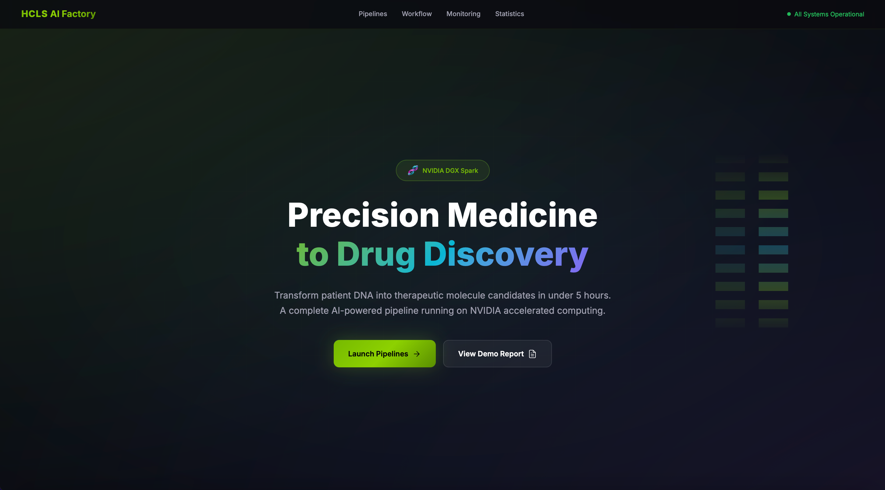

---
search:
  boost: 2
tags:
  - Demo
  - Walkthrough
  - VCP
  - Frontotemporal Dementia
---

# HCLS AI Factory — Demo Guide

> **Step-by-step walkthrough for demonstrating the HCLS AI Factory on DGX Spark.**
>
> License: Apache 2.0 | Date: February 2026

---

## Demo Overview

| Parameter | Value |
|---|---|
| Demo Duration | 15-20 minutes (live walkthrough) |
| Pipeline Mode | `demo` (pre-configured VCP/FTD) |
| Hardware | NVIDIA DGX Spark (GB10, 128 GB unified) |
| Target Gene | VCP — Frontotemporal Dementia |
| End Result | 100 ranked novel drug candidates |

### What the Audience Will See

1. Raw DNA data (FASTQ) entering the platform
2. GPU-accelerated variant calling (Parabricks) completing in minutes
3. 11.7 million variants annotated and indexed in a vector database
4. Interactive Claude RAG chat identifying VCP as a drug target
5. BioNeMo generating 100 novel VCP inhibitors
6. Ranked candidates with docking scores and drug-likeness profiles
7. PDF report generated automatically

---

## Pre-Demo Setup

### Stage 0: Data Acquisition

Before running the demo, all pipeline data must be downloaded. This is a one-time step (~500 GB).

```bash
# Download all required data (run once)
./setup-data.sh --all

# Verify data is ready
./setup-data.sh --status
# All 7 components should show [OK]
```

> If data was previously downloaded, `setup-data.sh` will detect existing files and skip them. See [Stage 0: Data Acquisition](DATA_SETUP.md) for troubleshooting.

### Step 1: Verify Hardware

```bash
# Verify DGX Spark GPU
nvidia-smi

# Expected: GB10 GPU, 128 GB unified memory
# Verify ARM64 architecture
uname -m
# Expected: aarch64
```

### Step 2: Set Environment Variables

```bash
# Copy and edit environment template
cp .env.example .env

# Required variables:
# ANTHROPIC_API_KEY=sk-ant-...     (for Claude RAG)
# NGC_API_KEY=nvapi-...            (for BioNeMo NIMs)
```

### Step 3: Start All Services

```bash
# Start services in dependency order
./start-services.sh

# This starts:
# 1. Infrastructure (Milvus, monitoring)
# 2. Stage 1 services (Parabricks, genomics portal)
# 3. Stage 2 services (RAG engine, Streamlit chat)
# 4. Stage 3 services (BioNeMo NIMs, discovery UI)
# 5. Landing page (health monitor)
```

### Step 4: Verify All Services Healthy

Open the landing page: **http://localhost:8080**

{ loading=lazy style="max-width:100%; border-radius:12px; box-shadow: 0 4px 20px rgba(0,0,0,0.12); margin-bottom: 1rem;" }

All 10 services should show green status:

| Service | Port | Expected Status |
|---|---|---|
| Parabricks Portal | 5000 | GREEN |
| Milvus Vector DB | 19530 | GREEN |
| RAG API | 5001 | GREEN |
| Streamlit Chat | 8501 | GREEN |
| MolMIM NIM | 8001 | GREEN |
| DiffDock NIM | 8002 | GREEN |
| Discovery UI | 8505 | GREEN |
| Grafana | 3000 | GREEN |
| Prometheus | 9099 | GREEN |
| DCGM Exporter | 9400 | GREEN |

### Step 5: Verify Demo Data

```bash
# Verify all data is downloaded and ready
./setup-data.sh --status

# Or check individual files
ls genomics-pipeline/data/ref/GRCh38.fa              # 3.1 GB reference
ls genomics-pipeline/data/input/HG002_R1.fastq.gz    # ~100 GB read 1
ls genomics-pipeline/data/input/HG002_R2.fastq.gz    # ~100 GB read 2
ls rag-chat-pipeline/data/annotations/                # ClinVar + AlphaMissense
```

> If any files are missing, run `./setup-data.sh --all` to download them. See Stage 0 above.

---

## Demo Script

### Opening (1 minute)

**Talking points:**

- "This is the HCLS AI Factory — a platform that transforms patient DNA into novel drug candidates in under 5 hours."
- "Everything runs on this single DGX Spark — a $3,999 desktop workstation."
- "Three stages: GPU-accelerated genomics, RAG-grounded target identification, and AI-driven drug discovery."

**Show:** Landing page at http://localhost:8080 — highlight the 10-service health grid.

---

### Stage 1: Genomics (3-4 minutes)

#### Launch Pipeline

```bash
# Launch demo mode
python run_pipeline.py --mode demo
```

**Show:** Genomics portal at http://localhost:5000

**Talking points:**

- "Patient DNA was sequenced by an Illumina instrument, producing ~200 GB of raw FASTQ data."
- "NVIDIA Parabricks runs BWA-MEM2 alignment on the GPU — 20-45 minutes instead of 12-24 hours on CPU."
- "Google DeepVariant then calls variants with >99% accuracy — 10-35 minutes on GPU."
- "Total Stage 1: under 1 hour. On CPU, this would take 1-2 days."

**Key numbers to mention:**
- ~200 GB FASTQ input (30× whole-genome sequencing)
- ~11.7 million variants called
- ~3.5 million pass quality filter (QUAL>30)
- GRCh38 reference genome (3.1 GB)

**Show:** Grafana dashboard at http://localhost:3000 — GPU utilization spiking during alignment and variant calling.

---

### Stage 2: RAG/Chat (5-6 minutes)

#### Show Annotation Pipeline

**Talking points:**

- "The 3.5 million high-quality variants are annotated with three databases."
- "ClinVar — 4.1 million clinical variants from NCBI. Tells us if a variant is pathogenic."
- "AlphaMissense — 71 million AI-predicted pathogenicity scores from DeepMind."
- "VEP — Ensembl Variant Effect Predictor for functional consequences."

**Annotation funnel to walk through:**
- 11.7M variants → 3.5M (quality filter) → 35,616 (ClinVar match) → 6,831 (AlphaMissense match) → 2,412 (actionable)

#### Show Vector Database

**Talking points:**

- "Every variant is embedded using BGE-small-en-v1.5 and indexed in Milvus."
- "3.5 million variant embeddings, each 384 dimensions, searchable in milliseconds."
- "This is what makes natural language queries possible over genomic data."

**Show:** Milvus genomic_evidence collection with 17 fields and 3.5M records via the RAG API at http://localhost:5001/api/collections or the Streamlit Chat UI.

#### Interactive Chat Demo

**Show:** Streamlit chat at http://localhost:8501

**Type this query:**
> "What are the most promising drug targets in this patient's genome for neurodegenerative disease?"

**Expected response from Claude:**

Claude will identify VCP as the primary target with:
- rs188935092 (chr9:35065263 G>A) — ClinVar Pathogenic
- AlphaMissense score 0.87 (well above 0.564 pathogenic threshold)
- HIGH impact missense variant in D2 ATPase domain
- Known drug target — CB-5083 reached Phase I clinical trial
- Druggability score 0.92

**Follow-up query:**
> "Tell me more about the VCP protein structure and druggable binding sites."

**Talking points:**

- "Claude is grounded in the actual variant evidence — not hallucinating."
- "The knowledge base covers 201 genes across 13 therapeutic areas."
- "171 of those genes (85%) are classified as druggable targets."

---

### Stage 3: Drug Discovery (4-5 minutes)

#### Show Structure Retrieval

**Talking points:**

- "VCP maps to UniProt P55072. The pipeline queries RCSB PDB for protein structures."
- "Four structures found: 8OOI, 9DIL, 7K56, 5FTK."
- "5FTK scores highest — it's an X-ray structure at 2.3 Å resolution with the CB-5083 inhibitor already bound."
- "Having an inhibitor-bound structure means we know exactly where drugs bind."

#### Show Molecule Generation

**Show:** Discovery UI at http://localhost:8505

**Talking points:**

- "BioNeMo MolMIM takes the CB-5083 seed compound and generates 100 novel analogs."
- "It's a masked language model for molecules — masks parts of the SMILES string and regenerates novel chemistry."
- "98 of 100 pass RDKit chemical validity checks."

#### Show Docking Results

**Talking points:**

- "BioNeMo DiffDock predicts how each molecule binds to the VCP D2 ATPase domain."
- "It uses diffusion modeling — no pre-defined grid needed."
- "34 candidates score below -8.0 kcal/mol — excellent binding affinity."

#### Show Ranked Candidates

**Talking points:**

- "Final ranking: 30% generation confidence, 40% docking affinity, 30% QED drug-likeness."
- "Top candidate: composite score 0.89 — that's 39% better than the CB-5083 seed."
- "The top candidate also has better QED (0.81 vs 0.62) and better docking (-11.4 vs -8.1)."
- "87 of 98 pass Lipinski's Rule of Five for oral drug-likeness."

**Key demo table:**

| Metric | CB-5083 (Seed) | Top Candidate | Improvement |
|---|---|---|---|
| Dock Score | -8.1 kcal/mol | -11.4 kcal/mol | +41% |
| QED | 0.62 | 0.81 | +31% |
| MW | 487.2 Da | 423.5 Da | -13% |
| Composite | 0.64 | 0.89 | +39% |

#### Show PDF Report

**Talking points:**

- "A complete PDF report is generated automatically via ReportLab."
- "It includes provenance: every tool version, every database version, every threshold."
- "This is reproducible science — run the same pipeline, get the same results."

---

### Closing (2 minutes)

**Talking points:**

- "In under 5 hours, on a $3,999 desktop workstation, we went from raw DNA to 100 ranked drug candidates."
- "This collapses a process that traditionally takes weeks to months."
- "The same Nextflow pipelines scale from DGX Spark to DGX SuperPOD for enterprise deployments."
- "All HCLS AI Factory code is Apache 2.0. NVIDIA components are free for development on DGX Spark."

**Scaling story:**

| Phase | Hardware | Scale |
|---|---|---|
| Phase 1 | DGX Spark ($3,999) | Proof build — what you just saw |
| Phase 2 | DGX B200 | Department — multiple concurrent patients |
| Phase 3 | DGX SuperPOD | Enterprise — thousands concurrent, federated |

**Cross-modal:**

- "The Imaging Intelligence Agent can trigger genomic analysis — a Lung-RADS 4B+ finding automatically initiates tumor profiling."
- "Drug candidates feed back into integrated clinical reports."

---

## Troubleshooting

### Service Not Starting

```bash
# Check Docker container status
docker compose ps

# Check container logs
docker compose logs <service-name>

# Restart a specific service
docker compose restart <service-name>
```

### BioNeMo NIM Not Ready

MolMIM and DiffDock NIMs require NGC API key and may take 2-5 minutes to initialize on first start.

```bash
# Check NIM health
curl http://localhost:8001/v1/health/ready
curl http://localhost:8002/v1/health/ready
```

### Milvus Connection Issues

```bash
# Check Milvus status
curl http://localhost:19530/v1/vector/collections

# Check etcd and MinIO dependencies
docker compose logs milvus-etcd
docker compose logs milvus-minio
```

### GPU Out of Memory

Monitor GPU memory during Parabricks execution. DeepVariant peaks at ~60 GB on the 128 GB unified memory system.

```bash
# Monitor GPU memory
watch -n 1 nvidia-smi
```

---

## Quick Reference

| Action | Command / URL |
|---|---|
| Download data | `./setup-data.sh --all` |
| Check data status | `./setup-data.sh --status` |
| Start services | `./start-services.sh` |
| Launch demo | `python run_pipeline.py --mode demo` |
| Landing page | http://localhost:8080 |
| Genomics portal | http://localhost:5000 |
| Chat interface | http://localhost:8501 |
| RAG API | http://localhost:5001 |
| Discovery UI | http://localhost:8505 |
| Grafana | http://localhost:3000 |
| GPU monitoring | `nvidia-smi` or http://localhost:3000 |

---

*HCLS AI Factory — Apache 2.0 | February 2026*
