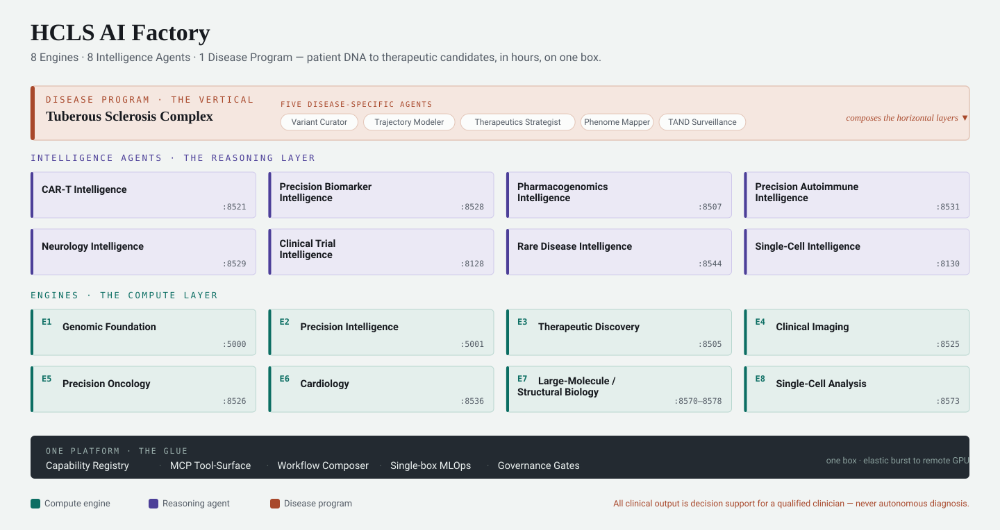

# Capability Brief — two cuts

A standalone, self-contained capability brief for the HCLS AI Factory: the **8 engines, 8
intelligence agents, and the flagship TSC disease program**, written to reach different audiences
without one artifact carrying contradictory jobs (the *two-cut principle* — see the
`broad-general-persona` skill).



| File | Cut | Audience | Register |
|---|---|---|---|
| [`capability-brief.html`](capability-brief.html) | **Technical** | Experts, builders, skeptics | Full spec — every engine/agent with ports, roles, demo homes, and inline honesty flags |
| [`mission.html`](mission.html) | **Mission** | Broad public & families | Understated, human-first; no jargon; the "why," honesty framed as care, openness as the hook |

Both are single self-contained HTML files (inline CSS, system fonts, no external assets) — open
either directly in a browser. Both include a `@media print` stylesheet, so **File → Print → Save as
PDF** produces a clean leave-behind (page breaks fall between cards/sections, hover/shadow removed,
taxonomy colors preserved).

## The architecture figure

`architecture.svg` is the single-glance diagram above (color-keyed to the brief: teal = compute
engines, indigo = reasoning agents, ember = the TSC vertical). It is **generated**, not
hand-drawn — edit the rosters in `architecture_figure.py` and regenerate from the repo root:

```bash
python3 docs/brief/architecture_figure.py   # rewrites docs/brief/architecture.svg
```

## Canonical source of truth

Content is drawn from the `engines-agents-disease-programs` skill and must stay reconciled with the
capability registry (`lib/hcls_common/capabilities.json`). Counts are **8 · 8 · 1**; a `live`
capability is never mock-served; all clinical output is **decision support for a qualified
clinician — never autonomous diagnosis or prescribing**. If the roster changes, update both cuts.

## Design notes

- **Technical cut** encodes the taxonomy in color — teal = compute engines, indigo = reasoning
  agents, ember = the TSC/mission thread and every honesty flag. Serif headings, mono for all data.
- **Mission cut** is a single narrow serif column (a "letter"), warm ember accent on a calm
  neutral ground, honesty stated plainly and with dignity.
