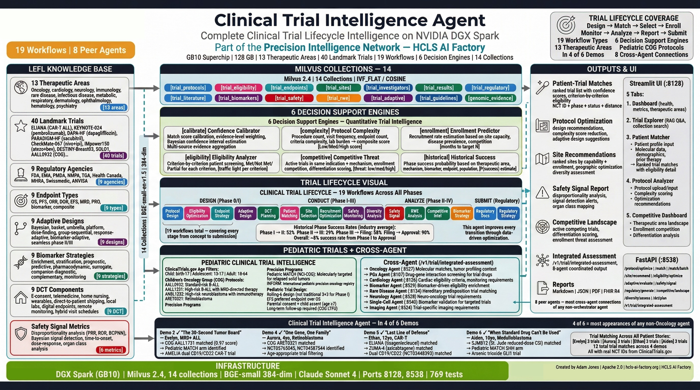

# Clinical Trial Intelligence Agent — Documentation Index

**Source:** [github.com/ajones1923/clinical-trial-intelligence-agent](https://github.com/ajones1923/clinical-trial-intelligence-agent)

> **Part of the [Precision Intelligence Engine](../engines/precision-intelligence.md)** — one of 11 specialized agents sharing a common molecular foundation within the HCLS AI Factory.

RAG-powered clinical trial optimization system built on Milvus, Claude, and BGE-small-en-v1.5.
Part of the [HCLS AI Factory](https://hcls-ai-factory.org) precision medicine platform.

---

## Documentation

| Document | Description |
|----------|-------------|
| [Project Bible](PROJECT_BIBLE.md) | Complete reference — collections, workflows, API, configuration |
| [Architecture Guide](ARCHITECTURE_GUIDE.md) | System design, data flow, component interactions |
| [White Paper](WHITE_PAPER.md) | Clinical trial efficiency crisis, RAG-based solution, validation |
| [Deployment Guide](DEPLOYMENT_GUIDE.md) | Docker Compose, manual setup, Milvus tuning, security |
| [Demo Guide](DEMO_GUIDE.md) | 5-tab walkthrough, sample queries, demo scenarios |
| [Learning Guide — Foundations](LEARNING_GUIDE_FOUNDATIONS.md) | Clinical trial primer for engineers and data scientists |
| [Learning Guide — Advanced](LEARNING_GUIDE_ADVANCED.md) | Adaptive designs, biomarker strategies, regulatory intelligence |
| [Production Readiness Report](PRODUCTION_READINESS_REPORT.md) | Capability matrix, test suite, deployment checklist |
| [Research Paper](CLINICAL_TRIAL_INTELLIGENCE_AGENT_RESEARCH_PAPER.md) | Full technical paper with PRD elements |

## Quick Links

- **Streamlit UI:** Port 8128
- **FastAPI API:** Port 8538
- **10 Clinical Workflows** | **14 Vector Collections** | **40 Landmark Trials**
- **769 Tests** | 100% Pass Rate | <0.5s Runtime

---

*Apache 2.0 License*

---

!!! warning "Clinical Decision Support Disclaimer"
    This agent is a clinical decision support research tool. It is not FDA-cleared and is not intended as a standalone diagnostic device. All recommendations should be reviewed by qualified healthcare professionals. Apache 2.0 License.
