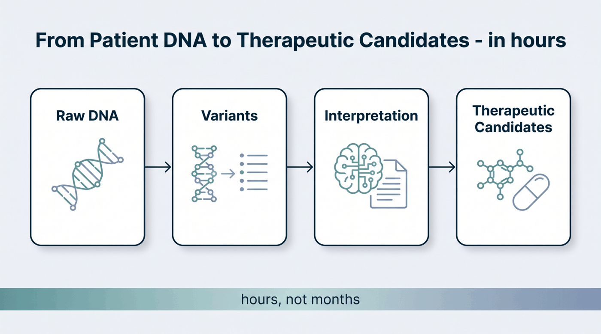

# Demonstrations

The demonstrations are the factory's proving ground and coverage contract: **nothing ships that can't
be shown, honestly, inside the portfolio.** Coverage is achieved by the *portfolio*, never by one demo
doing everything. Each demo composes capabilities at varying readiness — see the
[Capability Maturity Matrix](../honesty/maturity-matrix.md) for what is `live` vs `planned`.

/// caption
Illustrative — the D1 arc, "raw reads to a validated lead molecule."
///

| # | Demonstration | Exercises | Honesty flags |
|---|---|---|---|
| **D3** | **Tuberous Sclerosis Complex** *(flagship)* | The whole factory on one infant — most engines + agents + the platform layer | Gene therapy **preclinical**; everolimus real/approved; decision support; pediatric caution |
| D1 | Secondary genomics → novel drug molecule | Engines 1→2→3, MLOps, workflow composer, Chai-1 | Chai-1 **planned**; generated molecules are research candidates |
| D2 | Imaging → cardiac CAC → statin PGx → longevity | Engines 4 + 6, Pharmacogenomics + Biomarker agents | MAISI synthetic imaging **research/QA only**; decision support |
| D4 | Pediatric molecular tumor board | Engine 5, E1 germline, single-cell, fusion-first | Decision support; trial matching is informational |
| D5 | Oncology / CAR-T & biologic design | CAR-T agent, Engine 7 design suite, Chai-2 | Chai-2 **gated** (partnership access); designs are preclinical |
| D6 | Autoimmune program | Autoimmune agent, HLA, Pharmacogenomics | Research-/trial-use biomarker inputs; decision support |
| D7 | Neurology suite (Parkinson's featured) | Neurology agent: Parkinson's, Alzheimer's, ALS, MS, stroke | αSyn-SAA / NSD-ISS staging are **research-/trial-use**, not routine diagnostics |

## The unit of impact

The flagship [**TSC program**](../programs/tsc.md) follows the arc the whole portfolio is built
around — **weight → compression → hope**: the weight of a multi-system diagnosis, the compression of
months of cross-specialty work into one governed afternoon, and honest hope (a real approved therapy
today, an open bench for what comes next).

!!! note "How to read the demos"
    Completion demos exist to guarantee coverage and serve specialist audiences; they need not all run
    live. Every demo keeps its honesty flags on screen, and all clinical output is **decision support
    for a qualified clinician — never autonomous diagnosis or prescribing.**
