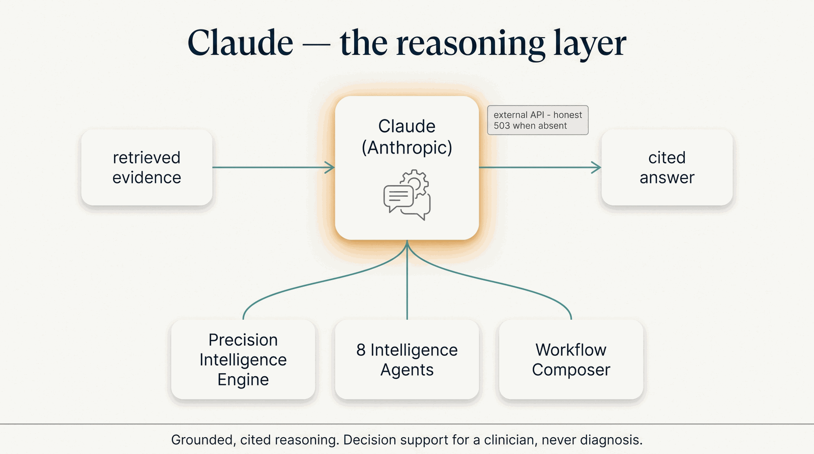

# Anthropic — Claude

Every part of the factory that *reasons* runs on a large language model. The factory uses
**Anthropic's Claude** as that reasoning engine — the model that reads retrieved evidence and writes
grounded, cited clinical reasoning. It's an external API connection, one of the
[Frontier Models](index.md) the factory reaches over the network.

/// caption
Illustrative. Claude reads retrieved evidence and returns a cited answer — an external API, an honest 503 when absent.
///

## Where it plugs in

| Capability | What Claude does there |
|---|---|
| **Precision Intelligence Engine** | RAG interpretation — turns annotated variants into a cited, plain-language clinical narrative for the agents to reason over. |
| **All 8 Intelligence Agents** | Each is a retrieval-augmented service: Claude reasons over the retrieved evidence to produce the agent's cited answer — a dose, a diagnosis shortlist, a trial match, and so on. |
| **Workflow Composer** | Turns a natural-language request into a validated, governed pipeline of capabilities. |

In short, Claude is the reasoning behind the entire agent layer — the "intelligence" in *intelligence
agent.*

## Honest limits

- **Decision support, never diagnosis.** Claude's output supports a qualified clinician; it never
  diagnoses or prescribes on its own.
- **Grounded, not free-associating.** It reasons over *retrieved* evidence (RAG) with citations, and
  returns an honest degraded response (**HTTP 503**) when its knowledge base or API key is absent — it
  does not fabricate clinical content.
- **An external dependency.** Claude is a proprietary API from Anthropic. The **specific model is
  configurable per service** and is set in code rather than pinned by this page — check the service
  you care about rather than trusting a version number in prose, which goes stale the moment
  Anthropic ships. Nothing on this layer is mock-served.
