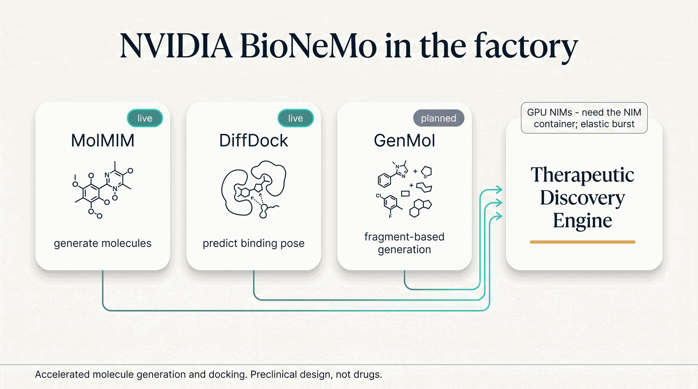

# NVIDIA BioNeMo

[NVIDIA BioNeMo](https://www.nvidia.com/en-us/clara/bionemo/) packages biology models as
GPU-accelerated inference microservices (**NIMs**) that the factory calls on demand. Its models power
the [Therapeutic Discovery Engine](../engines/therapeutic-discovery-engine.md)'s *generate → dock → score*
loop, connected as one of the [Frontier Models](index.md) via elastic burst.

/// caption
Illustrative. MolMIM and DiffDock are live clients (they need the NIM container); GenMol is planned.
///

## Where it plugs in

| Model | Role | Status |
|---|---|---|
| **MolMIM** | Generative small-molecule design from a seed compound. | live |
| **DiffDock** | Protein–ligand docking and 3-D pose prediction. | live |
| **GenMol** | SAFE-fragment molecule generation (a diversity complement to MolMIM). | planned |

All three serve the **Therapeutic Discovery Engine** — MolMIM and DiffDock as the generation and
docking stages, GenMol as a planned diversity generator.

## Working with Chai Discovery

BioNeMo and [Chai Discovery](chai-discovery.md) are the two halves of one design bench: **BioNeMo
builds and docks small molecules; Chai predicts and validates structures.** Chained, they close a loop
neither can on its own.

<video class="cap-video" controls preload="metadata" playsinline poster="/assets/videos/posters/frontier-bionemo-chai.jpg" src="/assets/videos/frontier-bionemo-chai.mp4">
  Your browser can't play embedded video — <a href="/assets/videos/frontier-bionemo-chai.mp4">download the explainer</a>.
</video>
/// caption
A ~90-second walkthrough: BioNeMo generates and docks a small molecule, Chai-1 co-folds it for an independent structural check, and Chai-2 opens a parallel biologic lane. Roadmap where noted — decision support, not diagnosis.
///

- **Generate → dock → *structurally validate.*** MolMIM (or RDKit BRICS) proposes molecules and
  DiffDock predicts a binding pose — then **[Chai-1](chai-discovery.md)** co-folds that top candidate
  *inside* its target's pocket, an independent, structure-based second opinion on the docking. Two
  different methods agreeing on the same pose is far stronger evidence than either alone.
- **A parallel large-molecule lane.** Where a target is better hit by a biologic than a small molecule,
  **[Chai-2](chai-discovery.md)** designs a de-novo binder and Chai-1 validates the complex — so the
  same target can be pursued as a *small molecule* (BioNeMo) **or** a *biologic* (Chai), side by side.

What the pairing enables:

| Engine / Agent | What BioNeMo + Chai unlock together |
|---|---|
| **Therapeutic Discovery Engine** | Small-molecule *and* large-molecule design under one roof, with Chai-1 as the shared structural validator for both. |
| **Structural Biology Engine** | BioNeMo's docked ligands get co-folded and cross-checked by Chai-1 — docking pose meets predicted complex. |
| **Precision Oncology Engine** | A tumor board can weigh both a small-molecule inhibitor (BioNeMo) *and* a biologic (Chai-2) against the same target, each with structural evidence. |

!!! note "Honest about maturity"
    The small-molecule half runs today: MolMIM and DiffDock are `live` (they need the NIM container).
    The moment the loop reaches Chai it becomes forward-looking — **Chai-1 is `planned`, Chai-2 is
    `gated`** — so the *integrated* generate → dock → validate → design pipeline is a **roadmap
    capability**, not a live one. Everything here stays preclinical **decision support**, and both Chai
    stages **burst to a remote GPU**.

## Honest limits

- **Real clients, real dependency.** MolMIM and DiffDock are `live` — real client code — but they need
  the **NVIDIA NIM container** (NGC + GPU) deployed to actually run; a clearly-labeled mock fallback is
  used only in development.
- **The default generator is open.** The engine's *default, verified* molecule generator is RDKit
  BRICS; MolMIM is the GPU-accelerated alternative when its NIM is deployed.
- **Elastic burst.** These are GPU microservices that run off the box, on demand — never pretending to
  run locally.
- **Preclinical design, not drugs.** Generated molecules and docking poses are preclinical design
  candidates — decision support for a scientist, not therapies.
