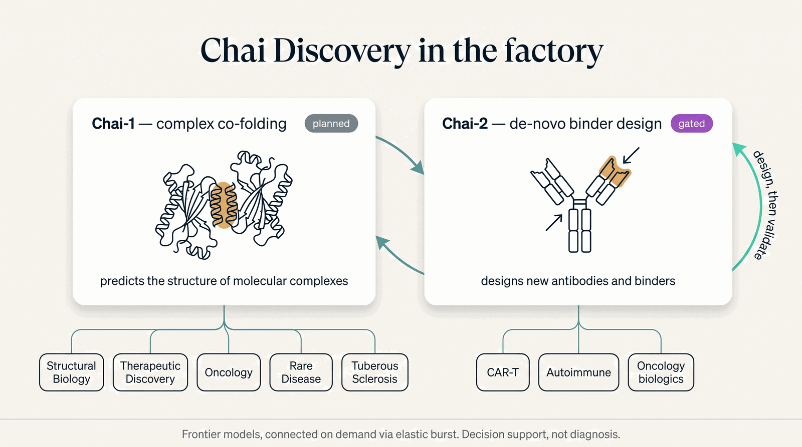

# Chai Discovery

[Chai Discovery](https://www.chaidiscovery.com/product) builds two frontier models the factory is
designed around — one to **predict** molecular complexes, one to **design** new binders. They chain:
Chai-2 designs a binder, Chai-1 validates the binder–target complex. Both are
[Frontier Models](index.md), connected on demand via [elastic burst](../../run/hardware.md).

/// caption
Illustrative. Chai-1 is `planned` (open, Apache-2.0); Chai-2 is `gated` (partner access). Both burst to a remote GPU.
///

## Chai-1 — complex co-folding &nbsp; planned

*Open (Apache-2.0, commercial-cleared); build in progress — flips to `live` when it is stood up.*

AlphaFold3-class structure prediction of **complexes** — proteins with other proteins, small-molecule
ligands, and DNA/RNA — the co-folding that [ESMFold](../engines/structural-biology-engine.md)
(single-sequence only) cannot do. Where it plugs in:

| Capability | What Chai-1 adds |
|---|---|
| **Structural Biology Engine** | Complex co-folding; anchors the design-then-validate chain (RFdiffusion → ProteinMPNN → Chai-1). |
| **Therapeutic Discovery Engine** | Structure-based design — co-fold a candidate molecule inside its target's pocket to confirm it binds. |
| **Precision Oncology Engine** | Fusion-protein, drug–target, and neoantigen–MHC complex structures for the tumor board. |
| **CAR-T · Precision Autoimmune agents** | scFv–antigen and antibody–antigen / HLA–peptide complexes — the structural basis of recognition. |
| **Rare Disease · Neurology agents** | Whether a missense variant disrupts a protein interface — mechanistic evidence for pathogenicity. |
| **Tuberous Sclerosis** *(flagship)* | Co-fold the **hamartin–tuberin (TSC1–TSC2) complex** and show how a pathogenic variant breaks it — making the gene → mTORC1 → everolimus story structurally concrete. |

## Chai-2 — de-novo binder & antibody design &nbsp; gated

*Partner access via Chai's platform (not open weights); integration contingent on access.*

Zero-shot design of **new** antibodies and protein binders against a target. Its home is the
binder-design family:

| Capability | What Chai-2 adds |
|---|---|
| **CAR-T Intelligence Agent** | Design novel scFv / binding domains for CAR-T targets. |
| **Precision Autoimmune Agent** | Design autoantibody-neutralizing or de-immunized binders. |
| **Precision Oncology · Therapeutic Discovery** | Biologics against tumor antigens — large-molecule design alongside small-molecule discovery. |
| **Structural Biology Engine** | The design frontier; hand off to **Chai-1** to validate the designed complex. |

!!! note "Honest by construction"
    Chai-1 is `planned` (open, build in progress) and Chai-2 is `gated` (partner access) — see the live
    [Capability Maturity Matrix](../../honesty/maturity-matrix.md). Both **burst to a remote GPU**, never
    pretending to run on the box; and any clinical use is **decision support for a qualified
    clinician**, never autonomous diagnosis.
