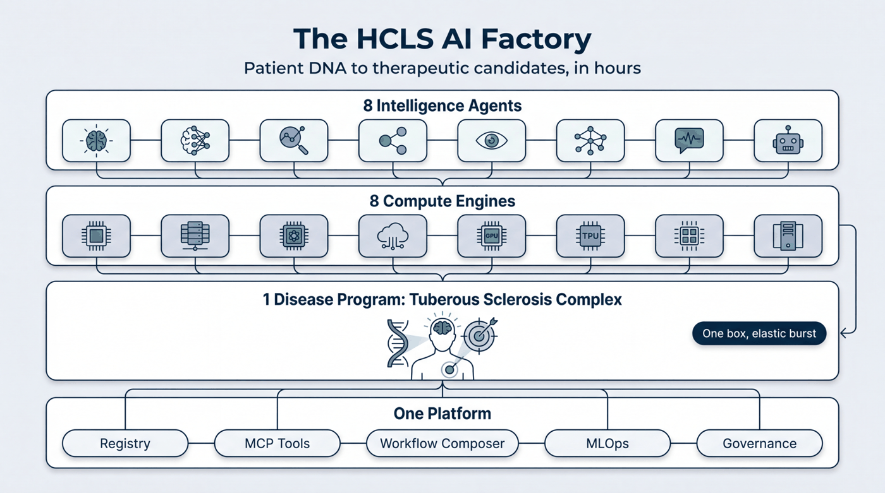

# The Factory — Overview

**Platform → Engine → Agent → Disease Program.** The HCLS AI Factory is one open-source system in
four layers: horizontal compute *engines*, clinical reasoning *agents* over them, disease *programs*
that compose them for one condition, and the *platform* glue that governs it all.

<video class="cap-video" controls preload="metadata" playsinline poster="/assets/videos/posters/factory-overview.jpg" src="/assets/videos/factory-overview.mp4">
  Your browser can't play embedded video — <a href="/assets/videos/factory-overview.mp4">download the overview</a>.
</video>
/// caption
A three-minute guided tour of the whole factory — narrated and captioned. Decision support, not diagnosis.
///

/// caption
Illustrative architecture diagram.
///

## The model

- **8 Engines** — the horizontal compute muscle: genomics, clinical interpretation, therapeutic
  discovery, imaging, oncology, cardiology, large-molecule / structural biology, and single-cell.
- **8 Intelligence Agents** — the clinical reasoning layers that interpret what the engines produce.
  Each is **decision support for a qualified clinician — never autonomous diagnosis or prescribing.**
- **1 Disease Program** — Tuberous Sclerosis Complex, the flagship vertical that composes the whole
  factory for one child in one *governed* afternoon.
- **One Platform** — the Capability Registry (the typed source of truth), the MCP tool-surface, the
  Workflow Composer, single-box MLOps, and the governance gates.
- **[Frontier Models](frontier-models.md)** — heavy or partner-gated models the factory connects to on
  demand via elastic burst (Chai Discovery's **Chai-1** & **Chai-2**, and the roadmap frontier), each
  with an honest status.

!!! tip "Engine vs. agent — the rule of thumb"
    An **engine** turns inputs into a *result* — a variant file, a docked molecule, a segmented scan.
    An **agent** reasons over those results the way a specialist would — a pharmacologist checking a
    dose, a geneticist ranking diagnoses — and always hands the decision back to the clinician.
    *Engines are the lab; agents are the consult.* And **"governed"** means every step runs behind the
    platform's governance gates — logged, access-controlled, and honesty-checked — so that afternoon is
    auditable, not a black box.

## See it honestly

- The **[Capability Maturity Matrix](../honesty/maturity-matrix.md)** shows every capability's real,
  registry-declared status — the site cannot claim ahead of the code.
- The **[Capability Brief](../brief/README.md)** is the full picture, in a technical cut and a
  mission cut.

!!! note "How to read this"
    **Decision support, not diagnosis.** **"Elastic burst," not "all on one box"** — heavy or
    ARM-incompatible models run on remote GPUs over a private mesh. **Real, never mocked** — a
    capability marked `live` is served by a real model against real input.
