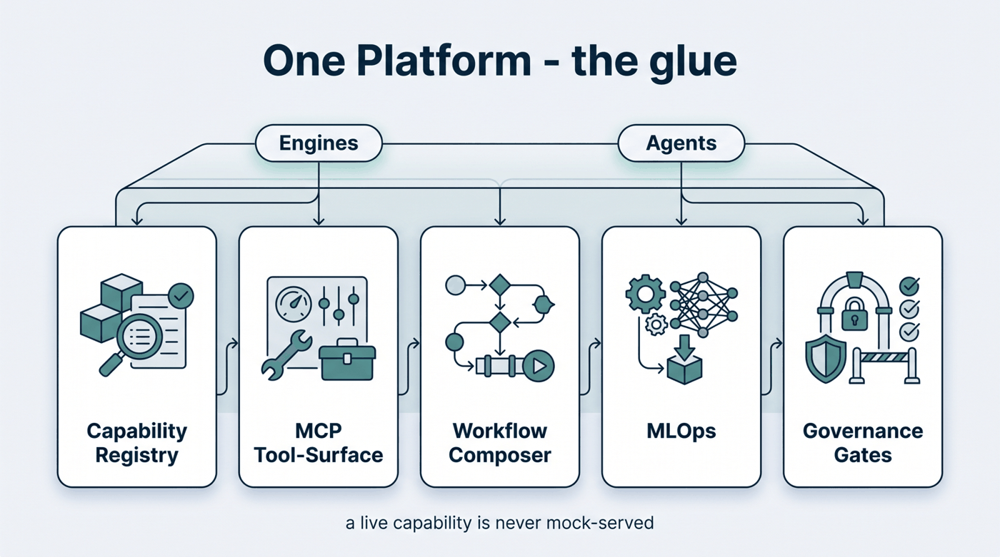

# One Platform — the glue

The engines compute and the agents reason, but they only become *one factory* because of a shared
platform layer: a typed source of truth, a tool-surface, a composer, single-box MLOps, and the
governance gates every capability passes through.

/// caption
Illustrative diagram.
///

- **Capability Registry** — the typed source of truth for every engine, agent, model, and service.
  A capability marked `live` is never mock-served; the [maturity matrix](../honesty/maturity-matrix.md)
  and this whole site render from it, so nothing can be advertised that the code doesn't declare.
- **MCP Tool-Surface** — every capability exposed as a governed tool an agent (or an external MCP
  client) can discover and call, fronted by the governance gates.
- **Workflow Composer** — turns a natural-language goal into a *validated, governed* pipeline by
  wiring capabilities along typed ports (a VCF output only connects to a VCF input).
- **Single-box MLOps** — model/versioning, runs, and lineage on one machine, with elastic burst to
  remote GPU for heavy or ARM-incompatible models.
- **Governance Gates** — the input-validation and output-honesty brackets, plus 21 CFR Part 11-style
  lineage, that every governed run passes through.

!!! note "Honest by construction"
    Because the registry is the single source of truth, the platform enforces the honesty rules
    mechanically — a `live` capability cannot be mock-served, and `verified` cannot sit on anything
    that isn't actually running. See [Honesty & Governance](../honesty/index.md).
