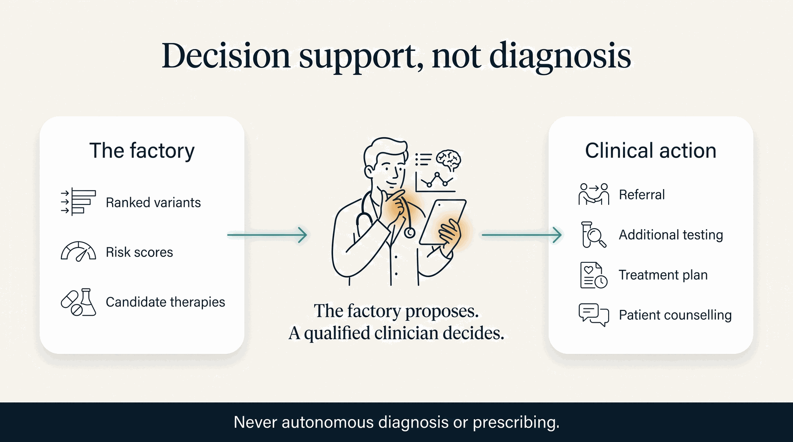

# Decision-Support Posture

**The HCLS AI Factory is clinical *decision support*, not a diagnostic or an autonomous agent.** Every
clinical surface — every engine, every intelligence agent, the TSC program — produces output that
**supports the judgment of a qualified clinician. It does not diagnose, prognose, prescribe, or
treat.** This posture is not a disclaimer bolted on at the end; it is a design constraint the whole
system is built around.

/// caption
The factory proposes; a qualified clinician decides. Never autonomous diagnosis or prescribing.
///

## What that means concretely

- An intelligence agent **recommends and flags** — it never *makes* the call. A pharmacogenomic dosing
  interlock, for example, flags a gene–drug risk and cites the guideline; it does not block an order
  or write a prescription.
- Outputs are **traceable**: every clinical claim links to a [primary source](citations.md), and every
  result is only as confident as its weakest input (honesty is *computed, not copied*).
- A clinician remains **in the loop and in authority** at every step. The factory makes evidence
  legible and fast; the qualified human weighs it and decides.

## Regulatory framing

The factory is **not marketed as, or represented to be, a medical device.** It is an open research and
decision-support platform. Any deployment in a care setting is the responsibility of the deploying
institution and its qualified clinicians, under the applicable regulatory framework. Where the work
points toward therapies still in research (e.g. gene therapy for TSC1/TSC2), those are labeled
**preclinical** and are not offered as available treatments — see the [Honesty Ledger](ledger.md).

## Pediatric & vulnerable-population caution

For pediatric and other vulnerable-population content, this posture is held **at full force**: nothing
on the site implies an available cure or that a specific outcome was or could have been guaranteed,
and no patient — above all a child — is used as a prop. Comfort and education, never a substitute for
a clinician or caregiver.

!!! note
    This page is linked from every clinical surface on the site. If you find any output framed as an
    autonomous diagnosis or prescription, that is a defect — please
    [open an issue](https://github.com/ajones1923/hcls-ai-factory/issues).
