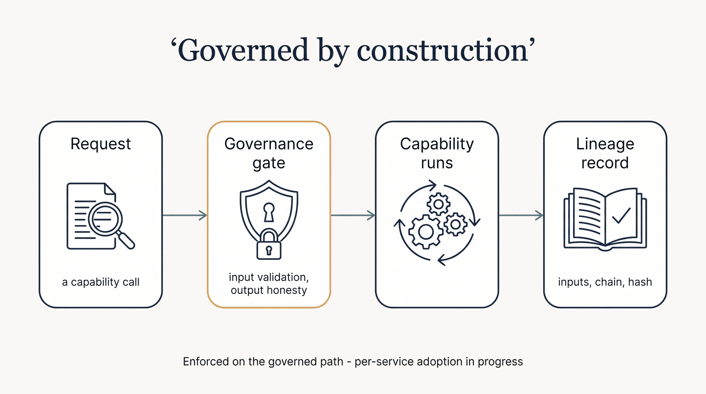

# Governance & Lineage

Trust in a clinical-decision-support system is not a slogan — it's enforced at the boundaries of every
capability. Governance in the HCLS AI Factory is **mechanical**: the registry is the source of truth,
and every governed run passes through the same gates.

/// caption
A governed run: request → gate → capability → lineage record. See *Where the gates fire today*
below for current coverage.
///

## The gates every governed run passes

- **Input-validation gate** — parameters are checked against each capability's typed contract (allowed
  values, numeric bounds, defaults) before anything runs. Bad input is rejected or clamped-and-logged,
  not silently mishandled.
- **Output-honesty gate** — a result is never presented as more confident than its weakest input or
  leg. Honesty is *computed, not copied*: a signal inherits the lowest maturity of what produced it.
- **The registry honesty rules** — a `live` capability can never be mock-served; `verified` cannot sit
  on anything that isn't actually running. Enforced in code (see the
  [Capability Maturity Matrix](maturity-matrix.md)).

## Where the gates fire today

Honesty about the honesty layer: the gates are **enforced on the governed path** — capability calls
made through the workflow composer and the tool surface — and adoption across the services' own HTTP
routes is **in progress**.

| | Coverage |
|---|---|
| Governance middleware installed (request id, timing, service identity) | **11 of 12** services |
| Input-validation gate invoked by a handler | **1 of 12** |
| Output-honesty gate invoked by a handler | **1 of 12** |
| API-key authentication available (fail-closed once configured) | **12 of 12** |

The middleware is deliberately *not* a gate: it identifies and times a request. A handler must call
`require_valid_input()` and `honesty_flags()` for a call to be gated, and the response header
`X-HCLS-Governed` names only the gates that actually ran — it is absent when none did.

So a request to a service's own route is authenticated and identified, but not yet input-validated
or honesty-checked unless that service has adopted the calls. We state the number rather than the
intention.

## Reproducible lineage (21 CFR Part 11-minded)

Governed runs carry a lineage manifest — inputs, the capability chain that produced each artifact,
serving details, a composed honesty tier, and a deterministic lineage hash — so a result can be traced
back to exactly what made it. The design intent is audit-grade reproducibility, not a black box.

**Scope, stated plainly:** the lineage mechanism (`chain_lineage`) is implemented and used on the
governed composer path. It is **not yet emitted by the services' own HTTP routes**. "21 CFR Part
11-**minded**" describes the design intent — traceable inputs, attributable steps, a deterministic
hash — and is not a claim of Part 11 validation or compliance.

## The neutral, reproducible repository

- **Neutral by construction** — no proprietary vendor or alternate-edition branding in tracked files
  (a pre-commit guard enforces it). Data, weights, and secrets stay local; only code and docs publish.
- **Reproducible build** — pinned generators and a strict CI gate; this very site fails its build
  before publishing if the registry is malformed or a link breaks.

## Privacy & the compute posture

**All patient data stays on the local box.** Heavy or ARM-incompatible models burst to remote GPU over
a private mesh — **"elastic burst," not "all on one box"** — and only derived, non-identifying work is
sent to a burst GPU, never raw PHI.

!!! note "Decision support, not a medical device"
    The factory supports a qualified clinician; it does not diagnose or prescribe autonomously, and it
    is not marketed as a medical device. See [Honesty & Governance](index.md) and the
    [Citations & Evidence](citations.md) behind every clinical claim.
