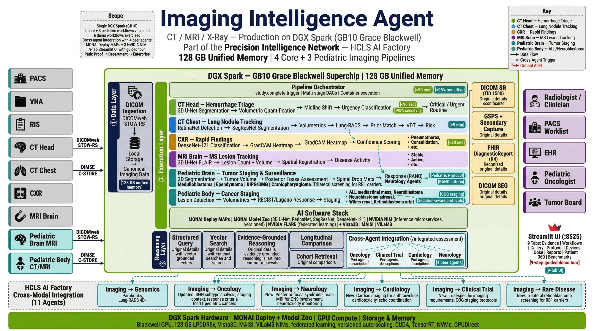

# Clinical Imaging Engine



**Source:** [github.com/ajones1923/imaging-intelligence-engine](https://github.com/ajones1923/imaging-intelligence-engine)

> **Part of the [Precision Intelligence Network](../engines/precision-intelligence.md)** — one of 11 specialized agents sharing a common molecular foundation within the HCLS AI Factory.

Automated detection, segmentation, longitudinal tracking, and clinical triage of CT, MRI, and chest X-ray studies on NVIDIA DGX Spark. Part of the [HCLS AI Factory](https://github.com/ajones1923/hcls-ai-factory).

## Overview

The Clinical Imaging Engine processes medical imaging studies using MONAI models and NVIDIA NIM microservices on DGX Spark hardware. A 9-tab Streamlit interface backed by 876 seed vectors across 10 Milvus collections provides evidence-grounded clinical reasoning, while six reference workflows run real pretrained model weights across 4 demo cases (DEMO-001 through DEMO-004). The Image Gallery showcases 9 AI-annotated medical images with a 3D Volume Slice Viewer and Before/After AI toggle. Cross-modal triggers connect imaging findings to 3.5M genomic variant vectors for precision medicine enrichment. Output is exported as Markdown, JSON, NVIDIA-branded PDF, or FHIR R4 DiagnosticReport Bundles with SNOMED CT, LOINC, and DICOM coding.

## Six Reference Workflows

| Workflow | Modality | Model (Pretrained Weights) | Key Output |
|---|---|---|---|
| **Hemorrhage Triage** | CT Head | SegResNet (MONAI `wholeBody_ct_segmentation`) | Volume (mL), midline shift (mm), urgency routing |
| **Lung Nodule Tracking** | CT Chest | RetinaNet + SegResNet (MONAI `lung_nodule_ct_detection`) | Lung-RADS 1--4B classification |
| **Coronary Angiography** | CT Heart | Calcium scoring + stenosis grading | Agatston score, stenosis severity |
| **Rapid Findings** | CXR | DenseNet-121 (torchxrayvision `densenet121-res224-all`, CheXpert) | Multi-label classification + GradCAM heatmaps |
| **MS Lesion Tracking** | MRI Brain | UNEST (MONAI `wholeBrainSeg_Large_UNEST_segmentation`) | Lesion count, disease activity (Stable/Active/Highly Active) |
| **Prostate PI-RADS** | MRI Prostate | Prostate lesion detection + PI-RADS v2.1 | PI-RADS 1--5 scoring |

## Architecture

```
DICOM Study Arrives (Orthanc 8042/4242)
    |
    v
[Webhook Router] ── CT+head / CT+chest / CT+heart / CR+chest / MR+brain / MR+prostate
    |
    v
[Clinical Workflow] (6 workflows)
(SegResNet / RetinaNet / DenseNet-121 / UNEST / Calcium Scoring / PI-RADS)
    |
    v
[Post-Processing + Cross-Modal Trigger]
Volume, midline shift, Lung-RADS, GradCAM, Agatston, PI-RADS
Lung-RADS 4A+ → genomic variant queries (3.5M vectors)
    |
    v
[RAG Engine + Claude Sonnet 4.6 / Llama-3 NIM]
10 imaging collections (876 seed vectors) + genomic_evidence (read-only)
    |
    v
[9-Tab Streamlit UI]
Evidence Explorer | Workflow Runner | Image Gallery | Protocol Advisor
Device & AI Ecosystem | Dose Intelligence | Reports & Export | Patient 360
Benchmarks & Validation
    |
    v
[Clinical Output]
Markdown | JSON | NVIDIA-branded PDF | FHIR R4 DiagnosticReport Bundle
```

Built on the HCLS AI Factory platform:

- **LLM:** Claude Sonnet 4.6 (Anthropic) primary, Llama-3 NIM fallback
- **RAG Engine:** Multi-collection Milvus vector search + LLM synthesis
- **Embeddings:** BGE-small-en-v1.5 (384-dim, IVF_FLAT, COSINE)
- **Database:** Milvus 2.4 (10 imaging collections + `genomic_evidence` read-only)
- **NIM Services:** VISTA-3D (segmentation), MAISI (synthetic CT), VILA-M3 (VLM), Llama-3 8B (LLM)
- **Cloud NIMs:** `meta/llama-3.1-8b-instruct` + `meta/llama-3.2-11b-vision-instruct` via `integrate.api.nvidia.com`
- **DICOM Server:** Orthanc (webhook auto-routing to 6 workflows)
- **UI:** Streamlit 9-tab interface (port 8525)
- **API:** FastAPI (port 8524)
- **Export:** Markdown, JSON, NVIDIA-branded PDF, FHIR R4 DiagnosticReport Bundle
- **Federated Learning:** NVIDIA FLARE (3 job configs)
- **Hardware target:** NVIDIA DGX Spark ($4,699)

## Knowledge Base

| Source | Records |
|---|---|
| Seed imaging vectors | 876 across 10 owned collections |
| Genomic evidence vectors (read-only) | 3,561,170 vectors |

620 unit tests, 9/9 end-to-end checks. 6 workflows, 4 demo cases, 9 Streamlit tabs.

## Demo Highlights (March 2026)

- **Image Gallery:** 5 CXR pathology showcase (Normal, Consolidation, Effusion, Cardiomegaly, Pneumothorax), cross-modality gallery, 3D Volume Slice Viewer with HU windowing, Before/After AI toggle
- **Workflow Runner:** Annotated AI images in 55/45 layout with 6-step pipeline animation (3.2s total) and 4 download formats
- **Patient 360:** Interactive Plotly network graph (3-layer: Case green, Findings orange, Genes cyan) with live Milvus genomic query
- **Evidence Explorer:** 4 pre-filled example query buttons and Plotly donut chart showing collection contribution
- **Protocol Advisor:** 4 pre-filled example indication buttons
- **Sidebar:** Guided tour expander (9-step demo flow), OHIF Viewer link, Demo Mode button
- **9 AI-annotated medical images:** 5 CXR (1024x1024) + 3 CT (512x512) + 1 bilateral pneumonia CXR

## Cross-Modal Integration

The Imaging Agent connects into the broader HCLS AI Factory genomics pipeline:

- **Lung-RADS 4A+** triggers EGFR/ALK/ROS1/KRAS genomic variant queries against 3.5M genomic vectors
- **CXR urgent findings** (consolidation, critical severity) trigger infection genomics queries
- **Brain lesion high activity** triggers neurological genomics queries (HLA-DRB1, demyelination markers)
- All cross-modal results are included in FHIR R4 export with SNOMED CT, LOINC, and DICOM coding

## Clinical Output

| Output | Format | Usage |
|---|---|---|
| Clinical Report | Markdown | Human-readable structured report |
| Structured Data | JSON | Programmatic consumption, dashboards |
| Printable Report | PDF | Clinical documentation, patient records |
| Interoperability | FHIR R4 DiagnosticReport Bundle | EHR integration (SNOMED CT + LOINC + DICOM coded) |

## Services

| Port | Service |
|---|---|
| 8524 | FastAPI REST Server |
| 8525 | Streamlit Chat UI |
| 8520 | NIM LLM (Llama-3 8B) |
| 8530 | NIM VISTA-3D |
| 8531 | NIM MAISI |
| 8532 | NIM VILA-M3 |
| 19530 | Milvus (gRPC) |
| 8042 | Orthanc REST API |
| 4242 | Orthanc DICOM C-STORE |

## Credits

- **Adam Jones**
- **Apache 2.0 License**

---

!!! warning "Clinical Decision Support Disclaimer"
    This agent is a clinical decision support research tool. It is not FDA-cleared and is not intended as a standalone diagnostic device. All recommendations should be reviewed by qualified healthcare professionals. Apache 2.0 License.
