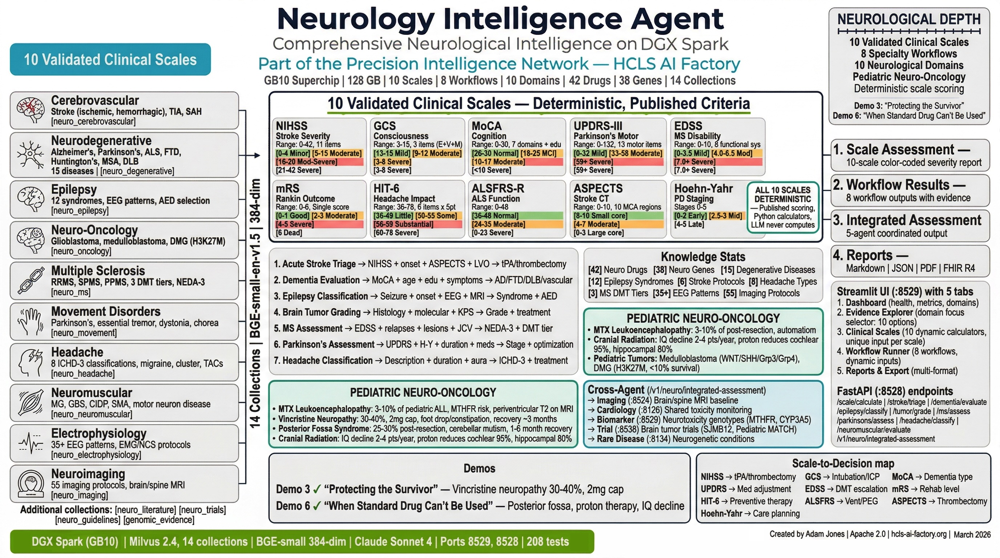

# Neurology Intelligence Agent

**Source:** [github.com/ajones1923/neurology-intelligence-agent](https://github.com/ajones1923/neurology-intelligence-agent)

> **Part of the [Precision Intelligence Engine](../engines/precision-intelligence.md)** — one of 11 specialized agents sharing a common molecular foundation within the HCLS AI Factory.

RAG-powered clinical decision support for neurology, covering 10 disease domains, 14 vector collections, 10 validated clinical scales, and 8 evidence-based workflows.

## Key Capabilities

- **Acute Stroke Triage:** NIHSS scoring, ASPECTS evaluation, tPA/thrombectomy eligibility (DAWN/DEFUSE-3)
- **Dementia Evaluation:** MoCA screening, ATN biomarker staging, anti-amyloid therapy eligibility
- **Epilepsy Classification:** ILAE 2017, 12 syndromes, drug-resistant epilepsy assessment, surgical candidacy
- **Brain Tumor Grading:** WHO 2021 molecular classification (IDH, MGMT, 1p/19q)
- **MS Monitoring:** EDSS scoring, NEDA-3 status, DMT escalation, JCV/PML risk
- **Parkinson's Assessment:** MDS-UPDRS Part III, Hoehn-Yahr staging, DBS candidacy
- **Headache Classification:** ICHD-3 criteria, HIT-6 scoring, CGRP therapy guidance
- **Neuromuscular Evaluation:** ALSFRS-R scoring, EMG/NCS pattern analysis

## Architecture

- **API:** FastAPI on port 8528
- **UI:** Streamlit on port 8529
- **Vector DB:** Milvus 2.4 with 14 domain-specific collections (BGE-small 384-dim)
- **LLM:** Claude (Anthropic) for evidence synthesis
- **Tests:** 209 automated tests across 12 modules

## Documentation

| Document | Description |
|---|---|
| [Production Readiness Report](production-readiness-report.md) | 25-section PRR with full capability, data, and test inventory |
| [Project Bible](project-bible.md) | Architecture, directory structure, data models, quality gates |
| [Architecture Guide](architecture-guide.md) | System design, scale calculator architecture, stroke pipeline, ATN staging |
| [White Paper](white-paper.md) | Problem statement, RAG solution, clinical capabilities, results |
| [Deployment Guide](deployment-guide.md) | Docker standalone, integrated, local dev, configuration |
| [Demo Guide](demo-guide.md) | 5 clinical scenarios: stroke, AD, epilepsy, tumor, MS |
| [Learning Guide -- Foundations](learning-guide-foundations.md) | Brain anatomy, stroke, dementia, seizures, MS, scales |
| [Learning Guide -- Advanced](learning-guide-advanced.md) | ATN, DAWN/DEFUSE-3, NEDA-3, EMG/NCS, DBS, surgery |
| [Research Paper](neurology-intelligence-agent-research-paper.md) | Technical research paper |

---

!!! warning "Clinical Decision Support Disclaimer"
    This agent is a clinical decision support research tool. It is not FDA-cleared and is not intended as a standalone diagnostic device. All recommendations should be reviewed by qualified healthcare professionals. Apache 2.0 License.
