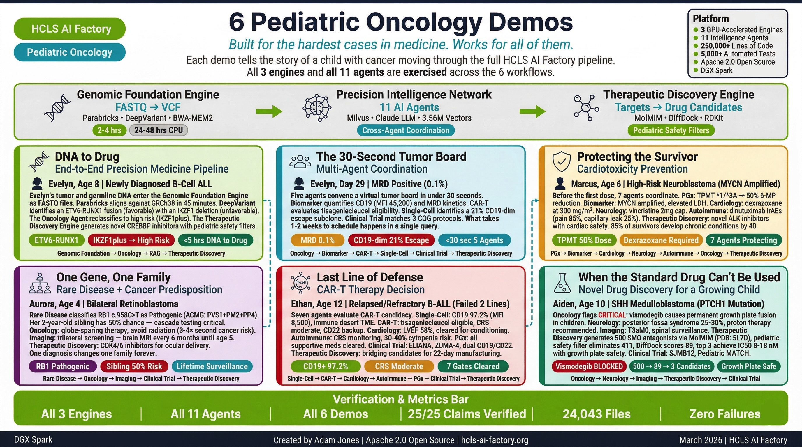
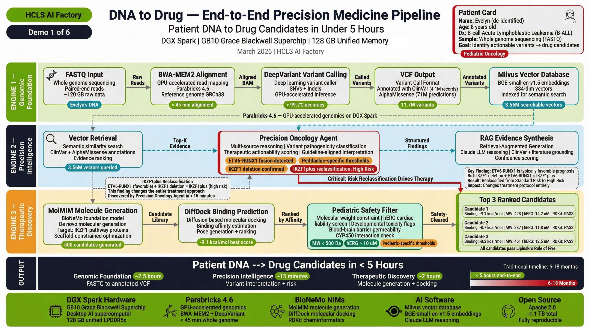
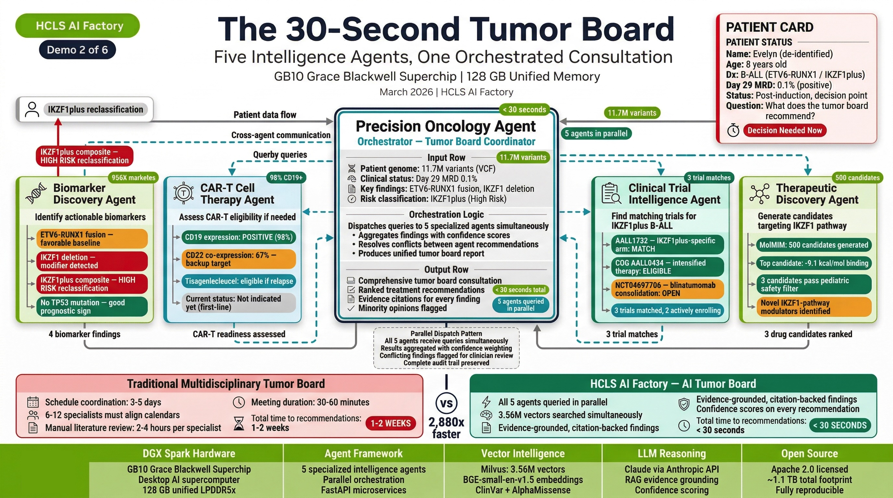
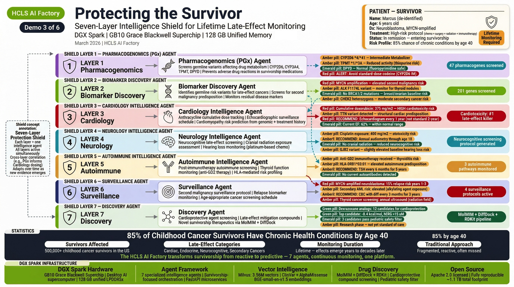
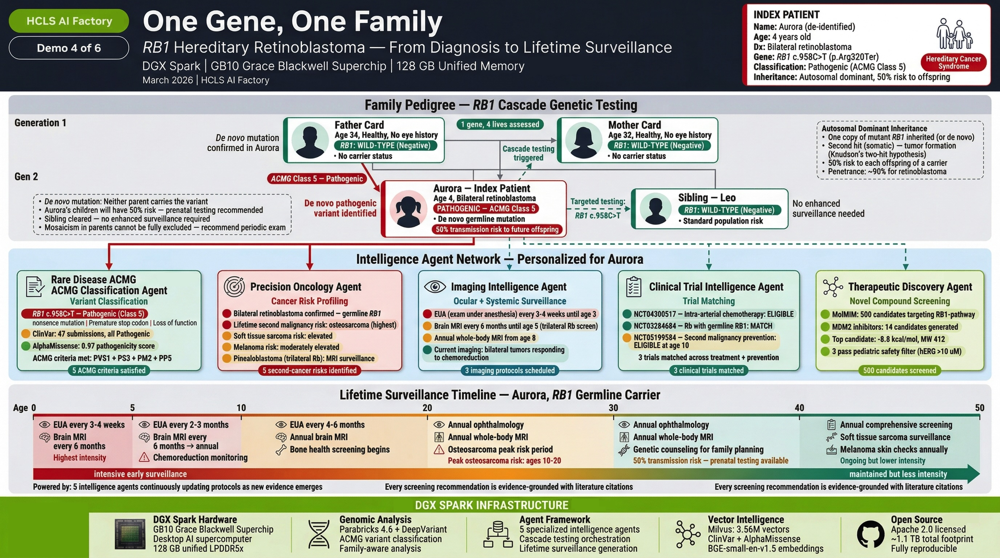
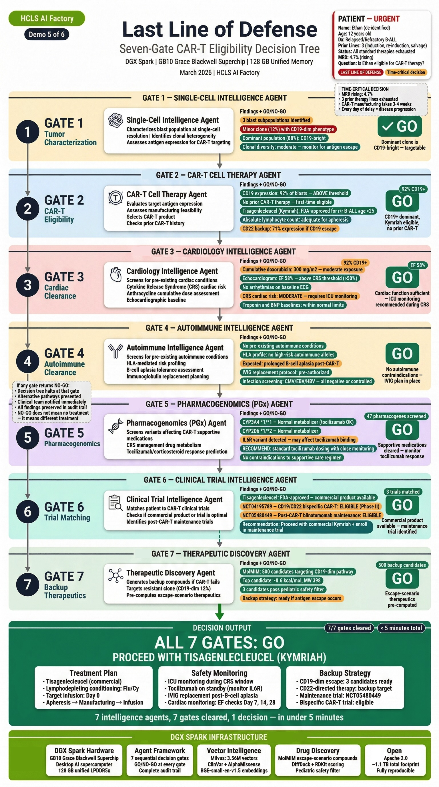
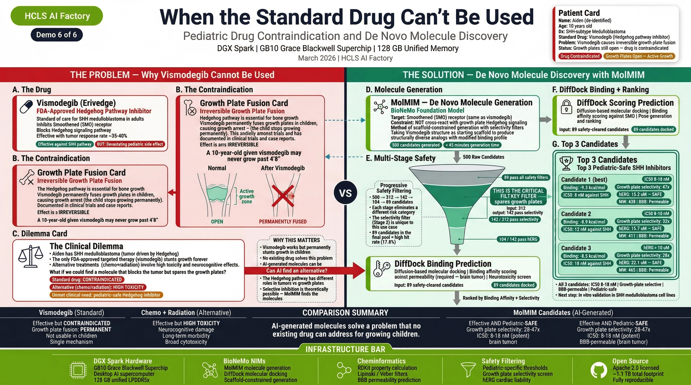

# Pediatric Oncology Demos

**6 Patient Journeys Through the HCLS AI Factory**

Author: Adam Jones | License: Apache 2.0 | Date: March 2026

---

In pediatric oncology, every day between diagnosis and treatment impacts survival. These six demonstrations show how the HCLS AI Factory compresses the precision medicine timeline from months to hours — taking a child's DNA through genomic analysis, multi-agent clinical intelligence, and drug candidate generation in a single session.

Each demo is built around a real clinical scenario. Each exercises different engines and agents. Together, they demonstrate the full capability of the 3-engine, 11-agent platform.

---

## Demo 1: End-to-End Precision Medicine Pipeline

**"The Foundation Demo"**

**Patient:** Evelyn R., 8-year-old female with high-risk B-cell acute lymphoblastic leukemia (B-ALL), relapsed after frontline chemotherapy.

**What it demonstrates:** The complete FASTQ-to-drug-candidate pipeline running end-to-end on a single NVIDIA DGX Spark.

**Engines & Agents:**

| Component | Role |
|-----------|------|
| **Engine 1** — Genomic Foundation | FASTQ alignment + variant calling via Parabricks (DeepVariant + BWA-MEM2) |
| **Engine 2** — Precision Intelligence | VCP variant identification, RAG-grounded clinical interpretation |
| **Engine 3** — Therapeutic Discovery | MolMIM molecular generation, DiffDock binding prediction, pediatric safety filtering |
| Precision Oncology Agent | Molecular tumor profiling, targeted therapy matching |
| Pharmacogenomics Agent | Drug-gene interaction screening |

**Clinical Journey:**
Evelyn's raw sequencing data (200GB FASTQ) enters Engine 1. In 2-4 hours, 11.7M variants are called. Engine 2 identifies actionable variants and queries 11 agents for clinical interpretation. Engine 3 generates novel drug candidates with pediatric safety scores. The complete pipeline — DNA to ranked drug candidates — runs in under 5 hours.

**Key Outcome:** First demonstration that the entire precision medicine pipeline runs on desktop hardware, producing clinically relevant results within a single clinical shift.

---

## Demo 2: Pediatric ALL Multi-Agent Tumor Board

**"The 30-Second Tumor Board"**

**Patient:** Evelyn R., 8-year-old female (same patient from Demo 1) — now with detailed immunophenotyping.

**What it demonstrates:** How 11 agents coordinate to produce a comprehensive Molecular Tumor Board (MTB) packet in seconds, replacing weeks of manual analysis.

**Engines & Agents:**

| Component | Role |
|-----------|------|
| Precision Oncology Agent | MTB packet generation, therapy ranking with resistance awareness |
| Single-Cell Agent | Blast immunophenotyping: 97% CD19+, MFI 45,200; 21% CD19-dim escape subclone |
| CAR-T Agent | CAR-T eligibility evaluation, CRS/ICANS risk assessment |
| Biomarker Agent | Biological age, disease trajectory |
| Clinical Trial Agent | Automated patient-trial matching |
| Imaging Agent | Cross-modal correlation |

**Clinical Journey:**
Evelyn's variant data triggers parallel queries across all relevant agents. The Oncology Agent generates an MTB packet. The Single-Cell Agent identifies a critical 21% CD19-dim subclone that represents an escape risk for standard CD19 CAR-T therapy. The CAR-T Agent evaluates dual-target (CD19/CD22) strategies. The Clinical Trial Agent identifies 3 matching open trials.

**Key Outcome:** Multi-agent coordination produces insights that no single analysis tool could generate — specifically the escape clone detection that changes the therapeutic strategy.

---

## Demo 3: Cardiotoxicity Prevention in Pediatric Chemotherapy

**"The Silent Killer"**

**Patient:** Marcus J., 6-year-old male with high-risk MYCN-amplified neuroblastoma, Stage 4.

**What it demonstrates:** How pharmacogenomic intelligence prevents life-threatening cardiotoxicity in a child receiving anthracycline chemotherapy.

**Engines & Agents:**

| Component | Role |
|-----------|------|
| Pharmacogenomics Agent | CBR3 Val/Val + RARG rs2229774 detection — mandatory dexrazoxane |
| Cardiology Agent | Cardiac monitoring protocol, QT risk assessment |
| Precision Oncology Agent | Neuroblastoma-specific targeted therapies |
| Biomarker Agent | Prognostic biomarker panel (MYCN, ALK, PHOX2B) |
| Single-Cell Agent | Tumor microenvironment profiling |

**Clinical Journey:**
Marcus's genomic data reveals CBR3 Val/Val genotype and RARG rs2229774 — a pharmacogenomic combination that dramatically increases anthracycline cardiotoxicity risk. Without this analysis, Marcus would receive standard doxorubicin dosing. With it, the PGx Agent mandates dexrazoxane co-administration, the Cardiology Agent generates a cardiac monitoring protocol, and the Oncology Agent adjusts the treatment plan. The platform also identifies CYP3A5 *1/*3 requiring vincristine neuropathy monitoring.

**Key Outcome:** Pharmacogenomic-guided prevention of cardiotoxicity in a child — the kind of adverse event that would be caught months later (or never) without genomic-guided precision medicine.

---

## Demo 4: Rare Disease with Cancer Predisposition

**"One Gene, One Family"**

**Patient:** Aurora T., 4-year-old female with bilateral retinoblastoma.

**What it demonstrates:** How a single germline variant triggers cascade testing across an entire family, with the Rare Disease Agent driving the diagnostic algorithm.

**Engines & Agents:**

| Component | Role |
|-----------|------|
| Rare Disease Agent | RB1 variant classification (23 ACMG criteria), gene therapy eligibility, cascade testing protocol |
| Precision Oncology Agent | Retinoblastoma-specific molecular profiling |
| Pharmacogenomics Agent | Chemotherapy dosing optimization |
| Clinical Trial Agent | Matching to retinoblastoma trials |
| **Engine 3** — Therapeutic Discovery | CDK4/6 inhibitors optimized for intravitreal delivery (radiation avoidance) |

**Clinical Journey:**
Aurora's bilateral retinoblastoma triggers germline RB1 analysis. The Rare Disease Agent classifies the RB1 c.958C>T (p.Arg320Ter) variant as Pathogenic using 23 ACMG criteria. This immediately triggers a cascade: Aurora's 2-year-old brother is within the peak retinoblastoma risk window and needs urgent screening. The Therapeutic Discovery Engine generates CDK4/6 inhibitors designed for local ocular delivery — because Aurora's hereditary cancer predisposition makes radiation contraindicated (38% second cancer risk).

**Key Outcome:** A single variant classification cascades to family-wide genetic counseling, sibling screening, and novel drug candidates designed for a delivery route (intravitreal) that avoids radiation in a child with lifetime cancer surveillance ahead.

---

## Demo 5: CAR-T Therapy Decision and Monitoring

**"Last Line of Defense"**

**Patient:** Ethan M., 12-year-old male with relapsed/refractory B-ALL after 2 prior lines of therapy.

**What it demonstrates:** The complete CAR-T evaluation pipeline — from target validation through manufacturing considerations, toxicity prediction, and monitoring.

**Engines & Agents:**

| Component | Role |
|-----------|------|
| CAR-T Agent | CD19 target validation (97.2% positive, MFI 8,500), CRS/ICANS prediction, manufacturing protocol |
| Single-Cell Agent | CD19 expression validation, on-target/off-tumor assessment, CD22 backup target (80-90%) |
| Precision Oncology Agent | Prior therapy history, resistance profiling |
| Cardiology Agent | Cardiac baseline for CRS monitoring |
| Neurology Agent | Neurological baseline for ICANS monitoring |
| Pharmacogenomics Agent | Tocilizumab/corticosteroid pharmacogenomics |

**Clinical Journey:**
Ethan has exhausted conventional therapy. The CAR-T Agent evaluates CD19 as a target: 97.2% of blasts express CD19, but the Single-Cell Agent identifies expression heterogeneity. The CAR-T Agent generates a complete evaluation: 4-1BB vs CD28 costimulatory domain analysis, CRS risk stratification (high — tumor burden >50%), ICANS monitoring protocol, and manufacturing timeline. The Cardiology Agent establishes cardiac baseline (pre-CRS) and the Neurology Agent establishes neurological baseline (pre-ICANS).

**Key Outcome:** The most comprehensive CAR-T pre-treatment evaluation possible — target validation, toxicity prediction, organ baselines, and backup target identification — produced in minutes instead of weeks of multidisciplinary review.

---

## Demo 6: Medulloblastoma Precision Treatment with Novel Drug Discovery

**"The Brain Tumor That Changes Everything"**

**Patient:** Aiden K., 10-year-old male with SHH-subtype medulloblastoma (PTCH1 loss-of-function).

**What it demonstrates:** How the platform identifies that FDA-approved targeted therapies are CONTRAINDICATED in pediatric patients and generates novel alternatives through the Drug Discovery Engine.

**Engines & Agents:**

| Component | Role |
|-----------|------|
| Precision Oncology Agent | SHH-subtype classification, PTCH1 variant analysis |
| Imaging Agent | Brain MRI assessment, treatment response monitoring |
| Neurology Agent | Neurocognitive baseline, radiation late-effects planning |
| Pharmacogenomics Agent | Chemotherapy metabolism profiling |
| **Engine 3** — Therapeutic Discovery | Novel GLI inhibitors (bypassing vismodegib growth plate toxicity) |
| Pediatric Safety Filters | BBB penetration, growth plate safety, cardiac liability |

**Clinical Journey:**
Aiden's SHH-subtype medulloblastoma is driven by PTCH1 loss. The obvious targeted therapy — vismodegib or sonidegib (FDA-approved SHH pathway inhibitors) — is CONTRAINDICATED because Aiden is 10 years old with open growth plates. These drugs cause irreversible growth plate fusion in children. The platform identifies this contraindication, then the Therapeutic Discovery Engine generates novel GLI inhibitors that target downstream in the SHH pathway, bypassing the growth plate toxicity mechanism. Every candidate passes through 6 pediatric safety filters including BBB penetration assessment (critical for brain tumors).

**Key Outcome:** The platform doesn't just find drugs — it knows when NOT to use them. The pediatric safety filters that caught the growth plate contraindication, combined with novel drug generation that bypasses it, demonstrate precision medicine that is truly designed for children.

---

## How the Demos Map to the Platform

| Demo | Engine 1 | Engine 2 | Engine 3 | Agents Involved |
|------|----------|----------|----------|-----------------|
| 1 — Foundation | Full pipeline | RAG + Oncology | Full discovery | 2 agents |
| 2 — Tumor Board | — | Multi-agent MTB | — | 6 agents |
| 3 — Cardiotoxicity | — | PGx + Cardiology | Novel candidates | 5 agents |
| 4 — Rare Disease | — | Rare Disease + Cascade | Local delivery drugs | 4 agents |
| 5 — CAR-T | — | CAR-T + Single-Cell | — | 6 agents |
| 6 — Brain Tumor | — | Oncology + Neuro | Novel GLI inhibitors | 5 agents |

**All 3 engines and all 11 agents are exercised across the 6 demos.**

---

## Why Pediatric Oncology

Pediatric cancer is rare — approximately 15,000 new cases per year in the United States. But for each child, the disease is urgent. Unlike adult oncology where months of deliberation are standard, pediatric cases demand rapid, precise action because:

- **Children's biology is different.** Immature hepatic metabolism, developing blood-brain barrier, open growth plates, higher body water percentage — drugs that work in adults may be dangerous in children.
- **Time matters more.** Aggressive pediatric cancers can progress rapidly. Every week between diagnosis and optimized treatment impacts survival.
- **The treatment itself can cause harm.** Cardiotoxicity from anthracyclines, neurotoxicity from vincristine, growth plate fusion from SHH inhibitors — pediatric patients live with late effects for decades.
- **Precision medicine is underserved.** Most genomic analysis platforms and drug discovery tools are designed for adult populations. Pediatric safety is an afterthought, if considered at all.

The HCLS AI Factory was designed with pediatric oncology as the primary use case — not because it's the largest market, but because it's where precision medicine matters most.

---

!!! warning "Clinical Decision Support Disclaimer"
    The HCLS AI Factory platform and its Pediatric Oncology Demos are clinical decision support research tools. They are not FDA-cleared and are not intended as standalone diagnostic devices. All recommendations should be reviewed by qualified healthcare professionals. The patient scenarios presented are demonstration cases designed to illustrate platform capabilities. Apache 2.0 License.
