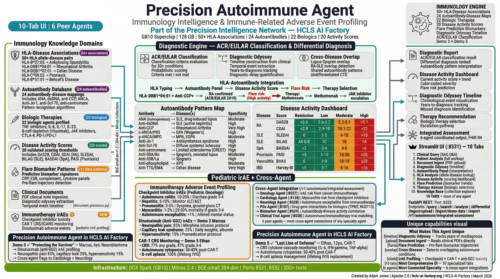

# Precision Autoimmune Intelligence Agent




*Source: [github.com/ajones1923/precision-autoimmune-agent](https://github.com/ajones1923/precision-autoimmune-agent)*

> **Part of the [Precision Intelligence Network](../engines/precision-intelligence.md)** — one of 11 specialized agents sharing a common molecular foundation within the HCLS AI Factory.

Autoimmune disease intelligence with autoantibody interpretation, HLA association analysis, disease activity scoring, flare prediction, and biologic therapy PGx recommendations. Part of the [HCLS AI Factory](https://github.com/ajones1923/hcls-ai-factory).

## Overview

The Precision Autoimmune Intelligence Agent transforms fragmented autoimmune clinical data into unified, actionable intelligence by combining multi-collection RAG search with deterministic clinical engines. It integrates autoantibody panels, HLA typing, disease activity scoring, flare prediction biomarker patterns, and biologic therapy pharmacogenomics to deliver interpretations that span the full diagnostic and treatment lifecycle of autoimmune disease -- from initial workup through long-term management.

| Collection | Records | Content |
|---|---|---|
| **Clinical Documents** | variable | Ingested patient clinical PDFs (progress notes, labs, imaging, pathology) |
| **Patient Labs** | variable | Lab results with reference range analysis and flag detection |
| **Autoantibody Panels** | 24 | Autoantibody reference panels with disease associations, sensitivity/specificity |
| **HLA Associations** | 22 | HLA allele to disease risk mapping with odds ratios and PMIDs |
| **Disease Criteria** | 10 | ACR/EULAR classification criteria for 10 autoimmune diseases |
| **Disease Activity** | 20 | Activity scoring systems (DAS28, SLEDAI-2K, PASI, EDSS, etc.) |
| **Flare Patterns** | 13 | Flare prediction biomarker patterns for 13 diseases |
| **Biologic Therapies** | 22 | Biologic drug database with PGx considerations |
| **PGx Rules** | variable | Pharmacogenomic dosing rules for autoimmune therapies |
| **Clinical Trials** | variable | Autoimmune disease clinical trials |
| **Literature** | variable | Published autoimmune literature and research |
| **Patient Timelines** | variable | Diagnostic timeline events for odyssey analysis |
| **Cross-Disease** | 9 | Cross-disease overlap syndromes and shared pathogenic mechanisms |
| **Genomic Evidence** | variable | *(read-only)* Shared from Stage 2 RAG pipeline |
| **Total** | **14 collections (13 owned + 1 read-only)** | |

### 6 Clinical Analysis Engines

| Engine | Function |
|---|---|
| **AutoantibodyInterpreter** | 24 autoantibodies mapped to 13 diseases with sensitivity/specificity data |
| **HLAAssociationAnalyzer** | 22 HLA alleles with disease odds ratios and PMIDs |
| **DiseaseActivityScorer** | 20 scoring systems (DAS28-CRP, DAS28-ESR, SLEDAI-2K, CDAI, BASDAI, SDAI, PASI, Mayo Score, Harvey-Bradshaw Index, ESSDAI, mRSS, EDSS, QMGS, Marsh Score, Burch-Wartofsky Score, ASDAS, MG-ADL, DAPSA, HbA1c-T1D, TSH-Hashimoto) |
| **FlarePredictor** | Biomarker-based flare risk with 13 disease-specific patterns |
| **BiologicTherapyAdvisor** | 22 biologic therapies with PGx considerations, contraindications, and monitoring |
| **DiagnosticOdysseyAnalyzer** | Timeline reconstruction, overlap syndrome detection, classification criteria evaluation, differential diagnosis |

### Example Queries

```
"Interpret ANA 1:640 homogeneous pattern with positive anti-dsDNA and low complement"
"What does HLA-DRB1*04:01 mean for rheumatoid arthritis prognosis?"
"Compare adalimumab vs tocilizumab for seropositive RA with shared epitope"
"Predict flare risk given rising CRP and falling complement C3 in SLE patient"
"HLA-DQ2/DQ8 positive with anti-tTG -- celiac disease screening recommendations"
```

### Demo Guide

For a complete walkthrough of all 10 UI tabs with demo patients, see the **[Demo Guide](demo-guide.md)**.

## Architecture

```
Patient Data Input (Autoantibodies + HLA + Biomarkers + Clinical PDFs)
    |
    v
[AutoantibodyInterpreter] ---- Positive antibodies? ----> Disease associations
    |                                                       (sensitivity/specificity)
    v
[6 Clinical Analysis Engines -- Parallel Execution]
    |               |              |              |
    v               v              v              v
HLA            Disease        Flare          Biologic
Association    Activity       Predictor      Therapy
Analyzer       Scorer         (13 disease    Advisor
(22 alleles)   (20 scores)    patterns)      (22 therapies + PGx)
    |               |              |              |
    +-------+-------+--------------+--------------+
            |
            v
    [DiagnosticOdysseyAnalyzer]
    Classification criteria | Overlap syndromes | Differential diagnosis
            |
            v
    [Multi-Collection RAG Engine]
    Parallel search across 14 Milvus collections
    (ThreadPoolExecutor, configurable weights)
            |
            v
    [Claude Sonnet 4] -> Grounded response with citations
            |
            v
    [Export: FHIR R4 | PDF | Markdown]
```

Built on the HCLS AI Factory platform:

- **Vector DB:** Milvus 2.4 with IVF_FLAT/COSINE indexes (nlist=1024, nprobe=16)
- **Embeddings:** BGE-small-en-v1.5 (384-dim)
- **LLM:** Claude Sonnet 4 (Anthropic API)
- **UI:** Streamlit 10 tabs (port 8531) | **API:** FastAPI (port 8532)
- **Hardware target:** NVIDIA DGX Spark ($4,699)

### UI Tabs

| # | Tab | Content |
|---|---|---|
| 1 | Clinical Query | RAG-powered Q&A with evidence citations across 14 collections |
| 2 | Patient Analysis | Full autoimmune analysis pipeline (antibodies + HLA + activity + flare + biologics) |
| 3 | Document Ingest | Upload clinical PDFs for patient record ingestion |
| 4 | Diagnostic Odyssey | Timeline visualization and diagnostic delay analysis |
| 5 | Autoantibody Panel | Interactive antibody interpretation with disease associations |
| 6 | HLA Analysis | HLA-disease association lookup with odds ratios |
| 7 | Disease Activity | Activity scoring dashboards (DAS28, SLEDAI-2K, BASDAI, etc.) |
| 8 | Flare Prediction | Biomarker-based flare risk with contributing/protective factors |
| 9 | Therapy Advisor | Biologic therapy recommendations with PGx and monitoring |
| 10 | Knowledge Base | Collection stats, evidence explorer, knowledge version info |

## Setup

### Prerequisites

- Python 3.10+
- Milvus 2.4 running on `localhost:19530`
- `AUTO_ANTHROPIC_API_KEY` environment variable (or in `.env`)

### Install

```bash
cd ai_agent_adds/precision_autoimmune_agent
pip install -r requirements.txt
```

### 1. Create Collections and Seed Reference Data

```bash
python3 scripts/setup_collections.py
```

Creates 14 Milvus collections with IVF_FLAT indexes and seeds reference data from the knowledge base.

### 2. Ingest Demo Patient Data

```bash
# Via API (after starting the API server):
curl -X POST http://localhost:8532/ingest/demo-data
```

Ingests clinical PDFs for 9 demo patients into Milvus collections.

### 3. Run Unit Tests

```bash
python3 -m pytest tests/ -v
```

455 tests covering all modules: collections (schemas, manager, search), diagnostic engine (classification criteria, overlap syndromes, differential diagnosis), RAG engine, export, API endpoints, timeline builder, and production readiness.

### 4. Launch UI

```bash
streamlit run app/autoimmune_ui.py --server.port 8531
```

### 5. Launch API (separate terminal)

```bash
uvicorn api.main:app --host 0.0.0.0 --port 8532
```

## Project Structure

```
precision_autoimmune_agent/
├── src/
│   ├── models.py                  # Pydantic data models (AutoimmunePatientProfile, etc.)
│   ├── collections.py             # 14 Milvus collection schemas + manager
│   ├── rag_engine.py              # Multi-collection RAG engine + Claude
│   ├── agent.py                   # AutoimmuneAgent orchestrator
│   ├── knowledge.py               # Knowledge base v2.0.0 (HLA, antibodies, biologics, flare patterns)
│   ├── diagnostic_engine.py       # Classification criteria, overlap syndromes, differential diagnosis
│   ├── document_processor.py      # PDF ingestion and chunking
│   ├── timeline_builder.py        # Diagnostic odyssey timeline construction
│   └── export.py                  # FHIR R4, PDF, Markdown export
├── app/
│   └── autoimmune_ui.py           # Streamlit UI (10 tabs, ~1,100 lines)
├── api/
│   └── main.py                    # FastAPI REST server (14 endpoints)
├── config/
│   └── settings.py                # AutoimmuneSettings (AUTO_ env prefix)
├── data/
│   ├── reference/                 # Reference data files
│   ├── cache/                     # Embedding cache
│   └── events/                    # Cross-agent event store
├── demo_data/
│   ├── sarah_mitchell/            # SLE patient (34F) -- 27+ clinical PDFs
│   ├── maya_rodriguez/            # POTS/hEDS/MCAS patient (28F) -- clinical PDFs
│   ├── linda_chen/                # Sjogren's patient (45F) -- clinical PDFs
│   ├── david_park/                # AS patient (45M) -- clinical PDFs
│   ├── rachel_thompson/           # MCTD patient (38F) -- clinical PDFs
│   ├── emma_williams/             # MS (RRMS) patient (34F) -- clinical PDFs
│   ├── james_cooper/              # T1D + Celiac overlap (19M) -- clinical PDFs
│   ├── karen_foster/              # SSc (dcSSc) patient (48F) -- clinical PDFs
│   └── michael_torres/            # Graves' Disease patient (41M) -- clinical PDFs
├── scripts/
│   ├── setup_collections.py       # Create and seed Milvus collections
│   ├── generate_demo_patients.py  # Generate demo patient PDFs
│   └── pdf_engine.py              # PDF generation utilities
├── tests/
│   ├── test_autoimmune.py         # Core agent tests
│   ├── test_collections.py        # Collection schema and manager tests
│   ├── test_diagnostic_engine.py  # Diagnostic engine tests
│   ├── test_rag_engine.py         # RAG engine tests
│   ├── test_export.py             # Export module tests
│   ├── test_api.py                # API endpoint tests
│   ├── test_timeline_builder.py   # Timeline builder tests
│   └── test_production_readiness.py # Production readiness checks
├── docker-compose.yml
├── Dockerfile
├── requirements.txt
└── LICENSE                        # Apache 2.0
```

**44 Python files | ~20,000 lines | Apache 2.0**

## Performance

Measured on NVIDIA DGX Spark (GB10 GPU, 128GB unified memory):

| Metric | Value |
|---|---|
| Seed all 14 collections | ~2 min |
| Vector search (14 collections, top-5 each) | 10-18 ms (cached) |
| Autoantibody interpretation (24 antibodies) | <50 ms |
| HLA association analysis (22 alleles) | <50 ms |
| Disease activity scoring (20 systems) | <100 ms |
| Flare prediction (13 patterns) | <100 ms |
| Biologic therapy matching (22 therapies) | <50 ms |
| Classification criteria evaluation | <50 ms |
| Full RAG query (search + Claude) | ~20-30 sec |
| FHIR R4 export | <500 ms |
| Unit tests (455 tests) | ~45 sec |

## Status

- **Phase 1 (Scaffold)** -- Complete. Architecture, data models, 14 collection schemas, 6 clinical engines, RAG engine, agent orchestrator, and Streamlit UI.
- **Phase 2 (Knowledge)** -- Complete. Knowledge v2.0.0: 22 HLA alleles, 24 autoantibodies, 22 biologic therapies, 20 disease activity scores, 13 flare patterns, 10 classification criteria sets, 9 overlap syndromes.
- **Phase 3 (Data)** -- Complete. 9 demo patients with full clinical PDF records, autoantibody panels, HLA typing, and longitudinal lab data.
- **Phase 4 (Integration)** -- Complete. Full RAG pipeline with Claude generating grounded, disease-specific interpretations. FHIR R4 export. Cross-agent integration stubs (Biomarker Agent, Imaging Agent).
- **Phase 5 (Testing)** -- Complete. 455 unit tests passing across 8 test files. Production readiness checks.
- **Phase 6 (Demo Ready)** -- Complete. Production-quality Streamlit UI with 10 tabs, 9 demo patients, PDF ingestion, and multi-format export.

## Credits

- **Adam Jones**
- **Apache 2.0 License**

---

!!! warning "Clinical Decision Support Disclaimer"
    This agent is a clinical decision support research tool. It is not FDA-cleared and is not intended as a standalone diagnostic device. All recommendations should be reviewed by qualified healthcare professionals. Apache 2.0 License.
