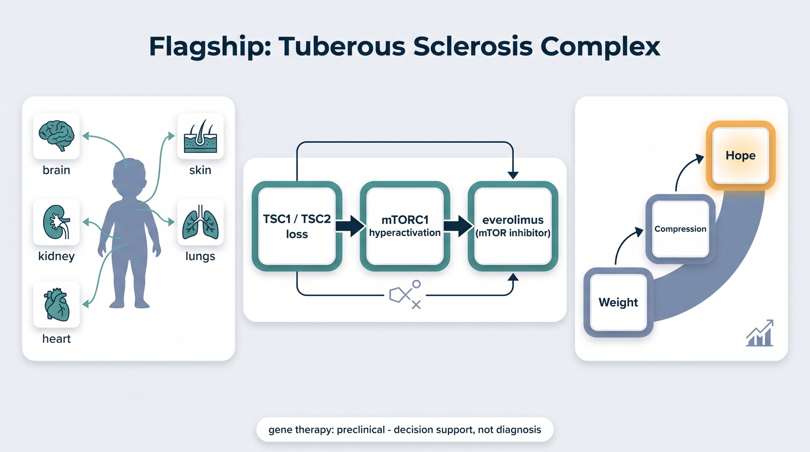
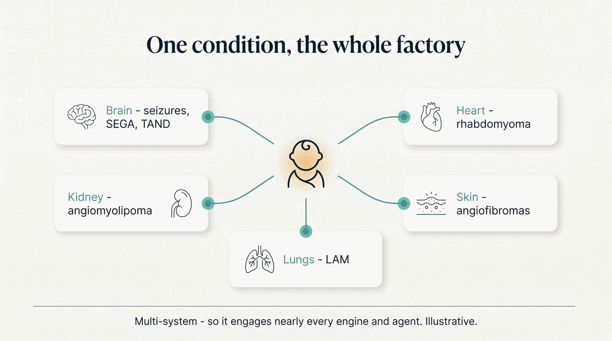
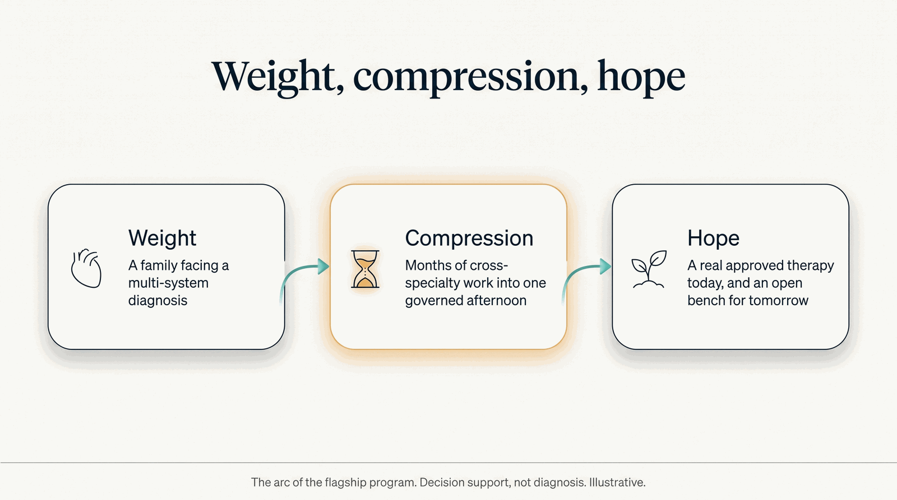

# Flagship: Tuberous Sclerosis Complex

The factory's first disease program, and the reason the whole thing exists: **one child, the whole
factory, one governed afternoon.** TSC is multi-system — brain, kidney, heart, skin, lungs — so it
lights up nearly every engine and agent, and it has a clean gene-to-drug story.

<video class="cap-video" controls preload="metadata" playsinline poster="/assets/videos/posters/tsc-usecase.jpg" src="/assets/videos/tsc-usecase.mp4">
  Your browser can't play embedded video — <a href="/assets/videos/tsc-usecase.mp4">download the video</a>.
</video>
/// caption
The flagship story in under a minute — narrated and captioned. Gene therapy is preclinical; decision support, not diagnosis.
///

/// caption
Illustrative diagram. Gene therapy is preclinical; decision support, not diagnosis.
///

## What TSC is, in plain terms

Tuberous Sclerosis Complex is a genetic condition — roughly **1 in 6,000 births** — in which benign
tumors (**hamartomas**) grow across many organs. Because it touches so many systems and follows a
clean genetic mechanism, it is the ideal first patient story for the factory: enough breadth to
exercise nearly every capability, with a therapy that is real today.

## One condition, the whole factory

/// caption
TSC is multi-system, so it engages nearly every engine and agent. Illustrative.
///

TSC rarely stays in one place. It shows up in the **brain** (seizures, subependymal giant cell
astrocytoma, and TSC-associated neuropsychiatric disorders — TAND), the **heart** (rhabdomyoma, often
seen in infancy), the **kidneys** (angiomyolipomas), the **skin** (angiofibromas and hypomelanotic
macules), and the **lungs** (lymphangioleiomyomatosis, LAM). That breadth is exactly why one TSC
patient recruits the genomics, imaging, cardiology, pharmacogenomics, rare-disease, and neurology
capabilities at once.

## The gene-to-drug story

**TSC1 / TSC2 loss → mTORC1 hyperactivation → everolimus (an mTOR inhibitor).** The TSC1 (hamartin)
and TSC2 (tuberin) proteins normally form a complex that restrains **mTORC1**, a master regulator of
cell growth. When a variant knocks that complex out, mTORC1 runs unchecked and hamartomas grow — so an
mTOR inhibitor addresses the mechanism directly. **Everolimus** is real and FDA-approved in TSC (SEGA
2010, renal angiomyolipoma 2012, seizures 2018). The factory helps a clinician reason over a patient's
variants, imaging, and phenotype to *support* that decision. It does not make it.

## The arc

/// caption
Three beats: the weight of the diagnosis, the compression into one afternoon, honest hope. Illustrative.
///

The program is built as three beats — **weight → compression → hope**: the weight of a family facing
a multi-system diagnosis; the compression of months of cross-specialty work into one governed
afternoon; and honest hope — a real, approved therapy today, and an open bench for what comes next.

## How the factory composes here

The [Tuberous Sclerosis engine](../factory/engines/tuberous-sclerosis-engine.md) composes the
horizontal [engines](../factory/engines/index.md) and [intelligence agents](../factory/agents/index.md)
— genomics, imaging, pharmacogenomics, rare-disease, and more — into one vertical for TSC.

!!! warning "Honesty ledger — carried at full force"
    - **Gene therapy for TSC1/TSC2 is preclinical** — an open design/analysis bench, not a treatment
      available today.
    - **Everolimus is real and approved** — the factory supports, it does not prescribe.
    - **Decision support, not diagnosis**, and **pediatric / vulnerable-population caution at full
      force.** See [Honesty & Governance](../honesty/index.md).

*Replication roadmap: NF1, NF2, Rett, Williams, and the broader mTORopathies — same pattern, same
horizontal foundation.*
