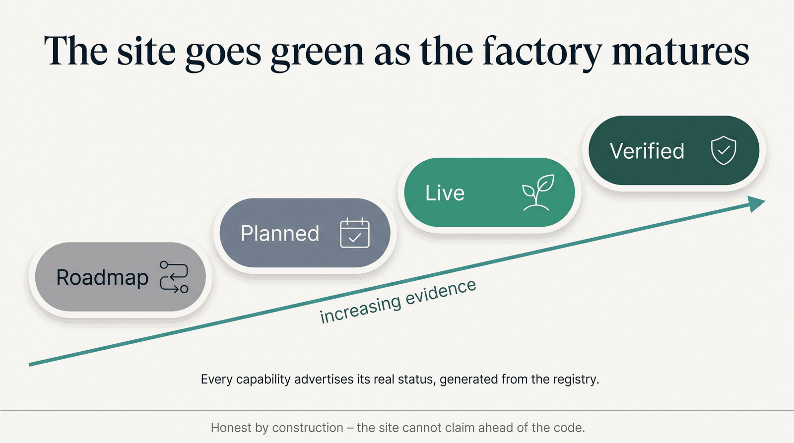

# Roadmap

The factory and this site grow together, in public. The **[Capability Maturity
Matrix](honesty/maturity-matrix.md)** is the live scorecard; this page is the honest direction.

/// caption
Every capability advertises its real status, generated from the registry — the site cannot claim ahead of the code.
///

## Platform

- **Live today** — the platform library (capability registry, MCP tool-surface, workflow composer,
  governance gates) and the engines/agents the registry declares `live`.
- **Planned** — the frontier co-folding and generation models registered `planned` (e.g. Chai-1,
  Chai-2, GenMol) flip to `live` only when they are stood up and served for real.
- **Preclinical** — gene-therapy directions (including TSC1/TSC2) are an open design/analysis bench,
  not a treatment available today.

## This site

Built in four phases, each flipping matrix badges green as real capabilities come online:

| Phase | Focus |
|---|---|
| **0 — Foundation** *(in progress)* | design-system + honest status badges, OG/SEO + `llms.txt`, the registry-bound maturity matrix, the section skeleton, a strict docs build in CI |
| **1 — Depth** | per-engine / per-agent / TSC pages, published diagrams, badges flipping as capabilities verify |
| **2 — Proof** | "Run It Yourself" quickstart, verified-on-real-data proofs, citations, governance |
| **3 — Launch** | performance + accessibility pass, analytics for the right metrics, the launch moment |

## Changelog

The site build, in public — most-recent first.

- **2026-07** — **Verification campaign:** ran capabilities on real public data and earned `verified`
  where they passed — the variant store (HG002), single-cell compute (pbmc3k), ACMG secondary-findings
  (real ClinVar), molecule generator + ADMET (real drugs), ESM-2 search + ProteinMPNN (real proteins).
- **2026-07** — **Fuller IA:** two-tier tab navigation, a page for every engine and agent, About /
  Mission, Honesty Ledger + Decision-Support Posture pages, Run It Yourself split
  (Quickstart / Hardware / Reproducibility), per-page social OG cards, `CITATION.cff`.
- **2026-07** — **Honesty audit:** code-level review of every `live` capability; corrected the real
  overclaims (`live → planned` where a dependency can't load); the maturity vocabulary shipped.
- **2026-07** — **Foundation (Phases 0–3):** the registry-bound maturity matrix, the honesty spine,
  citations & governance pages, `llms.txt` + SEO, the design-system status badges, a strict docs build
  gating every PR.

## A note on the status vocabulary

Beyond the serving states **live** and **planned**, the registry now carries an optional, orthogonal
**maturity tier** — **verified · preclinical · research-use · roadmap · gated** — machine-checked
against the code (e.g. `verified` is rejected by the registry on anything not actually running). It
is populated **conservatively**, only where the registry documents a basis: today the queryable
variant store is `verified` (proven on real HG002) and Chai-2 is `gated` (partnership access).
Broadening coverage — and adding finer-grained capability entries for the feature-level caveats now
carried on the [Honesty & Governance ledger](honesty/index.md) (e.g. TSC gene therapy is preclinical)
— continues as capabilities are audited.
