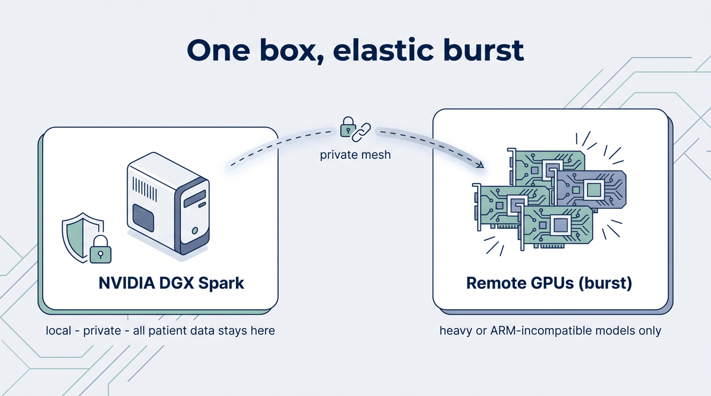

# Hardware & Elastic Burst

**"Elastic burst," not "all on one box."** The reference target is a single **NVIDIA DGX Spark**
(GB10: ARM Grace + Blackwell). Most of the factory runs there. Heavy or ARM-incompatible models run on
**remote GPUs on demand**, over a private mesh — and the site says so wherever that's the case, because
a "one box" claim that quietly needs a cluster is exactly the gap a skeptic turns into a headline.

/// caption
Illustrative diagram. All patient data stays on the local box; only derived, non-identifying work bursts to a remote GPU.
///

## What runs where

| Runs locally on the DGX Spark | Bursts to remote GPU (on demand) |
|---|---|
| Orchestration, the capability registry, the MCP tool-surface, the workflow composer | Frontier co-folding (Chai-1 / Chai-2), RFdiffusion, Evo 2 |
| Governance gates + 21 CFR Part 11-style lineage | x86-only CUDA containers (e.g. Parabricks, several BioNeMo NIMs) |
| The RAG intelligence agents (vector DB + LLM), multi-omics join, DuckDB | Anything ARM-incompatible or too heavy for one box |
| **All patient data** | **Only derived, non-identifying work** — never raw PHI |

Two reasons a model bursts: raw compute (frontier models exceed one box), and architecture (the Spark
is aarch64, so x86-only CUDA containers must run on a remote x86 GPU regardless of raw power).

## Privacy is architectural

**All patient data stays on the local box.** Only derived, non-identifying assets are ever sent to a
burst GPU — never raw PHI. This is a design constraint, not a policy note; see
[Governance & Lineage](../honesty/governance.md).

!!! note
    "Elastic burst" is a hard [honesty invariant](../honesty/ledger.md): no page implies everything
    runs locally, and no burst sends raw patient data off the box.
