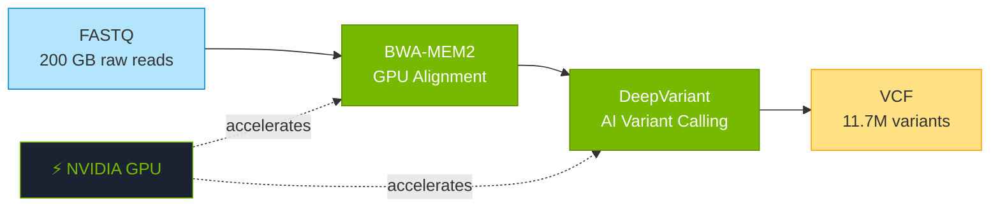

# Stage 1: GPU Genomics

  
01

  

    
From raw sequencing data to millions of variants

    
120 – 240 minutes on DGX Spark

  

---

!!! info "Prerequisite: Stage 0 — Data Acquisition"
    Before running Stage 1, all required data must be downloaded via [`setup-data.sh`](DATA_SETUP.md). This includes HG002 FASTQ files (~200 GB), the GRCh38 reference genome, and BWA-MEM2 index. Stage 0 is a one-time step.

## What This Stage Does

When a patient's DNA is sequenced, the machine produces **raw data** — billions of short DNA fragments stored in FASTQ files, typically around 200 GB per patient.

Stage 1 transforms this raw data into **actionable genetic information**:

1. **Alignment** — Each DNA fragment is mapped back to its position on the human reference genome (like assembling a 3-billion-piece puzzle)

2. **Variant Calling** — The pipeline identifies where this patient's DNA differs from the reference — these differences are called **variants**

3. **Quality Filtering** — AI-powered models (DeepVariant) distinguish real variants from sequencing errors with >99% accuracy

---

## By the Numbers

| Metric | Value |
|--------|-------|
| Input size | ~200 GB FASTQ |
| Reads aligned | 800M – 1.2B |
| Variants discovered | 11.7 million |
| High-quality variants | 3.5 million |
| Accuracy | >99% (DeepVariant) |
| Runtime | 120 – 240 minutes |

---

## The Speed Advantage

| Step | Traditional (CPU) | HCLS AI Factory (GPU) |
|------|-------------------|----------------------|
| Alignment (BWA-MEM2) | 12 – 24 hours | 1 – 2 hours |
| Variant Calling | 8 – 12 hours | 1 – 2 hours |
| **Total** | **1 – 2 days** | **2 – 4 hours** |

GPU acceleration via NVIDIA Parabricks delivers **10–50x speedup** over traditional CPU pipelines.

---

## Technology Stack

- **NVIDIA Parabricks 4.6** — GPU-accelerated GATK best practices
- **BWA-MEM2** — Burrows-Wheeler Aligner for read mapping
- **Google DeepVariant** — AI-powered variant calling
- **Nextflow** — Workflow orchestration
- **Docker** — Containerized, reproducible execution

---

## How It Works

Click to view the full pipeline logical diagram

---

## Output

The stage produces a **VCF file** (Variant Call Format) containing:

- **Chromosome position** of each variant
- **Reference allele** (what the reference genome has)
- **Alternate allele** (what the patient has)
- **Quality scores** (confidence in the call)
- **Genotype** (heterozygous or homozygous)

This VCF file becomes the input for [Stage 2: Evidence RAG](stage-2-rag.md), where we determine which variants actually matter.

---

## Why GPU Acceleration Matters

Traditional genomics pipelines run on CPU clusters and take **1–2 days per patient**. For a hospital processing hundreds of patients, this creates bottlenecks.

GPU acceleration changes the equation:

- **Same accuracy** — FDA-cleared Parabricks matches CPU results
- **10x faster** — Hours instead of days
- **Lower cost** — One DGX Spark vs. a CPU cluster
- **Real-time capability** — Results while the patient is still in clinic

