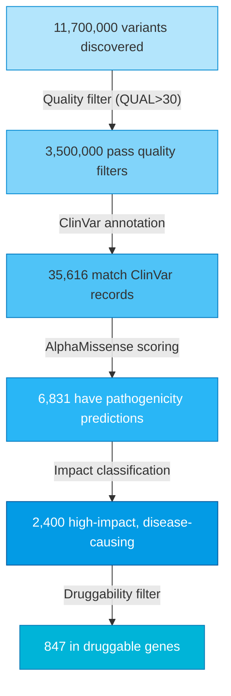
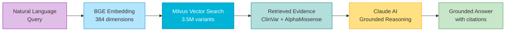

# Stage 2: Evidence RAG

  
02

  

    
Finding the needle in 11.7 million variants

    
Interactive queries in seconds

  

---

## What This Stage Does

Stage 1 produced **11.7 million variants**. Most are harmless — they're just what makes you, you. The challenge is finding the ones that actually **cause disease** and can be **targeted with drugs**.

Stage 2 uses **Retrieval-Augmented Generation (RAG)** to:

1. **Annotate** — Cross-reference every variant against clinical databases
2. **Embed** — Convert variants into searchable vector representations
3. **Reason** — Use AI to interpret evidence and identify targets

---

## The Funnel

This is the heart of what the platform does — narrowing millions of variants to actionable targets:

From 11.7 million down to 847. That's the power of AI-driven annotation.

---

## Knowledge Base

The RAG system is grounded in curated biomedical knowledge:

| Source | Coverage |
|--------|----------|
| **ClinVar** | 4.1 million clinically studied variants |
| **AlphaMissense** | DeepMind's pathogenicity predictions |
| **Gene Panel** | 201 genes across 13 therapeutic areas |
| **Druggability** | 171 genes (85%) with known drug targets |

### Therapeutic Areas Covered

Neurology · Oncology · Cardiovascular · Metabolic · Immunology · Rare Disease · Ophthalmology · Dermatology · Respiratory · Hematology · Musculoskeletal · Endocrine · Infectious Disease

---

## How RAG Works

**Retrieval-Augmented Generation** combines search with AI reasoning:

1. **You ask a question** in natural language
2. **Vector search** finds the most relevant variants and annotations
3. **Evidence is retrieved** from the knowledge base
4. **Claude reasons** over the evidence to provide grounded answers

The AI can only cite variants and evidence that **actually exist in this patient's data**. It's not hallucinating — it's reasoning over real genomic evidence.

---

## Example Query

**Question:** "What pathogenic variants does this patient have in genes associated with neurodegeneration?"

**Response:** The system identifies a VCP variant (chr9:35,065,263 G>A) with:

- ClinVar classification: **Pathogenic**
- AlphaMissense score: **0.87** (threshold: 0.564)
- Associated disease: **Frontotemporal Dementia**
- Druggability: **Yes** — VCP is a known therapeutic target

This variant becomes the input for [Stage 3: Drug Discovery](stage-3-drug-discovery.md).

---

## Technology Stack

- **Milvus 2.4** — Vector database for 3.5M variant embeddings
- **Anthropic Claude** — AI reasoning over retrieved evidence
- **ClinVar** — NIH clinical variant database
- **AlphaMissense** — DeepMind pathogenicity predictions
- **Streamlit** — Interactive chat interface
- **Flask** — REST API for programmatic access

---

## By the Numbers

| Metric | Value |
|--------|-------|
| Variants indexed | 3.5 million |
| Embedding dimensions | 384 |
| Query latency | < 2 seconds |
| Knowledge sources | 4 (ClinVar, AlphaMissense, Gene Panel, PDB) |
| Genes covered | 201 |
| Druggable targets | 171 (85%) |

---

## Why This Matters

Traditional variant interpretation requires:

- **Manual literature review** — Hours per variant
- **Expert curation** — Scarce clinical geneticists
- **Fragmented tools** — Separate databases, no unified view

The RAG pipeline delivers:

- **Instant answers** — Seconds, not hours
- **Grounded reasoning** — Every claim traceable to evidence
- **Unified view** — All annotations in one place
- **Natural language** — No bioinformatics expertise required

