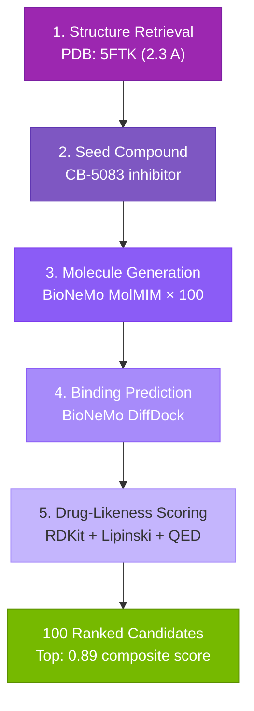

# Stage 3: Drug Discovery

<div class="stage-hero stage-hero-purple">
  <div class="stage-number">03</div>
  <div class="stage-intro">
    <p class="stage-tagline">Designing new medicines with generative AI</p>
    <p class="stage-time">8 – 16 minutes per target</p>
  </div>
</div>

---

## What This Stage Does

Stage 2 identified a **druggable target** — a disease-causing gene that scientists know how to modulate with drugs. Stage 3 designs **new molecules** that might treat the disease.

This is generative drug discovery:

1. **Structure Retrieval** — Fetch the 3D protein structure from PDB
2. **Seed Compound** — Identify an existing drug as a starting point
3. **Molecule Generation** — AI creates 100 novel molecular designs
4. **Binding Prediction** — Simulate how each molecule binds to the target
5. **Drug-Likeness Scoring** — Filter for molecules that could work as medicines

---

## The Process



### 1. Get the Target Structure

For VCP (the target from Stage 2), the pipeline queries the Protein Data Bank:

- **PDB ID:** 5FTK
- **Resolution:** 2.3 Å
- **Key insight:** Structure shows VCP bound to an existing inhibitor — this reveals exactly where drugs should attach

### 2. Identify a Seed Compound

The existing drug **CB-5083** serves as our starting point:

- VCP inhibitor that reached Phase I trials
- Discontinued due to off-target effects
- Provides a molecular scaffold to improve upon

<figure style="text-align:center; margin: 1.5rem 0;">
  
  <figcaption style="font-size: 0.85rem; opacity: 0.7; margin-top: 0.5rem;">CB-5083 molecular structure — starting scaffold for AI optimization</figcaption>
</figure>

### 3. Generate Novel Molecules

**BioNeMo MolMIM** generates 100 new molecular structures:

- Uses the same AI architecture as text generators
- But writes molecular structures (SMILES notation) instead of sentences
- Each molecule is a variation designed to improve on the seed

### 4. Predict Binding

**BioNeMo DiffDock** simulates molecular docking:

- Predicts the 3D pose of each molecule in the binding pocket
- Calculates binding affinity (docking score)
- Score < -8.0 kcal/mol = excellent binding

### 5. Score Drug-Likeness

**RDKit** evaluates whether molecules could work as oral drugs:

- **Lipinski's Rule of Five** — Size, solubility, permeability
- **QED Score** — Quantitative Estimate of Drug-likeness (0–1)
- Threshold: QED > 0.67 indicates good drug potential

---

## Results

From 100 generated molecules:

| Metric | Value |
|--------|-------|
| Valid structures | 98 |
| Pass Lipinski's rules | 87 (89%) |
| QED > 0.67 | 72 (73%) |
| Docking score < -8.0 | 45 (46%) |
| **Top candidate QED** | **0.81** |
| **Top candidate docking** | **-11.4 kcal/mol** |

### Top Candidate vs. Original Drug

| Metric | CB-5083 (Original) | AI Candidate |
|--------|-------------------|--------------|
| Binding strength | -8.1 kcal/mol | -11.4 kcal/mol |
| Drug-likeness (QED) | 0.62 | 0.81 |
| Composite score | 0.64 | 0.89 |
| **Improvement** | — | **+39%** |

---

## Technology Stack

<div class="tech-pills">

- **NVIDIA BioNeMo MolMIM** — Generative AI for molecules
- **NVIDIA BioNeMo DiffDock** — AI-powered docking prediction
- **RDKit** — Cheminformatics and drug-likeness scoring
- **Protein Data Bank** — 3D protein structures
- **RCSB API** — Programmatic structure retrieval

</div>

---

## How Scoring Works

Each candidate is ranked by a composite formula:

```
Score = (0.30 × Generation Confidence) +
        (0.40 × Binding Strength) +
        (0.30 × Drug-Likeness)
```

- **Generation Confidence** — How well the AI generated the structure
- **Binding Strength** — Predicted affinity to the target (docking score)
- **Drug-Likeness** — QED score from RDKit

---

## Important Context

These are **computational predictions** — promising starting points for laboratory testing, not finished medicines.

Real drug development requires:

- **Synthesis** — Actually making the molecules
- **In vitro testing** — Cell-based assays
- **In vivo testing** — Animal models
- **Clinical trials** — Human safety and efficacy
- **Regulatory approval** — FDA or equivalent

What this pipeline does is **collapse the first step** — identifying targets and generating candidates — from months of work into hours.

---

## The Output

Stage 3 produces a ranked list of 100 drug candidates:

```
Rank  SMILES                          Docking   QED    Score
----  ------------------------------  --------  -----  -----
1     CC1=CC=C(C=C1)C2=CN=C(N2)...   -11.4     0.81   0.89
2     COC1=CC=C(C=C1)N2C=NC3=C2...   -10.8     0.78   0.86
3     CC(C)NC(=O)C1=CC=C(C=C1)...    -10.2     0.79   0.84
...
```

Each candidate includes:

- **SMILES notation** — Machine-readable molecular structure
- **2D structure image** — Visual representation
- **Docking score** — Predicted binding affinity
- **QED score** — Drug-likeness
- **Lipinski violations** — Rule-of-five compliance
- **Composite rank** — Overall score

---

## Full Pipeline Summary


**Total time:** Under 5 hours from raw DNA to drug candidates (plus one-time Stage 0 data acquisition).

