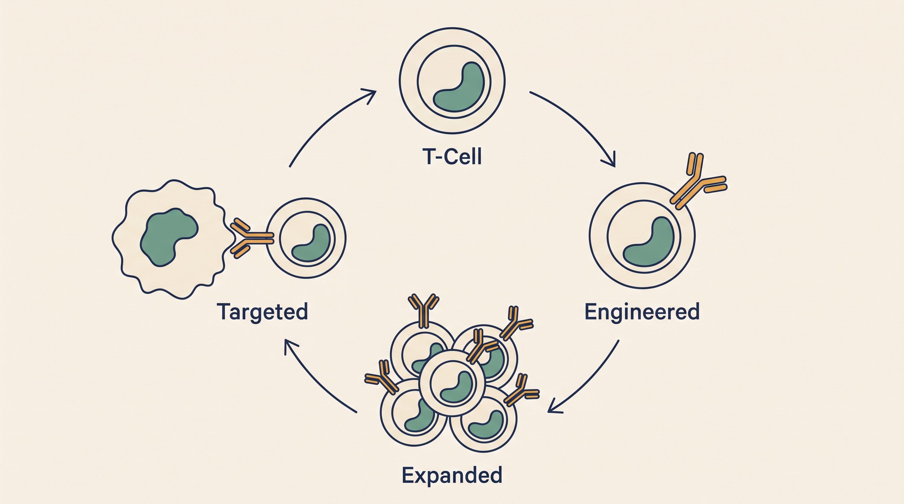

# CAR-T Intelligence — Overview

**Kind:** agent · **Demo:** `A1` · **Source:** `core/agents/cart`


/// caption
Illustrative. CAR-T Intelligence at a glance.
///

## What it is

Reasons about engineered T-cell therapies — which construct, for which patient, with which risks.

## Why it matters

CAR-T is powerful and dangerous in the same breath. Construct choice and its safety counterweight belong in the same conversation.

> **Decision support for a qualified clinician — never autonomous diagnosis or prescribing.** Every output on this page is intended to inform a clinician's judgement, not replace it.

## Honest limit

On-target off-tumour toxicity and cytokine release are real. Any construct suggestion carries its monitoring requirement.

## Endpoints

**UI :8521 · API :8522** (platform convention: registry endpoint is the UI, API is UI + 1)

| Capability | Type | Status | Endpoint |
|---|---|---|---|
| `cart-intelligence-agent` | agent | **live** | localhost:8521 |

## Size and health

| | |
|---|---|
| Python files | 62 |
| Lines of code | 22,155 |
| Test files | 11 |
| Containerised | yes |

Verify at any time:

```bash
.venv/bin/python scripts/run_all_tests.py cart
```

## Where to go next

- [Foundation Learning Guide](FOUNDATION.md) — the concepts, no prior knowledge assumed
- [Advanced Learning Guide](ADVANCED.md) — architecture, modules, extension points
- [Demo Guide](DEMO.md) — how to run `A1`
