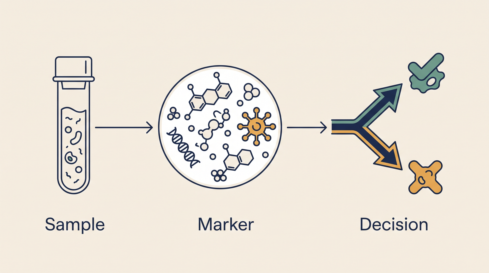

# Precision Biomarker — Overview

**Kind:** agent · **Demo:** `A2` · **Source:** `core/agents/precision-biomarker`


/// caption
Illustrative. Precision Biomarker at a glance.
///

## What it is

Identifies measurable markers that predict how a disease will behave or how a patient will respond.

## Why it matters

Predictive and prognostic are different questions. Conflating them changes the wrong decision.

> **Decision support for a qualified clinician — never autonomous diagnosis or prescribing.** Every output on this page is intended to inform a clinician's judgement, not replace it.

## Honest limit

Many biomarker inputs are research- or trial-use, not validated for routine clinical practice.

## Endpoints

**UI :8528 · API :8529** (platform convention: registry endpoint is the UI, API is UI + 1)

| Capability | Type | Status | Endpoint |
|---|---|---|---|
| `precision-biomarker-agent` | agent | **live** | localhost:8528 |

## Size and health

| | |
|---|---|
| Python files | 58 |
| Lines of code | 29,398 |
| Test files | 20 |
| Containerised | yes |

Verify at any time:

```bash
.venv/bin/python scripts/run_all_tests.py precision-biomarker
```

## Where to go next

- [Foundation Learning Guide](FOUNDATION.md) — the concepts, no prior knowledge assumed
- [Advanced Learning Guide](ADVANCED.md) — architecture, modules, extension points
- [Demo Guide](DEMO.md) — how to run `A2`
