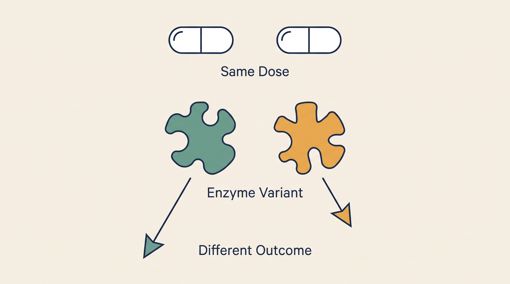

# Pharmacogenomics — Overview

**Kind:** agent · **Demo:** `A3` · **Source:** `core/agents/pharmacogenomics`


/// caption
Illustrative. Pharmacogenomics at a glance.
///

## What it is

Explains why two patients given the same dose of the same drug can have completely different outcomes.

## Why it matters

Genotype-guided dosing has CPIC guidelines behind it. For DPYD and fluorouracil the stakes are toxicity, not efficacy.

> **Decision support for a qualified clinician — never autonomous diagnosis or prescribing.** Every output on this page is intended to inform a clinician's judgement, not replace it.

## Honest limit

CPIC guidance covers specific gene-drug pairs. Substrate relationships outside those pairs are pharmacology, not guideline-backed dosing advice.

## Endpoints

**UI :8507 · API :8508** (platform convention: registry endpoint is the UI, API is UI + 1)

| Capability | Type | Status | Endpoint |
|---|---|---|---|
| `pharmacogenomics-intelligence-agent` | agent | **live** | localhost:8507 |

## Size and health

| | |
|---|---|
| Python files | 56 |
| Lines of code | 27,751 |
| Test files | 18 |
| Containerised | yes |

Verify at any time:

```bash
.venv/bin/python scripts/run_all_tests.py pharmacogenomics
```

## Where to go next

- [Foundation Learning Guide](FOUNDATION.md) — the concepts, no prior knowledge assumed
- [Advanced Learning Guide](ADVANCED.md) — architecture, modules, extension points
- [Demo Guide](DEMO.md) — how to run `A3`
