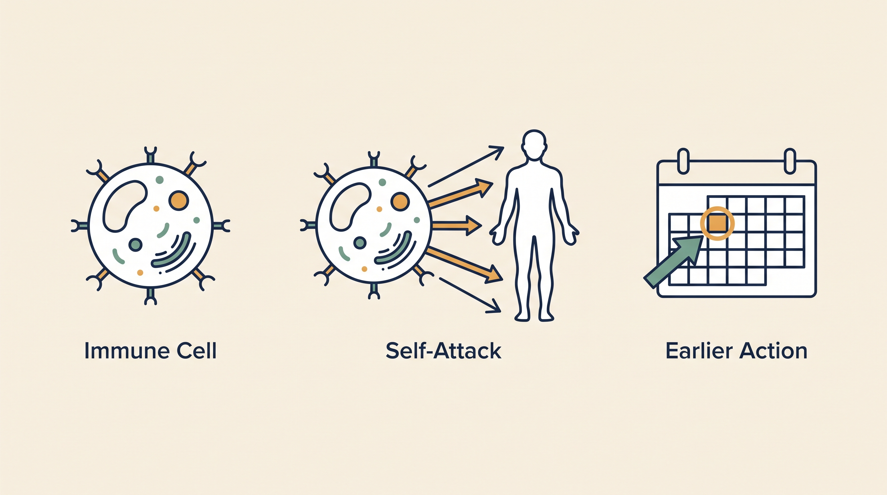

# Precision Autoimmune — Overview

**Kind:** agent · **Demo:** `A4` · **Source:** `core/agents/precision-autoimmune`


/// caption
Illustrative. Precision Autoimmune at a glance.
///

## What it is

Reasons about autoimmune disease — where the immune system attacks the body it should protect.

## Why it matters

Intervening before the next flare beats treating after it. That requires reading trajectory, not just current state.

> **Decision support for a qualified clinician — never autonomous diagnosis or prescribing.** Every output on this page is intended to inform a clinician's judgement, not replace it.

## Honest limit

Decision support only; autoimmune management is highly individual and specialist-led.

## Endpoints

**UI :8531 · API :8532** (platform convention: registry endpoint is the UI, API is UI + 1)

| Capability | Type | Status | Endpoint |
|---|---|---|---|
| `precision-autoimmune-agent` | agent | **live** | localhost:8531 |

## Size and health

| | |
|---|---|
| Python files | 45 |
| Lines of code | 20,427 |
| Test files | 9 |
| Containerised | yes |

Verify at any time:

```bash
.venv/bin/python scripts/run_all_tests.py precision-autoimmune
```

## Where to go next

- [Foundation Learning Guide](FOUNDATION.md) — the concepts, no prior knowledge assumed
- [Advanced Learning Guide](ADVANCED.md) — architecture, modules, extension points
- [Demo Guide](DEMO.md) — how to run `A4`
