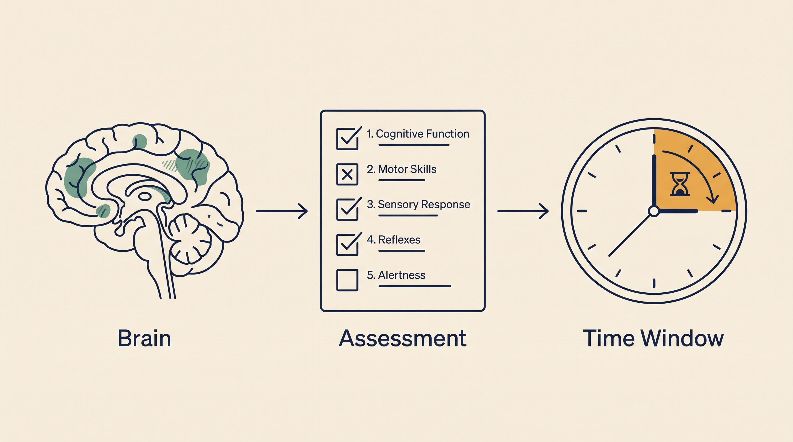

# Neurology Intelligence — Overview

**Kind:** agent · **Demo:** `A5` · **Source:** `core/agents/neurology`


/// caption
Illustrative. Neurology Intelligence at a glance.
///

## What it is

Supports neurological assessment and the decisions that follow it.

## Why it matters

In stroke, structured scoring and time-to-decision are the outcome. Consistency of assessment matters as much as speed.

> **Decision support for a qualified clinician — never autonomous diagnosis or prescribing.** Every output on this page is intended to inform a clinician's judgement, not replace it.

## Honest limit

Scales such as NIHSS are clinician-administered instruments. The agent supports their interpretation, it does not perform the examination.

## Endpoints

**UI :8535 · API :8536** (platform convention: registry endpoint is the UI, API is UI + 1)

| Capability | Type | Status | Endpoint |
|---|---|---|---|
| `neurology-intelligence-agent` | agent | **live** | localhost:8535 |

## Size and health

| | |
|---|---|
| Python files | 48 |
| Lines of code | 22,440 |
| Test files | 14 |
| Containerised | yes |

Verify at any time:

```bash
.venv/bin/python scripts/run_all_tests.py neurology
```

## Where to go next

- [Foundation Learning Guide](FOUNDATION.md) — the concepts, no prior knowledge assumed
- [Advanced Learning Guide](ADVANCED.md) — architecture, modules, extension points
- [Demo Guide](DEMO.md) — how to run `A5`
