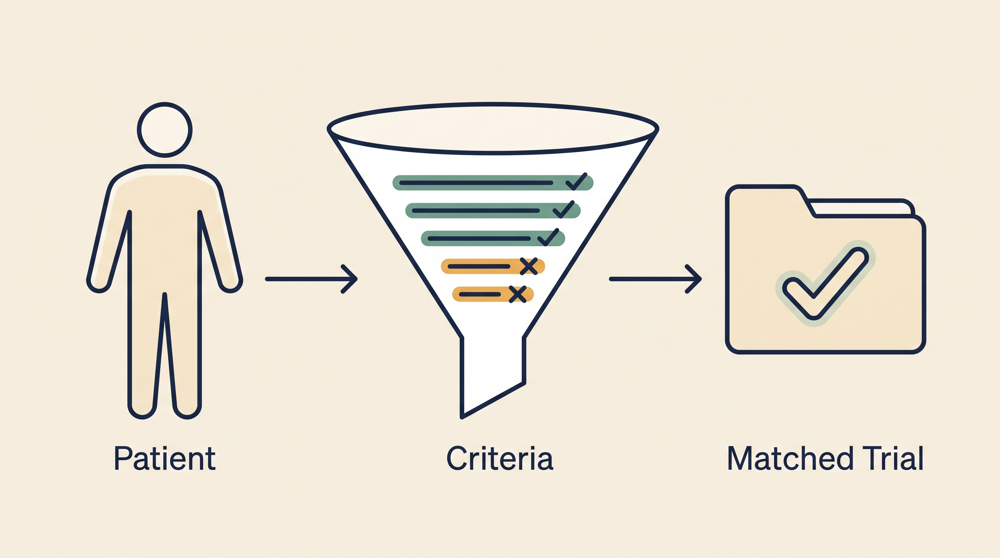

# Clinical Trial Intelligence — Overview

**Kind:** agent · **Demo:** `A6` · **Source:** `core/agents/clinical-trial`


/// caption
Illustrative. Clinical Trial Intelligence at a glance.
///

## What it is

Finds the trials a patient may be eligible for, and what a candidate molecule would need to enter one.

## Why it matters

Trial matching closes the loop: a discovered molecule is only a hypothesis until there is a path to test it in people.

> **Decision support for a qualified clinician — never autonomous diagnosis or prescribing.** Every output on this page is intended to inform a clinician's judgement, not replace it.

## Honest limit

Matching is informational. Eligibility is determined by the trial investigators, not by this agent.

## Endpoints

**UI :8538 · API :8539** (platform convention: registry endpoint is the UI, API is UI + 1)

| Capability | Type | Status | Endpoint |
|---|---|---|---|
| `clinical-trial-intelligence-agent` | agent | **live** | localhost:8538 |

## Size and health

| | |
|---|---|
| Python files | 47 |
| Lines of code | 23,396 |
| Test files | 14 |
| Containerised | yes |

Verify at any time:

```bash
.venv/bin/python scripts/run_all_tests.py clinical-trial
```

## Where to go next

- [Foundation Learning Guide](FOUNDATION.md) — the concepts, no prior knowledge assumed
- [Advanced Learning Guide](ADVANCED.md) — architecture, modules, extension points
- [Demo Guide](DEMO.md) — how to run `A6`
