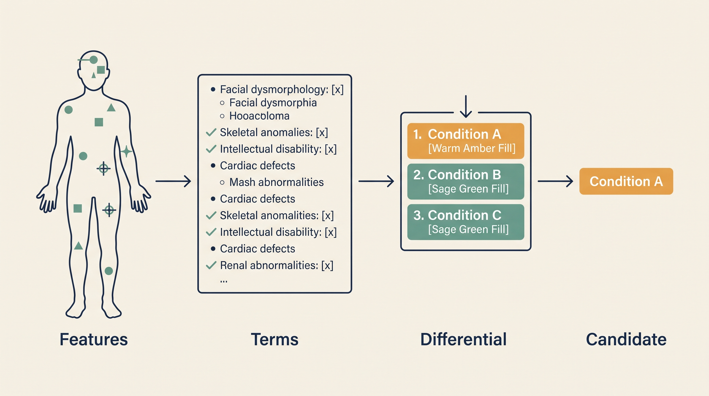

# Rare Disease Diagnostic — Overview

**Kind:** agent · **Demo:** `A7` · **Source:** `core/agents/rare-disease-diagnostic`


/// caption
Illustrative. Rare Disease Diagnostic at a glance.
///

## What it is

Takes a set of observed clinical features and produces a ranked list of conditions that could explain them.

## Why it matters

The diagnostic odyssey averages years. Compressing it is the mission of this platform in a single agent.

> **Decision support for a qualified clinician — never autonomous diagnosis or prescribing.** Every output on this page is intended to inform a clinician's judgement, not replace it.

## Honest limit

A ranked differential is a starting point for investigation, never a diagnosis.

## Endpoints

**UI :8544 · API :8545** (platform convention: registry endpoint is the UI, API is UI + 1)

| Capability | Type | Status | Endpoint |
|---|---|---|---|
| `rare-disease-diagnostic-agent` | agent | **live** | localhost:8544 |

## Size and health

| | |
|---|---|
| Python files | 48 |
| Lines of code | 22,454 |
| Test files | 14 |
| Containerised | yes |

Verify at any time:

```bash
.venv/bin/python scripts/run_all_tests.py rare-disease-diagnostic
```

## Where to go next

- [Foundation Learning Guide](FOUNDATION.md) — the concepts, no prior knowledge assumed
- [Advanced Learning Guide](ADVANCED.md) — architecture, modules, extension points
- [Demo Guide](DEMO.md) — how to run `A7`
