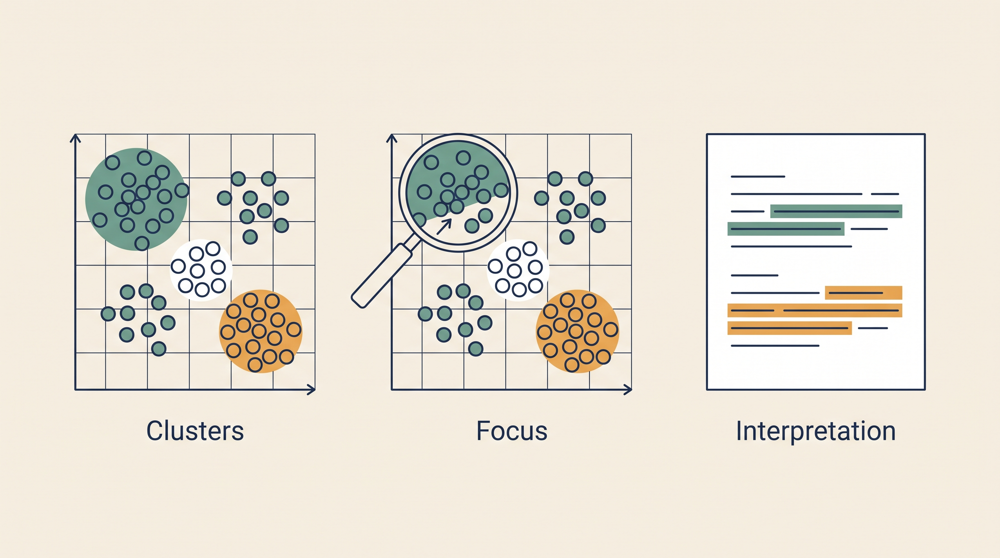

# Single-Cell Intelligence — Overview

**Kind:** agent · **Demo:** `A8` · **Source:** `core/agents/single-cell`


/// caption
Illustrative. Single-Cell Intelligence at a glance.
///

## What it is

Interprets what single-cell clustering results mean clinically.

## Why it matters

The engine computes; the agent explains. Nine clusters are a result — what they imply for this patient is an interpretation.

> **Decision support for a qualified clinician — never autonomous diagnosis or prescribing.** Every output on this page is intended to inform a clinician's judgement, not replace it.

## Honest limit

Interpretation rests on the quality of the upstream clustering and the marker panel used.

## Endpoints

**UI :8540 · API :8541** (platform convention: registry endpoint is the UI, API is UI + 1)

| Capability | Type | Status | Endpoint |
|---|---|---|---|
| `single-cell-intelligence-agent` | agent | **live** | localhost:8540 |

## Size and health

| | |
|---|---|
| Python files | 47 |
| Lines of code | 20,940 |
| Test files | 14 |
| Containerised | yes |

Verify at any time:

```bash
.venv/bin/python scripts/run_all_tests.py single-cell
```

## Where to go next

- [Foundation Learning Guide](FOUNDATION.md) — the concepts, no prior knowledge assumed
- [Advanced Learning Guide](ADVANCED.md) — architecture, modules, extension points
- [Demo Guide](DEMO.md) — how to run `A8`
