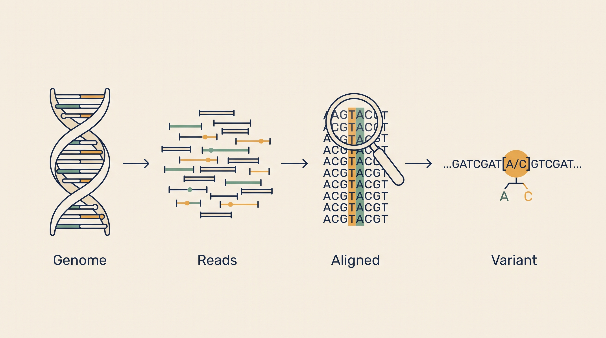

# Genomic Foundation — Overview

**Kind:** engine · **Demo:** `E1` · **Source:** `core/engines/genomic-foundation`


/// caption
Illustrative. Genomic Foundation at a glance.
///

## What it is

Turns raw sequencing reads into a list of the specific letters where a person's genome differs from the reference.

## Why it matters

Every downstream answer — which variant, which drug, which trial — depends on this list being right.

> **Decision support for a qualified clinician — never autonomous diagnosis or prescribing.** Every output on this page is intended to inform a clinician's judgement, not replace it.

## Honest limit

Alignment and variant calling require NVIDIA Parabricks, which is not installed on this box. Results shown today are pre-computed.

## Endpoints

**:5000** — a single-service portal, so there is no separate API port

| Capability | Type | Status | Endpoint |
|---|---|---|---|
| `genomics-engine` | engine | **live** | localhost:5000 |
| `variant-store` | service | **live** | localhost:8575 |
| `mosaicism-vaf` | stage | **planned** | localhost:8575 |
| `acmg-secondary-findings` | stage | **live** | — |
| `gwas-association` | stage | **live** | — |

## Size and health

| | |
|---|---|
| Python files | 15 |
| Lines of code | 3,264 |
| Test files | 8 |
| Containerised | yes |

Verify at any time:

```bash
.venv/bin/python scripts/run_all_tests.py genomic-foundation
```

## Where to go next

- [Foundation Learning Guide](FOUNDATION.md) — the concepts, no prior knowledge assumed
- [Advanced Learning Guide](ADVANCED.md) — architecture, modules, extension points
- [Demo Guide](DEMO.md) — how to run `E1`
