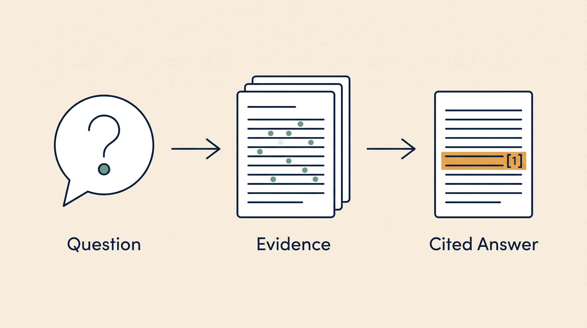

# Precision Intelligence — Overview

**Kind:** engine · **Demo:** `E2` · **Source:** `core/engines/precision-intelligence`


/// caption
Illustrative. Precision Intelligence at a glance.
///

## What it is

The evidence layer. You ask a question in plain English and it retrieves what is known, with citations.

## Why it matters

It is the difference between a variant list and an interpretation. It connects a letter change to published clinical significance.

> **Decision support for a qualified clinician — never autonomous diagnosis or prescribing.** Every output on this page is intended to inform a clinician's judgement, not replace it.

## Honest limit

Retrieval quality is bounded by what has been indexed. An unseeded collection returns nothing — that is a data problem, not a reasoning failure.

## Endpoints

**:5001** — a single-service portal, so there is no separate API port

| Capability | Type | Status | Endpoint |
|---|---|---|---|
| `precision-intelligence-engine` | engine | **live** | localhost:5001 |

## Size and health

| | |
|---|---|
| Python files | 30 |
| Lines of code | 11,346 |
| Test files | 11 |
| Containerised | yes |

Verify at any time:

```bash
.venv/bin/python scripts/run_all_tests.py precision-intelligence
```

## Where to go next

- [Foundation Learning Guide](FOUNDATION.md) — the concepts, no prior knowledge assumed
- [Advanced Learning Guide](ADVANCED.md) — architecture, modules, extension points
- [Demo Guide](DEMO.md) — how to run `E2`
