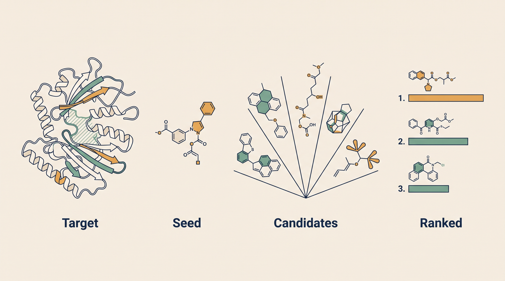

# Therapeutic Discovery — Overview

**Kind:** engine · **Demo:** `E3` · **Source:** `core/engines/therapeutic-discovery`


/// caption
Illustrative. Therapeutic Discovery at a glance.
///

## What it is

Designs new candidate molecules shaped to fit a specific protein, and scores how well each might bind.

## Why it matters

It attacks the hardest question in drug discovery — which molecule to even try — at the very front of a 10-15 year pipeline.

> **Decision support for a qualified clinician — never autonomous diagnosis or prescribing.** Every output on this page is intended to inform a clinician's judgement, not replace it.

## Honest limit

Molecule generation (MolMIM) and docking (DiffDock) are gated NVIDIA NIMs and are not installed. Candidates shown are pre-computed. This is the flagship demo and the easiest to overclaim.

## Endpoints

**:8505** — a single-service portal, so there is no separate API port

| Capability | Type | Status | Endpoint |
|---|---|---|---|
| `therapeutic-discovery-engine` | engine | **live** | localhost:8505 |
| `molmim-nim` | nim | **live** | localhost:8001 |
| `diffdock-nim` | nim | **live** | localhost:8002 |
| `genmol-nim` | nim | **planned** | — |
| `chemprop-admet` | model | **live** | localhost:8572 |
| `molecule-generator` | model | **live** | localhost:8574 |

## Size and health

| | |
|---|---|
| Python files | 33 |
| Lines of code | 9,227 |
| Test files | 13 |
| Containerised | yes |

Verify at any time:

```bash
.venv/bin/python scripts/run_all_tests.py therapeutic-discovery
```

## Where to go next

- [Foundation Learning Guide](FOUNDATION.md) — the concepts, no prior knowledge assumed
- [Advanced Learning Guide](ADVANCED.md) — architecture, modules, extension points
- [Demo Guide](DEMO.md) — how to run `E3`
