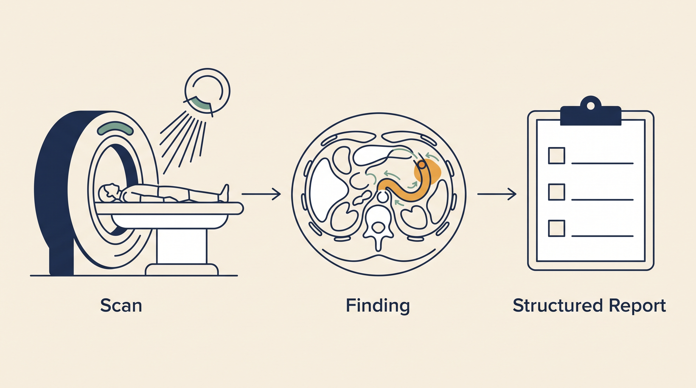

# Clinical Imaging — Overview

**Kind:** engine · **Demo:** `E4` · **Source:** `core/engines/clinical-imaging/agent`


/// caption
Illustrative. Clinical Imaging at a glance.
///

## What it is

Reads medical scans and produces a graded, structured report a radiologist can act on.

## Why it matters

Coronary CT to CAD-RADS 2.0 with modifiers, then a named genomic follow-up — imaging and genetics reasoning about the same patient.

> **Decision support for a qualified clinician — never autonomous diagnosis or prescribing.** Every output on this page is intended to inform a clinician's judgement, not replace it.

## Honest limit

CAD-RADS is a reporting standard, not a diagnosis. The report supports a clinician's read; it does not replace it.

## Endpoints

**UI :8523 · API :8524** (platform convention: registry endpoint is the UI, API is UI + 1)

| Capability | Type | Status | Endpoint |
|---|---|---|---|
| `imaging-intelligence-agent` | engine | **live** | localhost:8523 |

## Size and health

| | |
|---|---|
| Python files | 221 |
| Lines of code | 69,234 |
| Test files | 36 |
| Containerised | yes |

Verify at any time:

```bash
.venv/bin/python scripts/run_all_tests.py clinical-imaging
```

## Where to go next

- [Foundation Learning Guide](FOUNDATION.md) — the concepts, no prior knowledge assumed
- [Advanced Learning Guide](ADVANCED.md) — architecture, modules, extension points
- [Demo Guide](DEMO.md) — how to run `E4`
