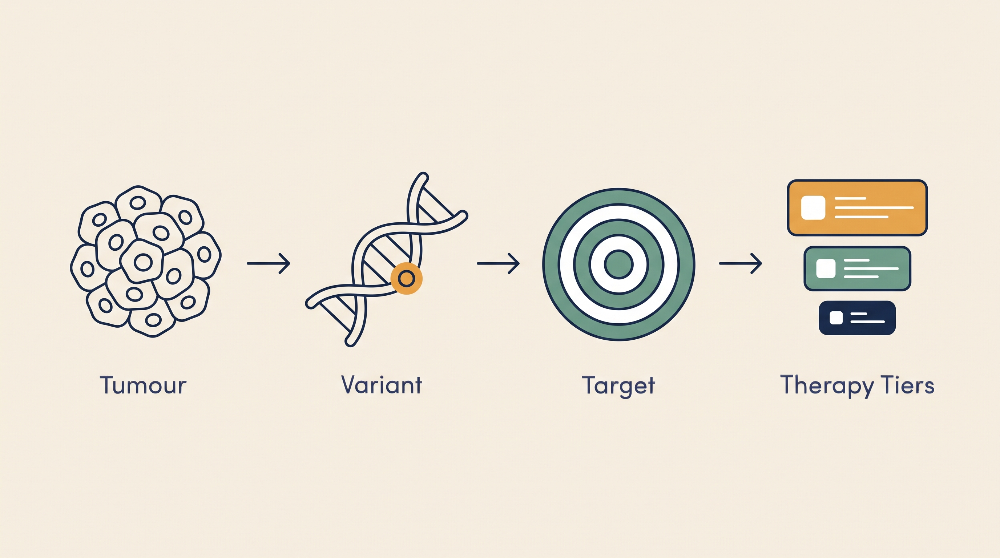

# Precision Oncology — Overview

**Kind:** engine · **Demo:** `E5` · **Source:** `core/engines/precision-oncology/agent`


/// caption
Illustrative. Precision Oncology at a glance.
///

## What it is

Takes a tumour's molecular profile and lays out the therapy options with the strength of evidence behind each.

## Why it matters

A molecular tumour board compresses weeks of cross-specialty review; showing the evidence tier is what clinicians actually trust.

> **Decision support for a qualified clinician — never autonomous diagnosis or prescribing.** Every output on this page is intended to inform a clinician's judgement, not replace it.

## Honest limit

Trial matching is informational. Therapy selection remains the treating oncologist's decision.

## Endpoints

**UI :8526 · API :8527** (platform convention: registry endpoint is the UI, API is UI + 1)

| Capability | Type | Status | Endpoint |
|---|---|---|---|
| `precision-oncology-agent` | engine | **live** | localhost:8526 |

## Size and health

| | |
|---|---|
| Python files | 67 |
| Lines of code | 21,723 |
| Test files | 13 |
| Containerised | yes |

Verify at any time:

```bash
.venv/bin/python scripts/run_all_tests.py precision-oncology
```

## Where to go next

- [Foundation Learning Guide](FOUNDATION.md) — the concepts, no prior knowledge assumed
- [Advanced Learning Guide](ADVANCED.md) — architecture, modules, extension points
- [Demo Guide](DEMO.md) — how to run `E5`
