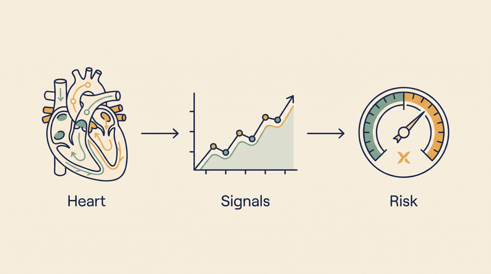

# Cardiology — Overview

**Kind:** engine · **Demo:** `E6` · **Source:** `core/engines/cardiology`


/// caption
Illustrative. Cardiology at a glance.
///

## What it is

Turns cardiac data into a structured risk assessment with the reasoning shown.

## Why it matters

Risk only matters if it changes management. Pair it with imaging findings and pharmacogenomics to decide whether a given statin will work.

> **Decision support for a qualified clinician — never autonomous diagnosis or prescribing.** Every output on this page is intended to inform a clinician's judgement, not replace it.

## Honest limit

Risk scores are population statistics applied to an individual. They inform, they do not determine.

## Endpoints

**UI :8126 · API :8127** (platform convention: registry endpoint is the UI, API is UI + 1)

| Capability | Type | Status | Endpoint |
|---|---|---|---|
| `cardiology-intelligence-agent` | engine | **live** | localhost:8126 |

## Size and health

| | |
|---|---|
| Python files | 59 |
| Lines of code | 45,345 |
| Test files | 20 |
| Containerised | yes |

Verify at any time:

```bash
.venv/bin/python scripts/run_all_tests.py cardiology
```

## Where to go next

- [Foundation Learning Guide](FOUNDATION.md) — the concepts, no prior knowledge assumed
- [Advanced Learning Guide](ADVANCED.md) — architecture, modules, extension points
- [Demo Guide](DEMO.md) — how to run `E6`
