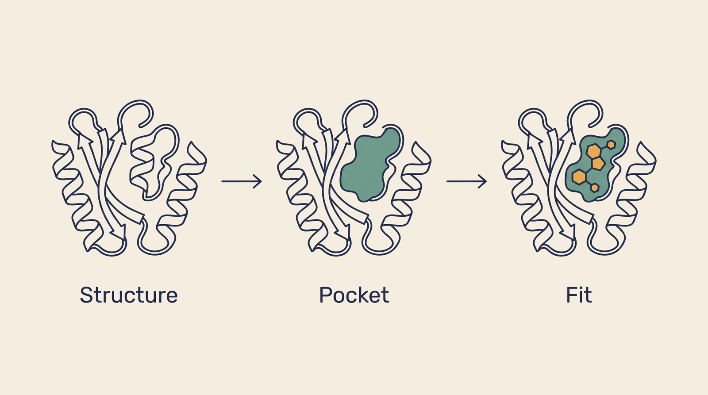

# Structural Biology — Overview

**Kind:** engine · **Demo:** `E7` · **Source:** `core/engines/structural-biology`


/// caption
Illustrative. Structural Biology at a glance.
///

## What it is

Works with the three-dimensional shape of proteins — searching, scoring and designing against them.

## Why it matters

A drug has to physically fit its target. Knowing the shape, atom by atom, is what makes rational design possible.

> **Decision support for a qualified clinician — never autonomous diagnosis or prescribing.** Every output on this page is intended to inform a clinician's judgement, not replace it.

## Honest limit

ESMFold prediction and ProteinMPNN design need CUDA, and these services are not currently served from the venv that has it, so structures shown are deposited PDB entries rather than predictions made live. The engine as a whole is registered `planned`: no process binds its aggregate port, and the model-level capabilities are the reachable surface.

## Endpoints

_No service port — this subject exposes no single registered endpoint._

| Capability | Type | Status | Endpoint |
|---|---|---|---|
| `esmfold-model` | model | **live** | localhost:8570 |
| `esm2-search` | model | **live** | localhost:8571 |
| `protein-developability` | model | **planned** | localhost:8576 |
| `mhcflurry-immunogenicity` | model | **planned** | localhost:8577 |
| `proteinmpnn-design` | model | **live** | localhost:8578 |
| `esm2-finetune` | model | **planned** | — |
| `chai1-structure` | model | **planned** | — |

## Size and health

| | |
|---|---|
| Python files | 21 |
| Lines of code | 1,233 |
| Test files | 7 |
| Containerised | yes |

Verify at any time:

```bash
.venv/bin/python scripts/run_all_tests.py structural-biology
```

## Where to go next

- [Foundation Learning Guide](FOUNDATION.md) — the concepts, no prior knowledge assumed
- [Advanced Learning Guide](ADVANCED.md) — architecture, modules, extension points
- [Demo Guide](DEMO.md) — how to run `E7`
