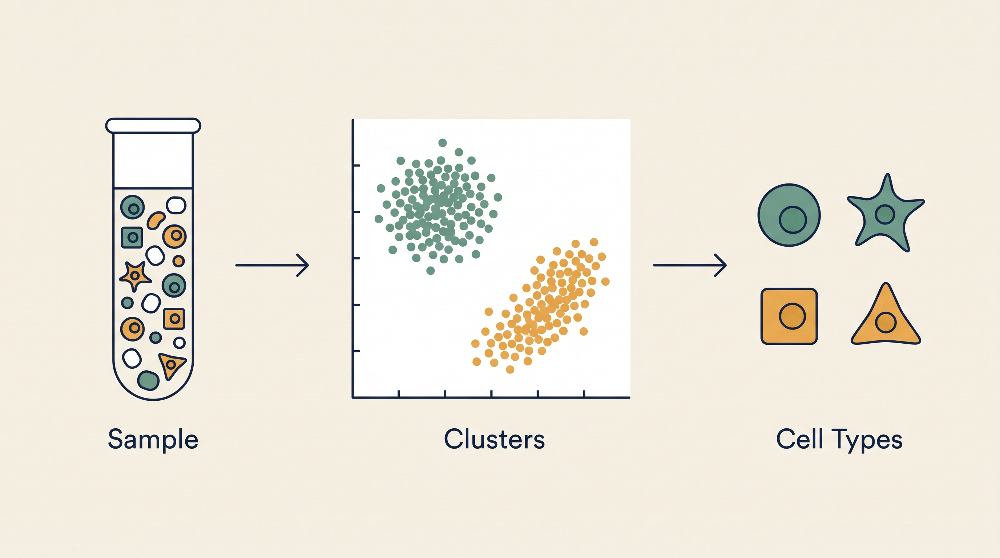

# Single-Cell Analysis — Overview

**Kind:** engine · **Demo:** `E8` · **Source:** `core/engines/single-cell`


/// caption
Illustrative. Single-Cell Analysis at a glance.
///

## What it is

Takes a sample of thousands of individual cells and works out how many distinct cell types are present.

## Why it matters

Bulk measurements average across cell types and hide the population that matters. Single-cell resolution recovers it.

> **Decision support for a qualified clinician — never autonomous diagnosis or prescribing.** Every output on this page is intended to inform a clinician's judgement, not replace it.

## Honest limit

Cluster annotation is by marker-gene overlap against a canonical panel. It is a strong heuristic, not a ground truth.

## Endpoints

**:8573** — a single-service portal, so there is no separate API port

| Capability | Type | Status | Endpoint |
|---|---|---|---|
| `singlecell-compute` | engine | **live** | localhost:8573 |

## Size and health

| | |
|---|---|
| Python files | 3 |
| Lines of code | 174 |
| Test files | 1 |
| Containerised | yes |

Verify at any time:

```bash
.venv/bin/python scripts/run_all_tests.py single-cell
```

## Where to go next

- [Foundation Learning Guide](FOUNDATION.md) — the concepts, no prior knowledge assumed
- [Advanced Learning Guide](ADVANCED.md) — architecture, modules, extension points
- [Demo Guide](DEMO.md) — how to run `E8`
