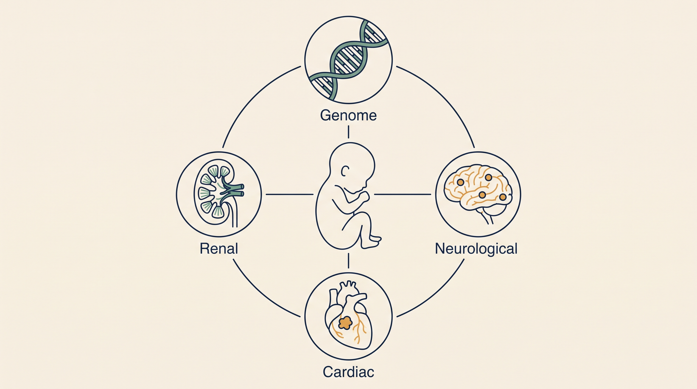

# Tuberous Sclerosis Complex — Overview

**Kind:** program · **Demo:** `P1` · **Source:** `core/disease-programs/tuberous-sclerosis`


/// caption
Illustrative. Tuberous Sclerosis Complex at a glance.
///

## What it is

The whole factory applied to one disease: tuberous sclerosis complex, a genetic condition causing growths across multiple organs.

## Why it matters

Five disease-specific agents compose the horizontal engines — variant curation, trajectory, therapeutics, phenotype mapping and TAND surveillance.

> **Decision support for a qualified clinician — never autonomous diagnosis or prescribing.** Every output on this page is intended to inform a clinician's judgement, not replace it.

## Honest limit

Gene-therapy correction of TSC1/TSC2 is preclinical — an open design bench, not a cure today. Pediatric caution at full force. Decision support, never prescribing.

## Endpoints

_No service port — this subject exposes no single registered endpoint._

_No capability is registered for this subject in `lib/hcls_common/capabilities.json`._

## Size and health

| | |
|---|---|
| Python files | 115 |
| Lines of code | 7,598 |
| Test files | 24 |
| Containerised | yes |

Verify at any time:

```bash
.venv/bin/python scripts/run_all_tests.py tuberous-sclerosis
```

## Where to go next

- [Foundation Learning Guide](FOUNDATION.md) — the concepts, no prior knowledge assumed
- [Advanced Learning Guide](ADVANCED.md) — architecture, modules, extension points
- [Demo Guide](DEMO.md) — how to run `P1`
